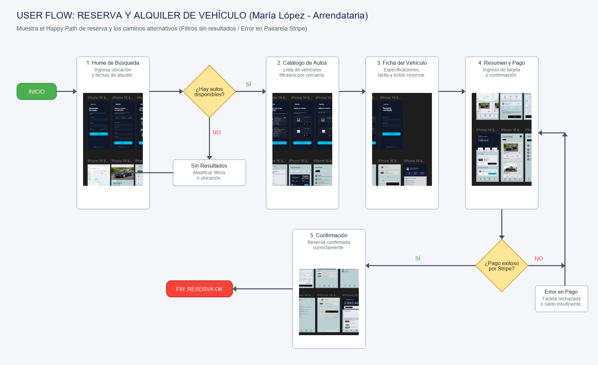
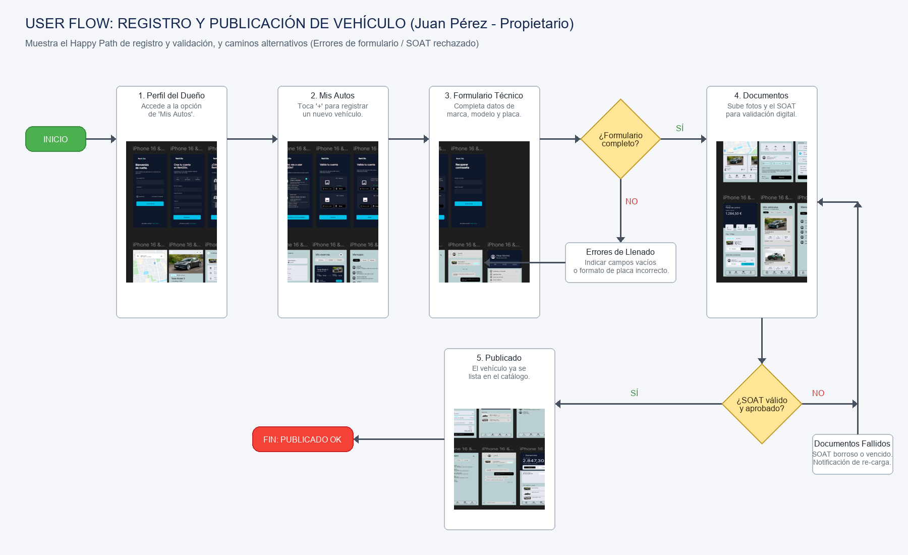
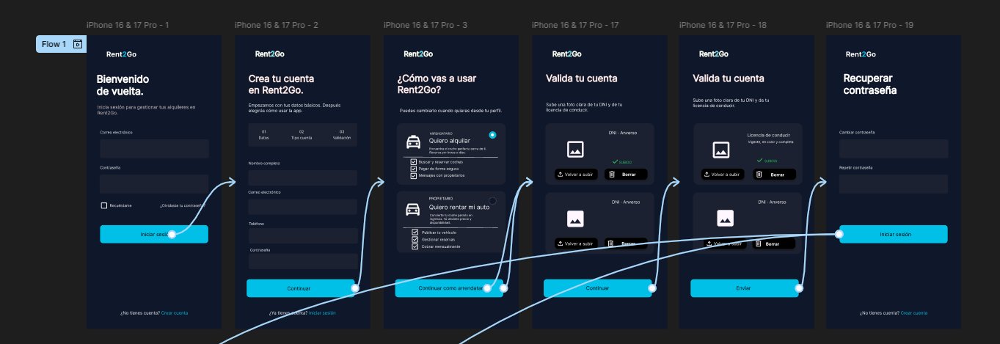
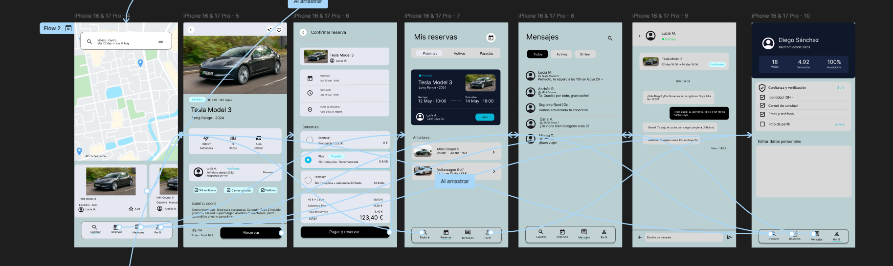
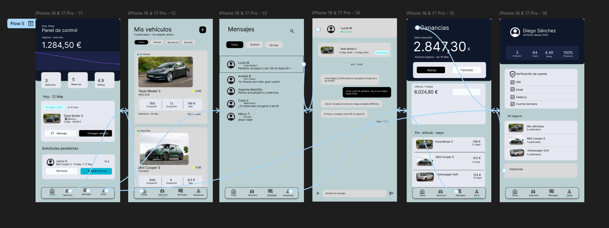

## Capítulo III: Solution UI/UX Design
### 3.1. Product design
### 3.1.1. Style Guidelines
### 3.1.1.1. General Style Guidelines

### Tipografía

<div align="center">
    
</div>

### Paleta de Colores

<div align="center">
    
</div>

### 3.1.2. Information Architecture
### 3.1.2.1. Organization Systems

La arquitectura de información de Rent2Go fue organizada mediante un sistema jerárquico orientado a tareas y objetivos de usuario. La estructura principal del sistema divide la experiencia en módulos funcionales enfocados en las necesidades principales de los segmentos objetivo:

- Gestión de vehículos
- Exploración y búsqueda de vehículos
- Reservas y alquileres
- Pagos y facturación
- Perfil y reputación de usuarios
- Soporte y ayuda

Esta organización permite que propietarios y arrendatarios accedan rápidamente a las funcionalidades relevantes según su contexto de uso, reduciendo fricción y mejorando la navegabilidad dentro de la aplicación móvil y la landing page.

### 3.1.2.2. Labelling Systems

El sistema de etiquetado de Rent2Go fue diseñado utilizando terminología simple, directa y consistente para facilitar la comprensión de las funcionalidades principales por parte de los usuarios.

### Ejemplos de etiquetas utilizadas

| Funcionalidad | Etiqueta |
|---|---|
| Publicar vehículo | “Publicar auto” |
| Reservas activas | “Mis reservas” |
| Historial de alquileres | “Historial” |
| Gestión de pagos | “Pagos” |
| Perfil del usuario | “Mi perfil” |
| Soporte | “Ayuda” |

Las etiquetas fueron definidas priorizando claridad, reconocimiento inmediato y familiaridad con aplicaciones móviles modernas.
### 3.1.2.3. SEO Tags and Meta Tags

La landing page de Rent2Go implementará estrategias básicas de SEO para mejorar la visibilidad en motores de búsqueda y aumentar el alcance orgánico del producto.

#### Meta Tags principales

```html
<meta name="title" content="Rent2Go - Plataforma de alquiler de vehículos P2P">
<meta name="description" content="Alquila vehículos de manera segura y flexible o genera ingresos con tu auto mediante Rent2Go.">
<meta name="keywords" content="alquiler de autos, rentar vehículos, carsharing, alquiler P2P, movilidad">
<meta name="author" content="R2G Technologies">
```

#### Estrategias SEO consideradas

- Uso de títulos jerárquicos (H1, H2, H3)
- Optimización mobile-first
- URLs amigables
- Carga rápida de la landing page
- Uso de palabras clave relacionadas con movilidad y alquiler vehicular
- Optimización para redes sociales mediante Open Graph

### 3.1.2.4. Searching Systems

El sistema de búsqueda de Rent2Go permitirá a los arrendatarios encontrar vehículos según distintos criterios relevantes para su necesidad de movilidad.

#### Funcionalidades principales de búsqueda

- Búsqueda por ubicación
- Filtrado por precio
- Filtrado por tipo de vehículo
- Filtrado por disponibilidad
- Filtrado por calificación del propietario
- Ordenamiento por precio, cercanía y popularidad

El objetivo del sistema es reducir el tiempo necesario para encontrar un vehículo adecuado y mejorar la experiencia de exploración dentro de la aplicación.

### 3.1.2.5. Navigation Systems

El sistema de navegación de Rent2Go fue diseñado siguiendo principios mobile-first y priorizando accesibilidad y simplicidad.

### Navegación principal

La aplicación contará con una barra de navegación inferior que permitirá acceso rápido a:

- Inicio
- Buscar vehículos
- Reservas
- Notificaciones
- Perfil

### Navegación secundaria

Además, se implementarán:

- Breadcrumbs en la landing page
- Navegación contextual dentro de reservas y pagos
- Botones de acción rápida
- Navegación persistente en pantallas clave

La estructura busca minimizar la cantidad de pasos requeridos para completar acciones importantes dentro del sistema.

### 3.1.3. Landing Page UI Design
### 3.1.3.1. Landing Page Wireframe

Esta sección presenta los wireframes del Landing Page tanto para Desktop Web Browser como para Mobile Web Browser. Los diseños fueron elaborados considerando principios de diseño como la jerarquía visual, consistencia, simplicidad y accesibilidad. Además, se aplicaron elementos de diseño inclusivo, asegurando una correcta navegación, legibilidad y adaptación a diferentes tamaños de pantalla. La arquitectura de información se organizó de manera clara para facilitar que los usuarios encuentren rápidamente las secciones principales de la plataforma.

<div align="center">
    
</div>

<div align="center">
    
</div>

<div align="center">
    
</div>

<div align="center">
    
</div>

### 3.1.3.2. Landing Page Mock-up

Esta sección presenta los mock-ups del Landing Page para Desktop Web Browser y Mobile Web Browser. Los diseños aplican principios de diseño visual, accesibilidad, arquitectura de información y el Design System definido para la plataforma, asegurando una experiencia clara, consistente y adaptable a diferentes dispositivos.

<div align="center">
    
</div>

### 3.1.4. Mobile Applications UX/UI Design
### 3.1.4.1. Mobile Applications Wireframes

En esta sección se presentan los wireframes desarrollados para la aplicación móvil Rent2Go. Los wireframes permiten representar de manera estructurada la distribución inicial de los elementos visuales y funcionales de cada pantalla antes del diseño final de los mock-ups.

<div align="center">
    
</div>

<div align="center">
    
</div>

<div align="center">
    
</div>

### 3.1.4.2. Mobile Applications Wireflow Diagrams

Esta sección presenta los diagramas de Wireflows para cada User Goal identificado en el alcance, relacionándolos con los User Persona (María López como Arrendataria y Juan Pérez como Propietario). El objetivo de estos Wireflows es mostrar de qué forma se refleja un cambio en una pantalla (Wireframe) como resultado de la interacción física o lógica en el flujo de la aplicación.

#### 1. Wireflow para María López (Arrendataria)

*   **User Goal:** Como arrendataria (María López), quiero buscar, filtrar y reservar un vehículo cercano a través de la aplicación móvil de Rent2Go para poder movilizarme de manera flexible y segura en mi día a día.
*   **Task Flow (Paso a paso lógico de acciones):**
    *   **Paso 1:** Iniciar sesión en la aplicación.
    *   **Paso 2:** Ingresar ubicación y rango de fechas de alquiler en el buscador principal.
    *   **Paso 3:** Aplicar filtros de preferencia (precio, calificación del dueño, tipo de transmisión).
    *   **Paso 4:** Seleccionar un vehículo específico y visualizar sus detalles.
    *   **Paso 5:** Presionar el botón "Reservar ahora".
    *   **Paso 6:** Completar la información de pago y confirmar la reserva.

*   **Explicación del Flujo:**
    El flujo de componentes (Wireflow) inicia en la **Pantalla de Inicio (Home)**, la cual contiene el formulario básico de búsqueda. Al realizar la acción de búsqueda, el sistema actualiza la interfaz y transiciona a la **Pantalla de Resultados**, donde se despliega la lista de vehículos disponibles en un formato de tarjetas informativas. Al seleccionar un vehículo, el flujo lleva a la **Pantalla de Detalle de Vehículo**, permitiendo visualizar especificaciones, fotos y calificaciones del propietario. Una vez que el usuario presiona "Reservar ahora", se despliega la **Pantalla de Pago y Resumen**, la cual recopila los datos financieros del usuario. Finalmente, tras procesar la transacción, la app muestra la **Pantalla de Éxito / Confirmación de Reserva**, completando el objetivo del usuario.

<div align="center">
    
</div>

---

#### 2. Wireflow para Juan Pérez (Propietario)

*   **User Goal:** Como propietario (Juan Pérez), quiero registrar mi vehículo y subir la documentación requerida para poder publicarlo en el catálogo de alquiler de Rent2Go y generar ingresos adicionales.
*   **Task Flow (Paso a paso lógico de acciones):**
    *   **Paso 1:** Iniciar sesión en la aplicación.
    *   **Paso 2:** Acceder a la sección de "Mis autos" desde el perfil de usuario.
    *   **Paso 3:** Seleccionar la opción de "Registrar nuevo vehículo".
    *   **Paso 4:** Completar el formulario con los detalles técnicos del auto (placa, marca, modelo, año, tarifa diaria).
    *   **Paso 5:** Subir fotografías del vehículo y del documento SOAT/tarjeta de propiedad para validación.
    *   **Paso 6:** Confirmar el registro y enviar a aprobación.

*   **Explicación del Flujo:**
    Este flujo comienza en la **Pantalla de Perfil de Usuario**, donde se ubica el botón para gestionar "Mis Autos". Al seleccionarlo, se transiciona a la **Pantalla de Mis Autos** (que muestra la lista de vehículos del propietario). Al presionar el botón de agregar ("+"), se abre la **Pantalla de Formulario Técnico**, donde el usuario ingresa marca, modelo, año y placa. El botón "Siguiente" redirige a la **Pantalla de Carga de Archivos**, la cual contiene campos interactivos para subir imágenes del vehículo y el SOAT. Finalmente, al dar clic en "Publicar", el sistema guarda la información y transiciona a la **Pantalla de Registro Exitoso**, donde se indica que el coche ha sido enviado a validación para su posterior publicación.

<div align="center">
    
</div>
### 3.1.4.3. Mobile Applications Mock-ups

En esta sección se presentan los mock-ups desarrollados para la aplicación móvil de Rent2Go. Estas interfaces fueron diseñadas con el objetivo de ofrecer una experiencia intuitiva, moderna y accesible tanto para propietarios de vehículos como para usuarios arrendatarios.

Durante el diseño de las pantallas se aplicaron principios de UX/UI enfocados en la simplicidad, facilidad de navegación y consistencia visual. Asimismo, se utilizaron elementos definidos dentro del Design System del proyecto, manteniendo uniformidad en colores, tipografías, componentes y estilos visuales.

### Aplicación de principios de diseño

Los mock-ups fueron desarrollados considerando distintos principios de diseño digital:

- **Consistencia visual:**  
  Todas las pantallas mantienen una misma línea gráfica basada en una paleta de colores azul oscuro, blanco y celeste, permitiendo uniformidad en toda la aplicación.

- **Jerarquía visual:**  
  Se utilizaron tamaños de texto, espaciados y contrastes para resaltar información importante como botones principales, precios, reservas y notificaciones.

- **Minimalismo:**  
  Las interfaces presentan únicamente los elementos necesarios para evitar sobrecargar al usuario y facilitar la interacción.

- **Retroalimentación visual:**  
  Los botones, formularios y estados de validación brindan respuestas visuales claras al usuario durante las acciones realizadas dentro de la aplicación.

- **Diseño responsive y móvil:**  
  Todas las vistas fueron diseñadas pensando en dispositivos móviles modernos, priorizando la comodidad visual y la facilidad de uso.

---

### Arquitectura de información aplicada

La organización de la información dentro de la aplicación busca facilitar la navegación y reducir el tiempo necesario para completar tareas.

Las funcionalidades fueron agrupadas según las principales necesidades de los usuarios:

| Funcionalidad | Objetivo |
|---|---|
| Inicio de sesión y registro | Permitir acceso seguro a la plataforma |
| Búsqueda de vehículos | Facilitar la exploración y reserva |
| Reservas | Gestionar alquileres realizados |
| Mensajería | Permitir comunicación entre usuarios |
| Perfil de usuario | Administrar información personal y vehículos |
| Ganancias | Mostrar ingresos generados por propietarios |

La navegación principal se encuentra ubicada en la parte inferior de la aplicación, permitiendo acceso rápido a las funcionalidades más importantes.

---

### Mock-ups desarrollados

Los mock-ups elaborados representan las principales funcionalidades de Rent2Go:

- Pantalla de inicio de sesión.
- Pantalla de creación de cuenta.
- Recuperación de contraseña.
- Validación de identidad y documentos.
- Pantalla principal de exploración de vehículos.
- Vista detallada de vehículos disponibles.
- Gestión de reservas.
- Sistema de mensajería entre usuarios.
- Perfil de usuario.
- Panel de ganancias para propietarios.

Estas interfaces permiten visualizar de forma realista el funcionamiento esperado de la aplicación móvil antes de su implementación.

<div align="center">
    
</div>

---

### Herramienta utilizada

Para el diseño de los mock-ups se utilizó la herramienta Figma, debido a su capacidad para desarrollar prototipos interactivos, sistemas de diseño y colaboración en tiempo real durante el proceso de diseño UX/UI.

https://www.figma.com/design/BMdRHNFasQzhoxhp9cJB93/Untitled?node-id=0-1&p=f&t=sAOXZsIjXz3z7kD4-0

### 3.1.4.4. Mobile Applications User Flow Diagrams

Los diagramas de User Flow muestran la secuencia de acciones, decisiones y rutas alternativas que siguen los usuarios al interactuar con Rent2Go. Estos flujos permiten visualizar el comportamiento esperado de la aplicación (incluyendo mock-ups de alta fidelidad, lógica de condiciones de negocio, el "happy path" y las rutas alternativas de error o "unhappy paths") y validar la experiencia de usuario antes del desarrollo.

#### 1. User Flow para María López (Arrendataria)

*   **User Goal:** Como arrendataria (María López), quiero buscar, filtrar y reservar un vehículo cercano a través de la aplicación móvil de Rent2Go para poder movilizarme de manera flexible y segura en mi día a día.
*   **Explicación de Flujos y Condiciones Especificados:**
    *   **Happy Path (Ruta de éxito):** Comienza cuando María inicia sesión y accede a la pantalla principal de exploración. Ingresa su ubicación de recogida y las fechas deseadas. Al presionar "Buscar", el sistema encuentra vehículos disponibles y despliega una lista de opciones. María selecciona un auto, revisa sus características y presiona "Reservar ahora". En la pantalla de pago, ingresa su tarjeta de crédito y confirma la operación. El pago es procesado exitosamente por Stripe y se muestra la pantalla de confirmación de reserva con los datos finales.
    *   **Unhappy Path 1 (Filtros sin coincidencia):** Si al aplicar un filtro restrictivo (ej. precio muy bajo o marca específica) no hay autos que coincidan con la búsqueda, el sistema no muestra resultados sino una pantalla de alerta "Sin Resultados". La condición obliga al usuario a modificar sus filtros o limpiar la búsqueda para volver a intentarlo.
    *   **Unhappy Path 2 (Falla en el procesamiento de pago):** Al ingresar los datos de pago, si el emisor rechaza la tarjeta (por fondos insuficientes, datos incorrectos o sospecha de fraude), el sistema evalúa la condición de fallo y muestra un modal de error "Pago fallido". El flujo le permite elegir entre cambiar el método de pago para reintentar la transacción o cancelar la reserva y regresar a la vista de detalles del auto.

<div align="center">
    
</div>

---

#### 2. User Flow para Juan Pérez (Propietario)

*   **User Goal:** Como propietario (Juan Pérez), quiero registrar mi vehículo y subir la documentación requerida para poder publicarlo en el catálogo de alquiler de Rent2Go y generar ingresos adicionales.
*   **Explicación de Flujos y Condiciones Especificados:**
    *   **Happy Path (Ruta de éxito):** Juan inicia sesión, se dirige a su Perfil e ingresa a "Mis Autos". Selecciona "Registrar nuevo vehículo" y llena todos los campos técnicos (marca, modelo, año, placa, kilometraje). Posteriormente sube fotos nítidas del auto y una imagen de su documento SOAT vigente. El sistema valida en tiempo real la integridad del formulario y envía los datos. El coche pasa a revisión por el administrador del sistema y queda guardado provisionalmente. Al aprobarse los documentos, el auto cambia a estado "Publicado" y se vuelve visible en el catálogo de búsqueda.
    *   **Unhappy Path 1 (Formulario incompleto):** Si Juan olvida llenar campos obligatorios o digita información errónea (como una placa con formato inválido) y presiona "Siguiente", el sistema no le permite avanzar. Muestra avisos de error debajo de cada campo afectado. El usuario debe subsanar el error para continuar con la carga de fotos y documentos.
    *   **Unhappy Path 2 (Documentación inválida o rechazada):** Si el documento del SOAT subido está vencido o es borroso, el proceso de validación lo marcará como "Rechazado". El sistema envía una notificación push al usuario alertándolo del inconveniente. El vehículo queda en estado "Rechazado" y el flujo redirige a Juan a la pantalla de carga para que pueda subir un documento SOAT válido y solicitar una nueva aprobación.

<div align="center">
    
</div>


### 3.1.4.5. Mobile Applications Prototyping

El prototipo de Rent2Go representa visualmente las funcionalidades principales de la aplicación móvil mediante pantallas de alta fidelidad. Su propósito es validar la experiencia de usuario, los flujos de navegación y la interacción entre propietarios y arrendatarios antes del desarrollo del producto final.

<div align="center">
    
</div>

<div align="center">
    
</div>

<div align="center">
    
</div>

Link del Prototipo: https://www.figma.com/proto/BMdRHNFasQzhoxhp9cJB93/Untitled?node-id=0-1&t=ySLsnXS3xevXtBv3-1