<div style="page-break-after: always;"></div>

# Capítulo III: Solution UI/UX Design

### 3.1. Product design

Este capítulo se alinea con lo implementado en la carpeta landing-page y las vistas proyectadas para la aplicación móvil. Se documenta el diseño visual, los componentes y la arquitectura de información existentes, manteniendo el enfoque mobile-first.

### 3.1.1. Style Guidelines

La Landing Page implementada se apoya en la estructura Vue del proyecto, con estilos configurados en `style.css` e `index.html`. Esta sección registra tanto la definición teórica del sistema de diseño como la implementación visual real para asegurar la trazabilidad del producto.

### 3.1.1.1. General Style Guidelines

- **Branding y tono**: Comunicación directa, confiable y orientada a la acción con llamados a la acción (CTAs) claros como "Reservar ahora" y "Explorar vehículos".
- **Tipografía aplicada**: Poppins como familia tipográfica base con fallback en `system-ui`, `Segoe UI`, `Roboto` y `Arial`.
- **Escala tipográfica**: Títulos principales, encabezados y texto base definidos de forma consistente (por ejemplo, con clases CSS `heading-xl`, `heading-lg`, `heading-md`, `heading-sm` y `body`).
- **Colores base**: Paleta principal con variantes (`primary-50`, `primary-100`, `primary-500`, `primary-600`), escala de grises neutros y superficies oscuras.
- **Estados y superficies**: Fondos claros y oscuros (soporte para modo oscuro mediante la clase `dark` en el elemento raíz `html`), bordes suaves y sombras sutiles en tarjetas para estados interactivos.
- **Espaciado y layout**: Retícula base de 8px, contenedores con ancho máximo y padding horizontal adaptativo (ej. 16px en móviles y 24px en escritorio).
- **Breakpoints responsive**: Configuración mobile-first con puntos de quiebre en 640px, 768px y 1024px.

#### Tipografía Visual

<div align="center">
    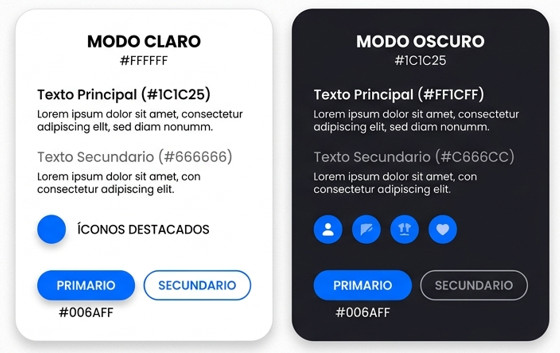
</div>

#### Paleta de Colores Visual

<div align="center">
    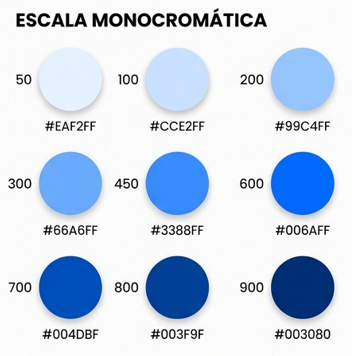
</div>

#### Componentes de Interfaz de Usuario (UI) Implementados en la Landing Page

- **Botón Primario**: Fondo azul `#0D6EFD`, texto blanco, bordes redondeados de 8px y efecto hover en `#0854d4`.
- **Botón Outline**: Borde de 1px, fondo transparente y cambio a fondo gris claro en hover.
- **Botón Icono**: Utilizado principalmente para el toggle del tema (claro/oscuro) y el menú de navegación móvil.
- **Tarjetas (Cards)**: Bordes suaves (radio de 16px), fondo de tarjeta contrastante y ligera elevación en hover.
- **Formularios**: Campos de entrada con bordes grises y foco resaltado visualmente (anillo de foco con variante primary).
- **Chips y Etiquetas**: Filtros de categorías rápidos y tags para atributos de la flota de vehículos.

### 3.1.2. Information Architecture

La arquitectura de información se estructura a partir del flujo de navegación y la organización de los componentes de la Landing Page (`index.html`) y las vistas proyectadas para la aplicación móvil.

### 3.1.2.1. Organization Systems

La arquitectura de Rent2Go se organiza a través de dos esquemas de organización:

#### A. Módulos Funcionales (Aplicación Móvil)
El sistema divide la experiencia móvil en áreas clave según las necesidades de propietarios y arrendatarios:
- Gestión de vehículos
- Exploración y búsqueda de vehículos
- Reservas y alquileres
- Pagos y facturación
- Perfil y reputación de usuarios
- Soporte y ayuda

#### B. Bloques Secuenciales (Landing Page)
La página de aterrizaje de una sola página implementa un sistema secuencial de bloques anclados para guiar al usuario hacia la conversión:
1. **Header**: Navegación y acciones principales.
2. **Hero**: Propuesta de valor clara y llamadas a la acción primarias.
3. **Features**: Características y ventajas del servicio.
4. **Fleet (Flota)**: Catálogo dinámico de vehículos con filtros.
5. **How it works (Cómo funciona)**: Pasos sencillos para alquilar o publicar.
6. **Requirements**: Requisitos esenciales para el registro.
7. **Testimonials**: Pruebas sociales para construir confianza.
8. **FAQ**: Resolución de preguntas frecuentes.
9. **CTA / Contacto**: Formulario final de conversión y soporte.
10. **Footer**: Enlaces secundarios de navegación y legales.

Esta organización permite que propietarios y arrendatarios accedan rápidamente a las funcionalidades relevantes según su contexto de uso, reduciendo fricción y mejorando la navegabilidad.

### 3.1.2.2. Labelling Systems

El sistema de etiquetado utiliza terminología clara, familiar y consistente para facilitar la interacción de los usuarios sin ambigüedades.

#### Ejemplos de Etiquetas en la Aplicación Móvil

| Funcionalidad | Etiqueta |
|---|---|
| Publicar vehículo | “Publicar auto” |
| Reservas activas | “Mis reservas” |
| Historial de alquileres | “Historial” |
| Gestión de pagos | “Pagos” |
| Perfil del usuario | “Mi perfil” |
| Soporte | “Ayuda” |

#### Etiquetas Reales de la Landing Page

- **Navegación Principal**: *Inicio*, *Vehículos*, *¿Cómo funciona?*, *Requisitos*, *Preguntas*, *Contacto*.
- **Etiquetas de Acción (CTAs)**: *Iniciar sesión*, *Reservar ahora*, *Explorar vehículos*, *Solicitar reserva*.

*Nota de internacionalización (i18n):* Para mantener soporte bilingüe en la Landing Page, la traducción se gestiona mediante claves `data-i18n` referenciadas en archivos JSON de traducción (`es_419.json` y `en_US.json`).

### 3.1.2.3. SEO Tags and Meta Tags

Se han implementado etiquetas de optimización en motores de búsqueda (SEO) directamente en el archivo `index.html` de la Landing Page, orientadas a maximizar la visibilidad y alcance orgánico.

#### Meta Tags Implementados en index.html

- **Título de la Página**: `Rent2Go – Alquila y monetiza vehículos`
- **Meta-Descripción**: `Rent2Go — Alquila y monetiza vehículos fácilmente`

#### Meta Tags Planificados para Trazabilidad Completa

```html
<meta name="title" content="Rent2Go - Plataforma de alquiler de vehículos P2P">
<meta name="description" content="Alquila vehículos de manera segura y flexible o genera ingresos con tu auto mediante Rent2Go.">
<meta name="keywords" content="alquiler de autos, rentar vehículos, carsharing, alquiler P2P, movilidad">
<meta name="author" content="R2G Technologies">
```

#### Estrategias SEO y ASO Consideradas

- Uso de títulos con jerarquía semántica (H1, H2, H3).
- Optimización técnica enfocada en mobile-first.
- URLs amigables y tiempos de carga reducidos.
- *Pendiente:* Incorporación de metadatos Open Graph y Twitter Cards para optimización en redes sociales.
- *Pendiente:* Planificación y optimización ASO (App Store Optimization) para cuando se publiquen las aplicaciones móviles en las tiendas correspondientes.

### 3.1.2.4. Searching Systems

El sistema de búsqueda se adapta al contexto del canal de interacción del usuario:

#### A. Filtros en la Landing Page (Implementado)
Para mantener la simplicidad, la Landing Page no requiere un buscador de texto completo. En su lugar, cuenta con un sistema de filtrado de flota basado en categorías:
- **Categorías**: *Todos*, *Económicos*, *SUVs*, *Lujo*, *Vans*.
- **Comportamiento**: Al seleccionar una categoría, el catálogo de tarjetas se actualiza dinámicamente.

#### B. Sistema de Búsqueda de la Aplicación Móvil (Diseño Proyectado)
La aplicación móvil común incorporará un motor de búsqueda avanzado con mayor granularidad:
- Búsqueda por ubicación geográfica.
- Filtrado por precio, tipo de vehículo, disponibilidad y calificación del propietario.
- Ordenamiento por precio, cercanía y popularidad.

El objetivo del sistema es reducir el tiempo necesario para encontrar un vehículo adecuado y mejorar la experiencia de exploración dentro de la aplicación.

### 3.1.2.5. Navigation Systems

El diseño del sistema de navegación prioriza la accesibilidad, facilidad de uso y la coherencia en ambos entornos:

#### A. Navegación en la Landing Page (Implementado)
- **Dispositivos de Escritorio (Desktop)**: Menú horizontal superior con enlaces de anclaje que dirigen al usuario directamente a las secciones de la página.
- **Dispositivos Móviles (Mobile)**: Botón de menú tipo "hamburguesa" que despliega un menú colapsable (gestionado con atributos de accesibilidad como `aria-hidden`).
- **Persistencia**: Accesos fijos a iniciar sesión y botones de conversión en el header.
- **Funcionalidades adicionales**: Controles para selección de idioma e interruptor de tema visual.

#### B. Navegación en la Aplicación Móvil (Diseño Proyectado)
- **Barra de Navegación Inferior (Bottom Navigation)**: Acceso inmediato con el pulgar a las secciones principales: *Inicio*, *Buscar*, *Reservas*, *Notificaciones* y *Perfil*.
- **Navegación Secundaria**: Enlaces contextuales para flujos de checkout, detalles de vehículo y botones flotantes para acciones rápidas.

La estructura busca minimizar la cantidad de pasos requeridos para completar acciones importantes dentro del sistema.

### 3.1.3. Landing Page UI Design

### 3.1.3.1. Landing Page Wireframe

Esta sección presenta los wireframes del Landing Page tanto para Desktop Web Browser como para Mobile Web Browser. Los diseños fueron elaborados considerando principios de diseño como la jerarquía visual, consistencia, simplicidad y accesibilidad. Además, se aplicaron elementos de diseño inclusivo, asegurando una correcta navegación, legibilidad y adaptación a diferentes tamaños de pantalla. La arquitectura de información se organizó de manera clara para facilitar que los usuarios encuentren rápidamente las secciones principales de la plataforma.

<div align="center">
    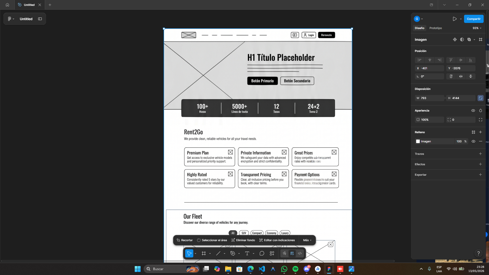
</div>

<div align="center">
    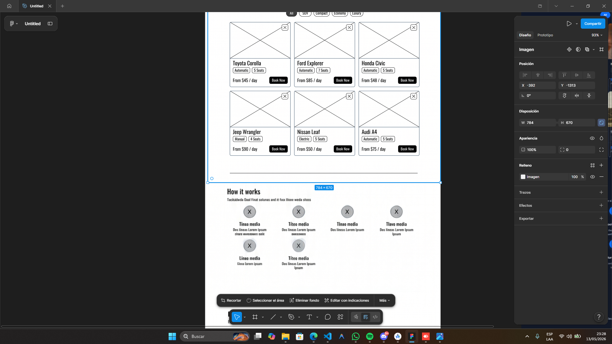
</div>

<div align="center">
    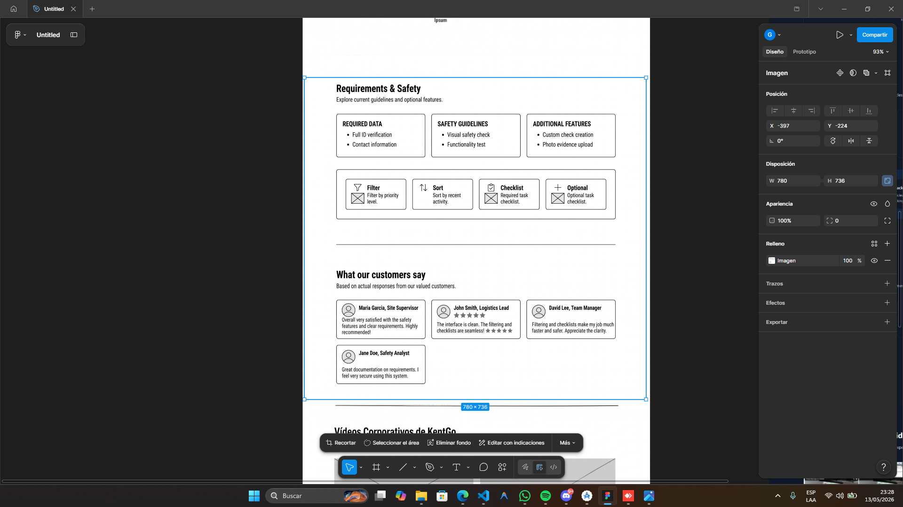
</div>

<div align="center">
    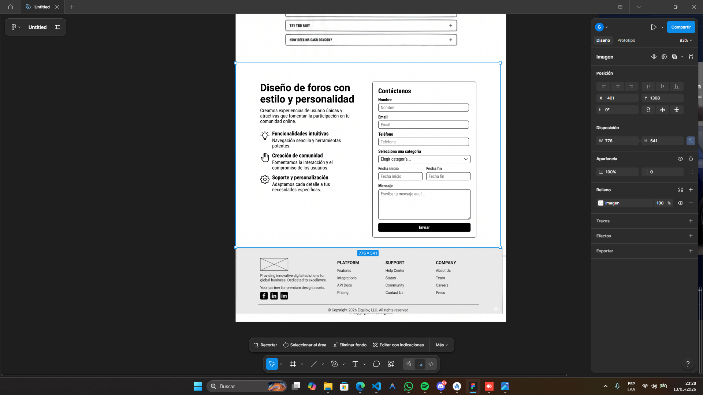
</div>

### 3.1.3.2. Landing Page Mock-up

Esta sección presenta los mock-ups del Landing Page para Desktop Web Browser y Mobile Web Browser. Los diseños aplican principios de diseño visual, accesibilidad, arquitectura de información y el Design System definido para la plataforma, asegurando una experiencia clara, consistente y adaptable a diferentes dispositivos.

<div align="center">
    
</div>

### 3.1.4. Mobile Applications UX/UI Design

### 3.1.4.1. Mobile Applications Wireframes

En esta sección se presentan los wireframes desarrollados para la aplicación móvil Rent2Go. Los wireframes permiten representar de manera estructurada la distribución inicial de los elementos visuales y funcionales de cada pantalla antes del diseño final de los mock-ups.

<div align="center">
    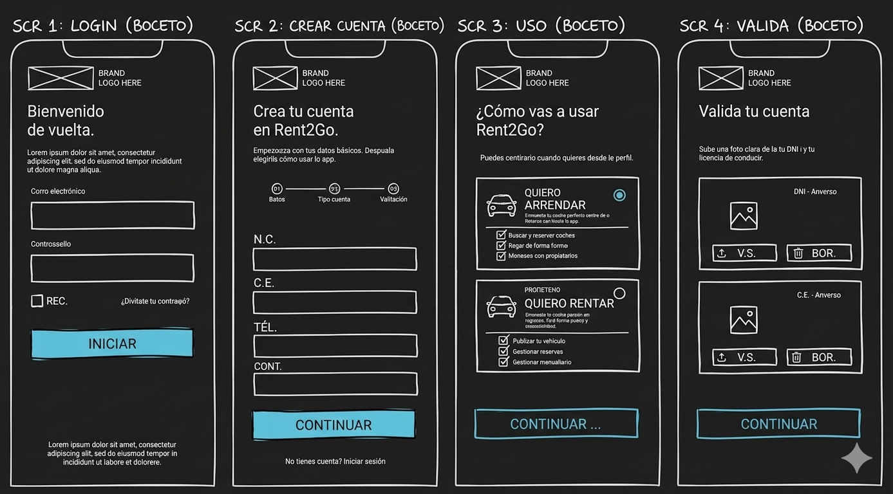
</div>

<div align="center">
    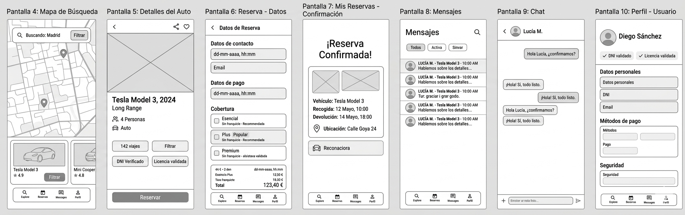
</div>

<div align="center">
    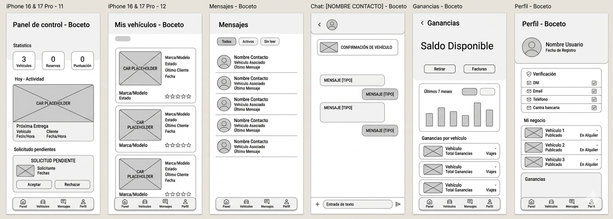
</div>

### 3.1.4.2. Mobile Applications Wireflow Diagrams

### 3.1.4.3. Mobile Applications Mock-ups

En esta sección se presentan los mock-ups desarrollados para la aplicación móvil de Rent2Go. Estas interfaces fueron diseñadas con el objetivo de ofrecer una experiencia intuitiva, moderna y accesible tanto para propietarios de vehículos como para usuarios arrendatarios.

Durante el diseño de las pantallas se aplicaron principios de UX/UI enfocados en la simplicidad, facilidad de navegación y consistencia visual. Asimismo, se utilizaron elementos definidos dentro del Design System del proyecto, manteniendo uniformidad en colores, tipografías, componentes y estilos visuales.

#### Aplicación de principios de diseño

Los mock-ups fueron desarrollados considerando distintos principios de diseño digital:

- **Consistencia visual:**  
  Todas las pantallas mantienen una misma línea gráfica basada en una paleta de colores azul oscuro, blanco y celeste, permitiendo uniformidad en toda la aplicación.

- **Jerarquía visual:**  
  Se utilizaron tamaños de texto, espaciados y contrastes para resaltar información importante como botones principales, precios, reservas y notificaciones.

- **Minimalismo:**  
  Las interfaces presentan únicamente los elementos necesarios para evitar sobrecargar al usuario y facilitar la interacción.

- **Retroalimentación visual:**  
  Los botones, formularios y estados de validación brindan respuestas visuales claras al usuario durante las acciones realizadas dentro de la aplicación.

- **Diseño responsive y móvil:**  
  Todas las vistas fueron diseñadas pensando en dispositivos móviles modernos, priorizando la comodidad visual y la facilidad de uso.

---

#### Arquitectura de información aplicada

La organización de la información dentro de la aplicación busca facilitar la navegación y reducir el tiempo necesario para completar tareas.

Las funcionalidades fueron agrupadas según las principales necesidades de los usuarios:

| Funcionalidad | Objetivo |
|---|---|
| Inicio de sesión y registro | Permitir acceso seguro a la plataforma |
| Búsqueda de vehículos | Facilitar la exploración y reserva |
| Reservas | Gestionar alquileres realizados |
| Mensajería | Permitir comunicación entre usuarios |
| Perfil de usuario | Administrar información personal y vehículos |
| Ganancias | Mostrar ingresos generados por propietarios |

La navegación principal se encuentra ubicada en la parte inferior de la aplicación, permitiendo acceso rápido a las funcionalidades más importantes.

---

#### Mock-ups desarrollados

Los mock-ups de alta fidelidad elaborados representan las principales funcionalidades de Rent2Go:

- Pantalla de inicio de sesión.
- Pantalla de creación de cuenta.
- Recuperación de contraseña.
- Validación de identidad y documentos.
- Pantalla principal de exploración de vehículos.
- Vista detallada de vehículos disponibles.
- Gestión de reservas.
- Sistema de mensajería entre usuarios.
- Perfil de usuario.
- Panel de ganancias para propietarios.

Estas interfaces permiten visualizar de forma realista el funcionamiento esperado de la aplicación móvil antes de su implementación.

<div align="center">
    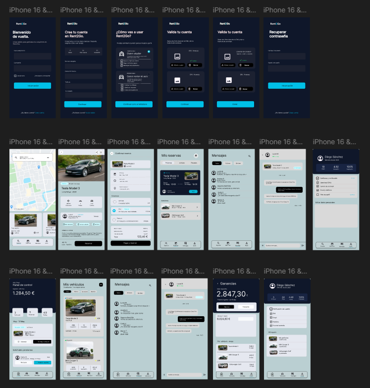
</div>

---

#### Herramienta utilizada

Para el diseño de los mock-ups se utilizó la herramienta Figma, debido a su capacidad para desarrollar prototipos interactivos, sistemas de diseño y colaboración en tiempo real durante el proceso de diseño UX/UI.

Link del archivo en Figma: [Figma Design File](https://www.figma.com/design/BMdRHNFasQzhoxhp9cJB93/Untitled?node-id=0-1&p=f&t=sAOXZsIjXz3z7kD4-0)

### 3.1.4.4. Mobile Applications User Flow Diagrams

En esta sección se presentan los User Flow Diagrams de la aplicación móvil Rent2Go, los cuales representan el recorrido que realiza el usuario para cumplir distintos objetivos dentro de la plataforma. Estos diagramas fueron elaborados considerando los User Persona definidos previamente y mantienen consistencia con los Wireflows y Mock-ups desarrollados.

<div align="center">
    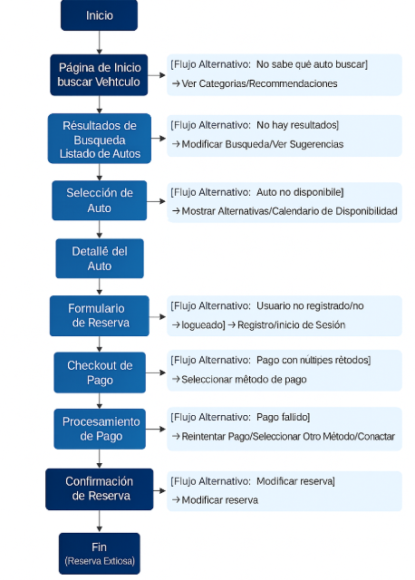
</div>

<div align="center">
    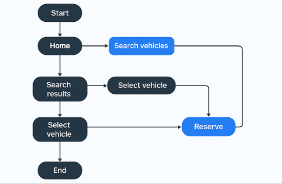
</div>

### 3.1.4.5. Mobile Applications Prototyping

Se mantiene el alcance mobile-first en el reporte, pero esta sección de prototipo interactivo queda marcada como un entregable pendiente para futuras iteraciones debido a que los esfuerzos actuales están concentrados en el desarrollo de la aplicación de producción y de los flujos estáticos del informe.

- [PENDIENTE: Configurar un prototipo interactivo con transiciones de flujos completos en Figma].
- [PENDIENTE: Grabar video demostrativo de la navegación del prototipo móvil].

---

## 3.2. Design System - Configuración base

La configuración visual real del proyecto está centralizada en los archivos fuentes de la Landing Page:
- `landing-page-samples/landing-page-main/index.html` (Declaración de fuentes tipográficas e inclusión de dependencias).
- `landing-page-samples/landing-page-main/src/style.css` (Configuración de colores de tema, variables globales del sistema de diseño y soporte para tema oscuro).
- Componentes estructurados en Vue (`App.vue` y archivos dentro de `src/components/`) que garantizan la consistencia visual y reusabilidad de los elementos de interfaz definidos.

## 3.3. Assets y Evidencias

### Evidencias Existentes en el Repositorio
- Maquetación y estructura de secciones en [index.html](file:///d:/1.-%20UNIVERSIDAD/Ciclo%209/Aplicaciones%20Moviles/final-project/project-report/README.md) (referenciando la maquetación y la tabla de contenidos general).
- Archivos de imágenes para wireframes, mockups y diagramas en la carpeta de recursos:
  - Wireframes de la Landing Page y Mobile en [Resources/capitulo_3/](file:///d:/1.-%20UNIVERSIDAD/Ciclo%209/Aplicaciones%20Moviles/final-project/project-report/Resources/capitulo_3).
  - Diagramas de flujos de usuario en `Resources/capitulo_3/flujo.png` y `flujo2.png`.

### Evidencias Pendientes
- [PENDIENTE: Capturas de pantalla de la Landing Page en modo claro y modo oscuro].
- [PENDIENTE: Reporte de contraste de color y cumplimiento de pautas de accesibilidad WCAG].
- [PENDIENTE: Capturas adicionales de pruebas responsive bajo distintos tamaños de pantalla (breakpoints)].

## 3.4. Siguientes pasos y tareas

1. Generar y anexar capturas de pantalla de la Landing Page real en ejecución en la carpeta `Resources/capitulo_3`.
2. Completar los diagramas y wireframes móviles restantes conforme el equipo de desarrollo finalice las interfaces en Figma.
3. Evaluar e integrar retroalimentación sobre la accesibilidad de colores en el Landing.
