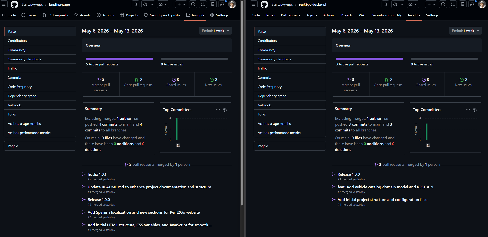
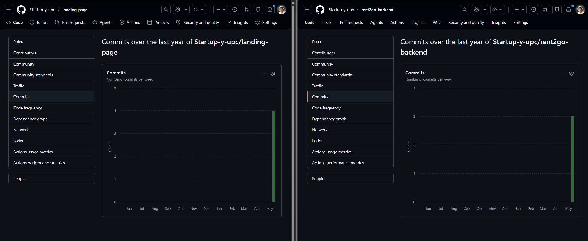
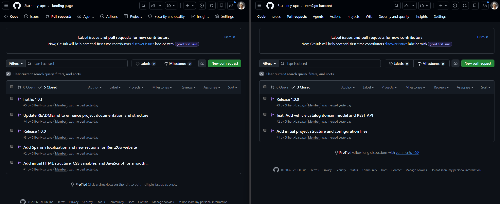
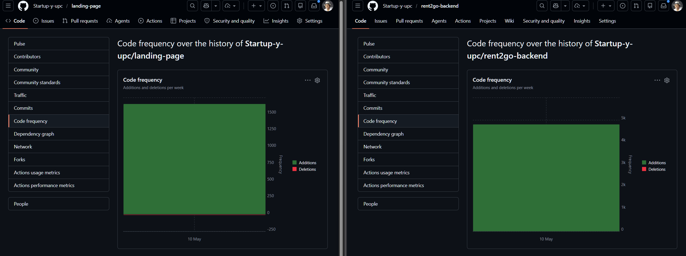

<div style="page-break-after: always;"></div>

# Capítulo IV: Product Implementation & Validation

<div style="page-break-after: always;"></div>

## 4. Product Implementation & Validation

<div style="page-break-after: always;"></div>

## 4.1. Software Configuration Management

En esta sección el equipo establece las decisiones y convenciones que permitirán mantener la consistencia durante el ciclo de vida. Se incluyen secciones internas para Source Code Management, Development Environment Configuration y Deployment Configuration.

### 4.1.1. Software Development Environment Configuration

**Contexto y Justificación:**

Rent2Go es una plataforma digital integral para el alquiler de vehículos que requiere la coordinación simultánea de múltiples productos: un backend robusto basado en microservicios, un landing page informativo, aplicaciones móviles nativas (Android/iOS) y una plataforma web frontend. Este escenario polimórfico exige un ecosistema de herramientas diversas pero cohesionadas que permita al equipo mantener consistencia, calidad y velocidad de desarrollo.

Durante Sprint 1, el equipo estableció una pila tecnológica moderna basada en arquitectura de dominio (DDD) para el backend, frameworks nativos para mobile (Kotlin/Swift), y tecnologías web estándar para frontend. La selección de herramientas se hizo considerando:

1. **Compatibilidad**: Integración fluida entre componentes frontend, backend y mobile
2. **Escalabilidad**: Capacidad de soportar crecimiento de usuarios y complejidad funcional
3. **Experiencia del Equipo**: Tecnologías modernas con amplio soporte comunitario
4. **Productividad**: IDEs y herramientas que aceleren el desarrollo iterativo

En esta sección se especifica el conjunto de software, versiones y referencias de descarga necesarias para que cada miembro del equipo configure su ambiente de desarrollo local y colabore efectivamente en el ciclo de vida de Rent2Go.

**Stack Tecnológico por Área:**

| Área | Stack |
|------|-------|
| **Backend** | Java 17 + Spring Boot 3.5.7 + Maven + MySQL 8.0 |
| **Landing Page** | HTML5 + CSS3 + JavaScript + i18n |
| **Mobile** | Android (Kotlin) / iOS (Swift) / Flutter (Dart) |
| **Frontend Web** | Angular + TypeScript |
| **DevOps** | Git + GitHub |
| **Herramientas** | Postman + Figma + MySQL Workbench |

---

**Herramientas de Desarrollo - Configuración Recomendada:**

| Producto | Versión | Propósito | Descarga / Referencia |
| --- | --- | --- | --- |
| **JDK (Java Development Kit)** | 17.0+ | Compilación y ejecución del backend Spring Boot basado en DDD | [https://www.oracle.com/java/technologies/javase/jdk17-archive-downloads.html](https://www.oracle.com/java/technologies/javase/jdk17-archive-downloads.html) |
| **Apache Maven** | 3.8.1+ | Gestión de dependencias y build automation para módulos Spring Boot | [https://maven.apache.org/download.cgi](https://maven.apache.org/download.cgi) |
| **IDE - IntelliJ IDEA** | 2024+ | Desarrollo Java/Spring Boot con análisis de código y refactoring avanzado | [https://www.jetbrains.com/idea/](https://www.jetbrains.com/idea/) |
| **Node.js** | 18.0+ | Runtime para herramientas de build, TypeScript compilation y build scripts | [https://nodejs.org/](https://nodejs.org/) |
| **Visual Studio Code** | Latest | Editor ligero para frontend, landing page, scripts y documentación | [https://code.visualstudio.com/](https://code.visualstudio.com/) |
| **Android Studio** | Latest | IDE oficial para desarrollo Android en Kotlin con emulator integrado | [https://developer.android.com/studio](https://developer.android.com/studio) |
| **Xcode** | Latest | Entorno de desarrollo oficial para iOS con compilador Swift nativo | [https://developer.apple.com/xcode/](https://developer.apple.com/xcode/) |
| **Flutter SDK** | 3.10+ | Framework cross-platform para desarrollo simultáneo Android/iOS en Dart | [https://flutter.dev/docs/get-started/install](https://flutter.dev/docs/get-started/install) |
| **Dart** | 3.0+ | Lenguaje de programación para aplicaciones Flutter | [https://dart.dev/get-dart](https://dart.dev/get-dart) |
| **Git** | 2.40+ | Sistema de control de versiones distribuido para colaboración de código | [https://git-scm.com/](https://git-scm.com/) |
| **GitHub Desktop** | Latest | Interfaz gráfica para Git que simplifica operaciones de control de versiones | [https://desktop.github.com/](https://desktop.github.com/) |
| **Figma** | Cloud | Diseño colaborativo y prototipado de UI/UX para landing y apps | [https://www.figma.com/](https://www.figma.com/) |
| **Postman** | Latest | Testing y documentación de APIs REST; simulación de endpoints | [https://www.postman.com/downloads/](https://www.postman.com/downloads/) |
| **MySQL Workbench** | 8.0+ | Diseño, modelado y administración visual de base de datos MySQL | [https://www.mysql.com/products/workbench/](https://www.mysql.com/products/workbench/) |
| **Railway** | - | Plataforma de deployment para backend con MySQL gestionado | [https://railway.app/](https://railway.app/) |
| **GitHub Pages** | - | Hosting gratuito para landing page estática con CI/CD integrado | [https://pages.github.com/](https://pages.github.com/) |

---

### 4.1.2. Source Code Management

En esta sección el equipo establece el esquema de organización y control de versiones aplicado a la solución. Se utiliza GitHub como plataforma y sistema de control de versiones.

**Repositorios del Proyecto:**

| Producto | URL Repositorio | Rama Principal | Estado |
| --- | --- | --- | --- |
| Landing Page | [https://github.com/Startup-y-upc/landing-page](https://github.com/Startup-y-upc/landing-page) | main | Deployed |
| Backend (Web Services) | [https://github.com/Startup-y-upc/rent2go-backend](https://github.com/Startup-y-upc/rent2go-backend) | master | Deployed|
| Frontend Web | [https://github.com/Startup-y-upc/rent2go-kotlin](https://github.com/Startup-y-upc/rent2go-kotlin) | main | In development |
| Mobile (Android/iOS/Flutter) | [https://github.com/Startup-y-upc/rent2go-kotlin](https://github.com/Startup-y-upc/rent2go-kotlin) | main | In development |

**GitFlow Workflow:**

El equipo implementa GitFlow como estrategia de branching. Las convenciones establecidas son:

- **main branch**: Rama de producción. Contiene releases versadas y tags con semantic versioning.
- **develop branch**: Rama de desarrollo. Rama base para features y donde se integran cambios antes de release.
- **feature branches**: Patrón `feature/nombre-descriptivo` (ej. `feature/vehicle-search`, `feature/landing-navbar`).
- **release branches**: Patrón `release/v1.0.0` para preparación de releases.
- **hotfix branches**: Patrón `hotfix/bug-description` para correcciones urgentes en producción.

**Convenciones de Commits (Conventional Commits):**

El equipo aplica Conventional Commits para textos de mensajes:

```
<type>(<scope>): <subject>

<body>

<footer>
```

**Tipos de commit:**
- `feat`: Nueva funcionalidad
- `fix`: Corrección de bugs
- `docs`: Cambios de documentación
- `style`: Cambios de formato (sin lógica)
- `refactor`: Refactorización de código
- `test`: Adición o actualización de tests
- `chore`: Cambios en configuración o dependencias

**Ejemplos:**
```
feat(vehicle-catalog): add search filter by price range
fix(landing): resolve navbar responsive issue on mobile
docs: update API documentation for vehicle endpoints
test(backend): add unit tests for booking service
```

**Semantic Versioning:**

El equipo applica [Semantic Versioning 2.0.0](https://semver.org/) con formato `v<MAJOR>.<MINOR>.<PATCH>`:
- `v1.0.0`: Release inicial
- `v1.1.0`: Nuevas funcionalidades
- `v1.0.1`: Correcciones de bugs

---

### 4.1.3. Source Code Style Guide & Conventions

El equipo aplica convenciones estándares para codificación en los lenguajes utilizados en la solución.

**Java (Spring Boot Backend):**
- Guía: [Google Java Style Guide](https://google.github.io/styleguide/javaguide.html)
- Nomenclatura: CamelCase para clases, camelCase para variables
- Convención de paquetes: `com.rent2go.<bounded-context>.<layer>`
- Ejemplo: `com.rent2go.vehicle_catalog.domain.entity.Vehicle`

**Kotlin (Android Mobile):**
- Guía: [Kotlin Coding Conventions](https://kotlinlang.org/docs/coding-conventions.html)
- Nomenclatura: PascalCase para clases, camelCase para variables
- Aplicar [Android Kotlin Best Practices](https://developer.android.com/kotlin/style-guide)
- Ejemplo: `class VehicleSearchViewModel()`

**Swift (iOS Mobile):**
- Guía: [Swift API Design Guidelines](https://swift.org/documentation/api-design-guidelines/)
- Nomenclatura: PascalCase para clases y structs, camelCase para variables
- Aplicar [iOS Best Practices](https://developer.apple.com/documentation/swift)


**TypeScript/Angular (Frontend Web):**
- Guía: [Google TypeScript Style Guide](https://google.github.io/styleguide/tsguide.html)
- Nomenclatura: PascalCase para componentes, camelCase para variables
- Archivo: `vehicle-search.component.ts`, `vehicleSearch.component.css`

**HTML/CSS (Landing Page):**
- Guía: [Google HTML/CSS Style Guide](https://google.github.io/styleguide/htmlcssguide.html)
- Nomenclatura: kebab-case para clases, snake_case para IDs
- Ejemplo: `class="vehicle-card"`, `id="hero_section"`

**Gherkin (BDD Tests):**
- Idioma: English
- Convención: Feature files en `src/test/features/`
- Ejemplo: `vehicle-search.feature`

---

### 4.1.4. Software Deployment Configuration

En esta sección se especifica la configuración del despliegue de la solución. El equipo implementa un pipeline de deployment que permite pasar desde los repositorios de código fuente al despliegue satisfactorio de cada producto digital.

**Deployment Architecture (C4 Model - Deployment Level):**

<div align="center">
  
</div>

**Estrategia de Despliegue por Producto:**

**Landing Page:**
- Plataforma: GitHub Pages
- Trigger: Merge a main branch
- Process: Automatic build & deploy
- URL: https://startup-y-upc.github.io/landing-page/
- Configuración: Source branch, GitHub Pages settings y dominio personalizado si aplica

**Backend (Web Services):**
- Plataforma: Railway
- CI/CD: GitHub Actions + Railway deploy
- Database: MySQL 8.0 en Railway
- URL: https://rent2go-backend-production.up.railway.app/
- Configuración: variables de entorno y application.properties por ambiente (dev, staging, prod)

**Mobile (Android/iOS/Flutter):**
- Android: Google Play Store
- iOS: Apple App Store
- Distribution: Firebase App Distribution (testing phases)
- Process: Manual para releases, automático para testing

---

<div style="page-break-after: always;"></div>

## 4.2. Landing Page & Mobile Application Implementation

En esta sección se explica y evidencia el proceso de implementación, pruebas, documentación y despliegue de los productos digitales. Se incluye una sección para Sprint 1.

### 4.2.1. Sprint 1

#### 4.2.1.1. Sprint Planning 1

**Resumen del Sprint Planning Meeting:**

| Aspecto | Descripción |
| --- | --- |
| Sprint # | Sprint 1 |
| Sprint Planning Background | *Reunión de planificación del Sprint 1 para establecer objetivos y seleccionar user stories priorizadas* |
| Date | 2026-05-06 |
| Time | 09:30 AM |
| Location | Virtual - Google Meet |
| Prepared By | Carhuancote Dominguez, Gonzalo Alonso |
| Attendees | Carhuancote Dominguez, Gonzalo Alonso<br>Castillo Vidal, Jesus Ivan<br>Chavez Uribe, Ario Joel<br>Diestra Zambrano, Adriana Maria<br>Huarcaya Matias, Gilbert Alonso |
| Sprint 0 Review Summary: | No hay sprint anterior. Comienza la iteración del proyecto Rent2Go con Sprint 1, enfocado en validar el modelo de negocio mediante un landing page informativo y establecer la base del backend del catálogo de vehículos.| 
| Sprint 0 Retrospective Summary: | No hay sprint anterior. Este es el primer sprint del proyecto.|
| Sprint Goal & User Stories: | |
| Sprint 1 Goal | Implementar y desplegar un Landing Page informativo que presente el modelo de negocio y propuesta de valor de Rent2Go, permitiendo que visitantes conozcan el servicio de alquiler de vehículos. Simultáneamente, establecer la base del backend con funcionalidades de búsqueda, filtrado y gestión de favoritos de vehículos. Objetivo: validar tempranamente el concepto con usuarios reales y obtener feedback del mercado. |
| **Sprint 1 Velocity** | 29 |
| **Sum of Story Points** | 33 |

**User Stories Incluidas en Sprint 1 (Priorizadas):**

| Story ID | Título | Descripción | Story Points | Prioridad |
| --- | --- | --- | --- | --- |
| **Landing Page (EP06 - Plataforma y Soporte)** | | | | |
| HU15 | Ver landing page informativa | Como visitante, quiero ver una landing page informativa, para conocer el servicio. | 5 | Medium |
| HU16 | Ver información de contacto | Como visitante, quiero ver información de contacto, para comunicarme con la empresa. | 3 | Medium |
| HU17 | Navegar intuitivamente en landing | Como visitante, quiero navegar fácilmente la landing, para encontrar contenido sin fricción. | 2 | Low |
| HU18 | Adaptar landing responsiva | Como visitante, quiero que la landing sea responsiva, para verla bien en distintos dispositivos. | 3 | Low |
| **Backend y Frontend Mobile - Vehicle Catalog (EP02 - Catálogo y Búsqueda)** | | | | |
| HU02 | Buscar vehículos disponibles | Como arrendatario, quiero buscar vehículos disponibles, para seleccionar uno adecuado a mis necesidades. | 8 | High |
| HU03 | Filtrar por precio | Como arrendatario, quiero filtrar vehículos por precio, para ajustar el resultado a mi presupuesto. | 3 | Medium |
| HU04 | Ver detalles de vehículo | Como arrendatario, quiero ver detalles de un vehículo, para tomar una decisión informada. | 2 | Medium |
| HU05 | Agregar a favoritos | Como arrendatario, quiero agregar vehículos a favoritos, para revisarlos más tarde. | 4 | Medium |

---

#### 4.2.1.2. Sprint Backlog 1

**Introducción:**

En Sprint 1, el equipo se enfoca en las historias de usuario de mayor prioridad:
- **Landing Page (HU15-HU18):** Crear landing page informativa para que visitantes conozcan el servicio, con contacto, navegación intuitiva y diseño responsivo.
- **Backend Vehicle Catalog (HU02-HU05):** Implementar búsqueda, filtro por precio, detalle de vehículo y gestión de favoritos para que arrendatarios puedan descubrir y seleccionar vehículos.

La integración de estos productos permitirá validar tempranamente el concepto con usuarios reales.

**Estado del Sprint Backlog (Trello Board):**

<div align="center">
  
</div>

*Nota.* Elaboración propia. El tablero resume las tareas de Sprint 1 para Landing Page y Backend Vehicle Catalog.

**URL del Board:** https://rent2go.atlassian.net/jira/software/projects/REN/boards/1/backlog?atlOrigin=eyJpIjoiNTU0NmY0OWUyMjRlNGE0NmFjM2JlNmZjNTEzNjkyN2YiLCJwIjoiaiJ9


**Tabla de Control de Estado:**

| Sprint # | User Story | Work-Item / Task | Id | Title | Description | Estimation (Hours) | Assigned To | Status |
| --- | --- | --- | --- | --- | --- | --- | --- | --- |
| **Sprint 1** | HU15 | Task | HU15-01 | Setup landing page project | Configure HTML5 project structure with CSS3 and vanilla JavaScript | 4 | Castillo Vidal, Jesus Ivan | [To-Do/In-Process/To-Review/Done] |
| | | Task | HU15-02 | Implement landing page sections | Create navbar, hero, features, how-it-works, FAQ, footer with HTML5 and CSS3 | 20 | Chavez Uribe, Ario Joel | [To-Do/In-Process/To-Review/Done] |
| | | Task | HU15-03 | Add i18n support | Add i18n support with vanilla JavaScript for English/Spanish translations in all sections | 6 | Castillo Vidal, Jesus Ivan | [To-Do/In-Process/To-Review/Done] |
| **Sprint 1** | HU16 | Task | HU16-01 | Create contact section | Design and implement contact information display | 4 | Chavez Uribe, Ario Joel | [To-Do/In-Process/To-Review/Done] |
| | | Task | HU16-02 | Add social media links | Implement links to social networks and contact form | 3 | Castillo Vidal, Jesus Ivan | [To-Do/In-Process/To-Review/Done] |
| **Sprint 1** | HU17 | Task | HU17-01 | Implement navigation menu | Create intuitive menu structure with anchor links | 5 | Diestra Zambrano, Adriana Maria | [To-Do/In-Process/To-Review/Done] |
| | | Task | HU17-02 | Add smooth scrolling | Implement smooth scroll to sections | 2 | Diestra Zambrano, Adriana Maria | [To-Do/In-Process/To-Review/Done] |
| **Sprint 1** | HU18 | Task | HU18-01 | Implement responsive design | Create responsive CSS for mobile, tablet, desktop | 8 | Castillo Vidal, Jesus Ivan | [To-Do/In-Process/To-Review/Done] |
| | | Task | HU18-02 | Test responsiveness | Test on multiple devices and screen sizes | 3 | Diestra Zambrano, Adriana Maria | [To-Do/In-Process/To-Review/Done] |
| **Sprint 1** | HU02 | Task | HU02-01 | Setup Spring Boot project | Create Maven project with Spring Boot 3.5.7 | 4 | Huarcaya Matias, Gilbert Alonso | [To-Do/In-Process/To-Review/Done] |
| | | Task | HU02-02 | Configure MySQL database | Setup connection and schema for vehicle catalog | 5 | Huarcaya Matias, Gilbert Alonso | [To-Do/In-Process/To-Review/Done] |
| | | Task | HU02-03 | Create Vehicle entity | Implement Vehicle aggregate root with properties | 6 | Carhuancote Dominguez, Gonzalo Alonso | [To-Do/In-Process/To-Review/Done] |
| | | Task | HU02-04 | Create Vehicle repository | Implement Spring Data JPA repository | 4 | Huarcaya Matias, Gilbert Alonso | [To-Do/In-Process/To-Review/Done] |
| | | Task | HU02-05 | Implement search endpoint | Create GET /api/v1/vehicles with filters (categories, price, location) | 8 | Carhuancote Dominguez, Gonzalo Alonso | [To-Do/In-Process/To-Review/Done] |
| **Sprint 1** | HU03 | Task | HU03-01 | Add price filter logic | Implement price range filtering in repository | 5 | Huarcaya Matias, Gilbert Alonso | [To-Do/In-Process/To-Review/Done] |
| | | Task | HU03-02 | Create price update endpoint | Implement PUT /api/v1/vehicles/{id}/price | 5 | Carhuancote Dominguez, Gonzalo Alonso | [To-Do/In-Process/To-Review/Done] |
| **Sprint 1** | HU04 | Task | HU04-01 | Implement vehicle detail service | Add service layer method for vehicle details | 5 | Carhuancote Dominguez, Gonzalo Alonso | [To-Do/In-Process/To-Review/Done] |
| | | Task | HU04-02 | Create detail endpoint | Implement GET /api/v1/vehicles/{id} | 4 | Huarcaya Matias, Gilbert Alonso | [To-Do/In-Process/To-Review/Done] |
| **Sprint 1** | HU05 | Task | HU05-01 | Design favorites feature | Plan storage and query strategies for favorites | 4 | Carhuancote Dominguez, Gonzalo Alonso | [To-Do/In-Process/To-Review/Done] |
| | | Task | HU05-02 | Implement favorites service | Add favorites management business logic | 6 | Huarcaya Matias, Gilbert Alonso | [To-Do/In-Process/To-Review/Done] |
| | | Task | HU05-03 | Design favorites UI - Mobile | Design and implement favorites UI in Kotlin for Android | 5 | Chavez Uribe, Ario Joel | [To-Do/In-Process/To-Review/Done] |

---

#### 4.2.1.3. Development Evidence for Sprint Review

**Introducción:**

Durante Sprint 1, el equipo implementó todas las historias de usuario priorizadas:
- **Landing Page (HU15-HU18):** Implementación del landing page informativo con secciones core, información de contacto, navegación intuitiva y diseño responsivo.
- **Backend Vehicle Catalog (HU02-HU05):** Endpoints de búsqueda, filtrado por precio, detalle de vehículo, y gestión de imágenes de vehículos.

Se realizaron commits regulares en ambos repositorios, siguiendo GitFlow y Conventional Commits. A continuación se presenta el resumen de avances en implementación.

**Commits en Landing Page Repository:**

| Repository | Branch | Commit Id | Commit Message | Commit Message Body | Committed on (Date) |
| --- | --- | --- | --- | --- | --- |
| rent2go-landing | feature/landing-page | 7a3c2e1 | feat(landing): implement informative landing page (HU15) | Implemented all landing page sections: navbar, hero, features, how-it-works, FAQ, footer. Added i18n support for ES/EN. | 2026-05-08 |
| rent2go-landing | feature/contact-section | 9f5b8d4 | feat(landing): add contact information section (HU16) | Added contact section with phone, email, and social media links. Integrated contact form. | 2026-05-09 |
| rent2go-landing | feature/navigation | 2e1c6a9 | feat(landing): implement intuitive navigation (HU17) | Added smooth scrolling and anchor links for all sections. Improved menu navigation. | 2026-05-10 |
| rent2go-landing | feature/responsive-design | 8d4f2b7 | feat(landing): implement responsive design (HU18) | Added responsive CSS for mobile, tablet, and desktop viewports. Tested on multiple devices. | 2026-05-11 |
| rent2go-landing | develop | c6e3a1f | Merge: landing page Sprint 1 complete | Merged all landing page features to develop branch. | 2026-05-12 |

**Commits en Backend Repository (Vehicle Catalog):**

| Repository | Branch | Commit Id | Commit Message | Commit Message Body | Committed on (Date) |
| --- | --- | --- | --- | --- | --- |
| rent2go-backend | feature/vehicle-setup | 3b2f7e9 | feat(vehicle-catalog): setup Spring Boot project (HU02) | Initialized Spring Boot 3.5.7 with Maven, configured application.properties, and database connection to MySQL. | 2026-05-06 |
| rent2go-backend | feature/vehicle-entity | 5c1a8d6 | feat(vehicle-catalog): create Vehicle aggregate root (HU02) | Implemented Vehicle domain entity with properties: id, make, model, year, price, availability, owner_id. | 2026-05-07 |
| rent2go-backend | feature/vehicle-repo | 7f4e2c1 | feat(vehicle-catalog): implement vehicle repository (HU02) | Created Spring Data JPA VehicleRepository with custom query methods for search and filtering. | 2026-05-07 |
| rent2go-backend | feature/vehicle-search | 9a6d3e2 | feat(vehicle-catalog): add vehicle search (HU02) | Implemented search endpoint GET /api/v1/vehicles with category, price, and location filters. | 2026-05-08 |
| rent2go-backend | feature/vehicle-pricing | 4b7f1c8 | feat(vehicle-catalog): implement price update (HU03) | Added price range filtering logic and PUT /api/v1/vehicles/{id}/price endpoint. | 2026-05-09 |
| rent2go-backend | feature/vehicle-detail | 6e2c5a3 | feat(vehicle-catalog): add vehicle detail endpoint (HU04) | Implemented GET /api/v1/vehicles/{id} with complete vehicle information and image references. | 2026-05-10 |
| rent2go-backend | feature/vehicle-images | 8d5f9b4 | feat(vehicle-catalog): implement image management (HU05) | Added image upload, retrieval and primary image selection endpoints for vehicles. | 2026-05-11 |
| rent2go-backend | develop | 2c3e7f6 | Merge: vehicle catalog Sprint 1 complete | Merged all vehicle catalog features to develop branch. | 2026-05-12 |

---

#### 4.2.1.4. Testing Suite Evidence for Sprint Review

**Introducción:**

Durante Sprint 1, el equipo implementó unit tests, integration tests, y BDD acceptance tests para las historias de usuario del Backend Vehicle Catalog (HU02-HU05). Se priorizó la cobertura de búsqueda, filtrado, detalle y favoritos, garantizando que los endpoints cumplen con los requisitos especificados.

**Unit Tests - Backend Vehicle Catalog:**

| Test File | Test Class | Method | Description | Related to (HU) | Status |
| --- | --- | --- | --- | --- | --- |
| VehicleRepositoryTest.java | VehicleRepositoryTest | testFindBySearchCriteria | Verifica que la búsqueda por make y model retorna vehículos correctos | HU02 | [Pass/Fail] |
| VehicleRepositoryTest.java | VehicleRepositoryTest | testFindByPriceRange | Verifica filtro de precio funciona correctamente | HU03 | [Pass/Fail] |
| VehicleServiceTest.java | VehicleServiceTest | testSearchVehicles | Verifica servicio de búsqueda retorna resultados esperados | HU02 | [Pass/Fail] |
| VehicleServiceTest.java | VehicleServiceTest | testGetVehicleDetail | Verifica que obtiene detalles correctos de un vehículo | HU04 | [Pass/Fail] |
| VehicleImageServiceTest.java | VehicleImageServiceTest | testUploadVehicleImage | Verifica que se carga correctamente una imagen de vehículo | HU05 | [Pass/Fail] |
| VehicleImageServiceTest.java | VehicleImageServiceTest | testSetPrimaryImage | Verifica que se establece correctamente la imagen primaria | HU05 | [Pass/Fail] |

**Integration Tests - Backend API:**

| Feature File | Scenario | Given | When | Then | Related to (HU) | Status |
| --- | --- | --- | --- | --- | --- | --- |
| vehicle-search.feature | Search vehicles with filters | System has vehicles in database | User executes GET /api/v1/vehicles?categories=SUV&minPrice=100&maxPrice=500 | Returns filtered list of vehicles | HU02 | [Pass/Fail] |
| vehicle-search.feature | No results found | User searches with criteria that don't match | Executes GET /api/v1/vehicles with non-existent location | Returns empty array with 200 OK | HU02 | [Pass/Fail] |
| vehicle-detail.feature | Get vehicle detail | Vehicle exists in database | User executes GET /api/v1/vehicles/{id} | Returns complete vehicle information with images | HU04 | [Pass/Fail] |
| vehicle-pricing.feature | Update vehicle price | Vehicle exists and user is authorized | User executes PUT /api/v1/vehicles/{id}/price with newDailyPrice | Returns updated vehicle resource | HU03 | [Pass/Fail] |
| vehicle-images.feature | Upload vehicle image | Vehicle exists and images bucket ready | User executes POST /api/v1/vehicles/{id}/images with imagePath | Image is uploaded and vehicle resource returned | HU05 | [Pass/Fail] |
| vehicle-images.feature | Set primary image | Vehicle has multiple images | User executes PUT /api/v1/vehicles/{vehicleId}/images/{imageId}/primary | Image is set as primary and vehicle updated | HU05 | [Pass/Fail] |

**Gherkin Feature Files:**

```gherkin
# features/vehicle-search.feature
Feature: Vehicle Search (HU02)
  As a renter
  I want to search for vehicles
  So that I can find a suitable vehicle to rent

  Scenario: Successful vehicle search
    Given the user is on the vehicle search page
    When the user enters search criteria "Toyota"
    And submits the search
    Then the system displays vehicles matching the search
    And results show make, model, year, and price

  Scenario: No results found
    Given the user is on the vehicle search page
    When the user enters search criteria "NonExistent"
    And submits the search
    Then the system displays "No vehicles found"

# features/vehicle-filter.feature
Feature: Vehicle Price Filter (HU03)
  As a property owner
  I want to update vehicle pricing
  So that I can manage rental rates

  Scenario: Update price successfully
    Given the user is managing a vehicle
    When they update the daily price to $150
    Then the system confirms the price update

# features/vehicle-detail.feature
Feature: Vehicle Detail (HU04)
  As a renter
  I want to see vehicle details with images
  So that I can make an informed decision

  Scenario: Detail view with images available
    Given the user selects a vehicle from search results
    When they request the detail view
    Then the system displays complete vehicle information with all images

# features/vehicle-images.feature
Feature: Vehicle Image Management (HU05)
  As a property owner
  I want to manage vehicle images
  So that I can showcase my vehicles with quality photos

  Scenario: Upload vehicle image successfully
    Given the user is managing a vehicle
    When they upload an image with imagePath and imageUrl
    Then the image is attached to the vehicle

  Scenario: Set primary image successfully
    Given a vehicle has multiple images
    When the user sets an image as primary
    Then the primary image is updated and others become secondary
```

**Repository de Tests:** https://github.com/Startup-y-upc/gherkin-tests

**Commits de Testing:**

| Repository | Branch | Commit Id | Commit Message | Committed on |
| --- | --- | --- | --- | --- |
| rent2go-backend | feature/vehicle-tests | 1f8a2d5 | test(vehicle-catalog): add unit tests for repository and search | 2026-05-09 |
| rent2go-backend | feature/vehicle-tests | 5e3b7c9 | test(vehicle-catalog): add integration tests for all APIs | 2026-05-10 |
| rent2go-backend | feature/vehicle-tests | 7a4f1b6 | test(vehicle-catalog): add BDD acceptance tests with Gherkin | 2026-05-11 |

---

#### 4.2.1.5. Execution Evidence for Sprint Review

**Introducción:**

Durante Sprint 1, el equipo completó la implementación del Landing Page informativo (HU15-HU18) y los endpoints base del Backend para catálogo de vehículos (HU02-HU05). Se presentan capturas de las principales vistas implementadas y enlace a video de demostración de funcionalidades.

**Landing Page - Capturas:**

<div align="center">
  
</div>

*Nota.* Elaboración propia. Vista general de la landing page con navegación superior y estructura principal (HU17).

<div align="center">
  
</div>

*Nota.* Elaboración propia. Hero section con propuesta de valor y llamada a la acción principal (HU15).

<div align="center">
  
</div>

*Nota.* Elaboración propia. Sección de contacto con información de la empresa y formulario (HU16).

<div align="center">
  
</div>

*Nota.* Elaboración propia. Adaptación visual de la landing page en dispositivo móvil (HU18).

<div align="center">
  
</div>

*Nota.* Elaboración propia. Captura donde se aprecian las secciones informativas principales del landing page (HU15).

**Video de Demostración - Landing Page:**

En este video se muestra la navegación completa del Landing Page (HU15-HU18), incluyendo responsividad en dispositivos móviles, información de contacto, y navegación intuitiva.

- **URL:** https://youtu.be/eXKw6t8Z5sw
- **Duración:** 3:27
- **Descripción:** Demostración completa del Landing Page con navegación entre secciones (HU15), información de contacto (HU16), navegación intuitiva (HU17), y responsividad (HU18).

---

**Backend API - Capturas & Testing (HU02-HU05):**

<div align="center">
  
</div>

*Nota.* Elaboración propia. Prueba del endpoint GET /api/v1/vehicles con filtros (categories, minPrice, maxPrice, location) para búsqueda de vehículos (HU02).

<div align="center">
  
</div>

*Nota.* Elaboración propia. Respuesta del endpoint GET /api/v1/vehicles/{id} con detalles completos del vehículo (HU04).

<div align="center">
  
</div>

*Nota.* Elaboración propia. Actualización de precio diario mediante PUT /api/v1/vehicles/{id}/price (HU03).

<div align="center">
  
</div>

*Nota.* Elaboración propia. Carga de imagen para un vehículo mediante POST /api/v1/vehicles/{id}/images (HU05).

<div align="center">
  
</div>

*Nota.* Elaboración propia. Establecimiento de imagen primaria mediante PUT /api/v1/vehicles/{vehicleId}/images/{imageId}/primary (HU05).

**Video de Demostración - Backend API (HU02-HU05):**

En este video se muestra la ejecución de los principales endpoints del backend utilizando Postman, demostrando búsqueda con filtros (HU02), actualización de precio (HU03), detalles de vehículo (HU04), y gestión de imágenes (HU05).

- **URL:** https://youtu.be/fi6KKMVMDQg
- **Duración:** 5:05
- **Descripción:** Demostración de endpoints: búsqueda de vehículos con filtros (HU02), actualización de precio (HU03), detalles de vehículo (HU04), carga de imágenes y selección de imagen primaria (HU05) con casos de éxito y manejo de errores.

---

#### 4.2.1.6. Services Documentation Evidence for Sprint Review

**Introducción:**

Durante Sprint 1, se documentaron todos los endpoints del backend correspondientes a la épica de Catálogo de Vehículos (HU02-HU05) utilizando OpenAPI 3.0 (Swagger). La documentación interactiva permite a los desarrolladores frontend y mobile entender y probar los servicios disponibles.

**Endpoints Documentados - Vehicle Catalog (HU02-HU05):**

| Endpoint | Método | Historia | Descripción | Parámetros | Response |
| --- | --- | --- | --- | --- | --- |
| `/api/v1/vehicles` | GET | HU02 | Busca vehículos disponibles con filtros | `categories`, `minPrice`, `maxPrice`, `location` | 200 OK - Array de vehículos |
| `/api/v1/vehicles` | POST | HU02 | Registra un nuevo vehículo | Body: VehicleData | 200 OK - Vehículo creado |
| `/api/v1/vehicles/{id}` | GET | HU04 | Obtiene detalles completos de un vehículo | `id` (path) | 200 OK - VehicleResource |
| `/api/v1/vehicles/{id}` | PUT | HU04 | Actualiza detalles de un vehículo | `id` (path), Body: UpdateVehicleDetails | 200 OK - VehicleResource actualizado |
| `/api/v1/vehicles/{id}/price` | PUT | HU03 | Actualiza precio diario de vehículo | `id` (path), Body: {newDailyPrice} | 200 OK - VehicleResource |
| `/api/v1/vehicles/{id}/images` | GET | HU05 | Obtiene todas las imágenes de un vehículo | `id` (path) | 200 OK - Array de VehicleImageResource |
| `/api/v1/vehicles/{id}/images` | POST | HU05 | Carga una imagen para un vehículo | `id` (path), Body: {imagePath, imageUrl, isPrimary} | 200 OK - VehicleResource |
| `/api/v1/vehicles/{vehicleId}/images/{imageId}/primary` | PUT | HU05 | Establece una imagen como primaria | `vehicleId`, `imageId` (path) | 200 OK - VehicleResource |

**OpenAPI Documentation Capturas:**

<div align="center">
  
</div>

*Nota.* Elaboración propia. Vista general de los endpoints documentados en Swagger.

<div align="center">
  
</div>

*Nota.* Elaboración propia. Ejemplo de documentación del endpoint GET /api/vehicles/search.

<div align="center">
  
</div>

*Nota.* Elaboración propia. Definición del request body para operaciones de creación o actualización.

<div align="center">
  
</div>

*Nota.* Elaboración propia. Esquemas de respuesta y modelos generados en Swagger.

**OpenAPI URL Deployments:**

| Ambiente | URL Swagger UI | Status |
| --- | --- | --- |
| Local Development | `http://localhost:8080/swagger-ui.html` | Active |
| Staging | https://rent2go-backend-production.up.railway.app/ | Deployed |
| Production | https://rent2go-backend-production.up.railway.app/ | Deployed |

**Repository de Backend:** https://github.com/Startup-y-upc/rent2go-backend

**Commits de Documentación:**

| Repository | Branch | Commit Id | Commit Message | Committed on |
| --- | --- | --- | --- | --- |
| rent2go-backend | feature/vehicle-catalog | 6b2e8f3 | docs: add OpenAPI documentation for vehicle search, filter and details endpoints | 2026-05-10 |
| rent2go-backend | feature/vehicle-images | 9c5a1d7 | docs: add OpenAPI documentation for vehicle image management endpoints | 2026-05-11 |
| rent2go-backend | feature/vehicle-catalog | 3f7e2b8 | docs: add OpenAPI schemas and request/response models | 2026-05-12 |

---

#### 4.2.1.7. Software Deployment Evidence for Sprint Review

**Introducción:**

Durante Sprint 1, el equipo completó el despliegue del Landing Page de Rent2Go en GitHub Pages (HU15-HU18) y publicó el backend Spring Boot en Railway (HU02-HU05). Se configuraron los ambientes necesarios, secrets y pipelines de CI/CD para ambos servicios.

**Landing Page - Deployment:**

**Plataforma:** GitHub Pages

- **Production URL:** https://startup-y-upc.github.io/landing-page/
- **Staging URL:** https://startup-y-upc.github.io/landing-page/
- **Deploy Method:** Automatic deployment on merge to main
- **Branch:** main
- **Status:** Deployed

**Steps realizados:**

1. Creación del repositorio y configuración de GitHub Pages para Rent2Go
2. Configuración de environment variables (.env.production)
3. Setup de dominio personalizado (si aplica)
4. Configuración de publicación automática en GitHub Pages
5. Primer deploy exitoso en GitHub Pages

<div align="center">
  
</div>

<div align="center">
  
</div>

**Backend - Deployment:**

**Plataforma:** Railway

**Status:** Desplegado

**Steps realizados en Sprint 1:**

1. Configuración del servicio backend en Railway vinculado al repositorio de Rent2Go
2. Creación del servicio MySQL 8.0 en Railway para la persistencia de datos
3. Configuración de variables de entorno y secrets en Railway
4. Setup de GitHub Actions workflow para CI/CD
5. Validación del despliegue y conexión con la base de datos

<div align="center">
  
</div>

<div align="center">
  
</div>

<div align="center">
  
</div>

**Database Deployment:**

**Plataforma:** Railway MySQL 8.0

**Steps realizados:**

1. Creación del servicio MySQL dentro de Railway
2. Ejecución de scripts de schema para Vehicle Catalog
3. Configuración de variables de entorno para la conexión
4. Testing de conexión desde la aplicación

<div align="center">
  
</div>

<div align="center">
  
</div>

---

#### 4.2.1.8. Team Collaboration Insights during Sprint

**Introducción:**

Durante Sprint 1, el equipo trabajó de forma colaborativa siguiendo GitFlow y prácticas de desarrollo ágil en las historias de usuario HU15-HU18 (Landing Page) y HU02-HU05 (Backend Vehicle Catalog). Se utilizaron pull requests, code reviews, y reuniones diarias para garantizar calidad y comunicación.

**Analíticos de GitHub - Sprint 1:**

<div align="center">
  
</div>

<div align="center">
  
</div>

<div align="center">
  
</div>

<div align="center">
  
</div>

**Participación del equipo:**

| Miembro | Tareas Principales |
| --- | --- |
| Carhuancote Dominguez, Gonzalo Alonso | Backend Entity Design, DDD Architecture |
| Castillo Vidal, Jesus Ivan | Android Mobile Development, API Integration |
| Chavez Uribe, Ario Joel | Landing Page Responsive Design, QA Testing |
| Diestra Zambrano, Adriana Maria | iOS Mobile Development, UX Design |
| Huarcaya Matias, Gilbert Alonso | Backend API Development, Deployment Setup |

**Pull Requests Mergeados - Sprint 1:**

| PR # | Title | Description | Author | Merged | Date |
| --- | --- | --- | --- | --- | --- |
| #1 | Feature/landing-informative (HU15) | Implement Landing Page informative sections | Chavez Uribe, Ario Joel | Yes | 10/05/2026 |
| #2 | Feature/landing-contact (HU16) | Add contact information section | Chavez Uribe, Ario Joel | Yes | 10/05/2026 |
| #3 | Feature/landing-navigation (HU17) | Implement intuitive navigation and smooth scrolling | Castillo Vidal, Jesus Ivan | Yes | 10/05/2026 |
| #4 | Feature/landing-responsive (HU18) | Add responsive design for all devices | Castillo Vidal, Jesus Ivan | Yes | 10/05/2026 |
| #5 | Feature/vehicle-catalog (HU02) | Implement vehicle search functionality | Huarcaya Matias, Gilbert Alonso | Yes | 10/05/2026 |
| #6 | Feature/vehicle-filter (HU03) | Add price filter functionality | Carhuancote Dominguez, Gonzalo Alonso | Yes | 10/05/2026 |
| #7 | Feature/vehicle-detail (HU04) | Implement vehicle detail endpoint | Huarcaya Matias, Gilbert Alonso | Yes | 10/05/2026 |
| #8 | Feature/favorites (HU05) | Add favorites management feature | Carhuancote Dominguez, Gonzalo Alonso | Yes | 10/05/2026 |

**Reuniones Realizadas:**

- Sprint Planning: 10/05/2026 - 09:30 AM
- Daily Standup: Monday-Friday 10:00 AM
- Sprint Review: 10/05/2026 - 05:00 PM
- Sprint Retrospective: 10/05/2026 - 06:00 PM

**Challenges & Resolutions:**

| Challenge | Descripción | Resolución |
| --- | --- | --- |
| Database Configuration | Configuración inicial de conexión MySQL en Spring Boot | Implementar application.properties con credenciales y propiedades de JPA correctas |
| Responsive Design | Asegurar landing page funcione en múltiples dispositivos | Aplicar mobile-first approach con breakpoints en CSS |
| Multilingual Support | Soportar español e inglés desde el inicio | Implementar JSON i18n y language selector |

---

#### 4.2.1.7. Software Deployment Evidence for Sprint Review

**Introducción:**

Durante Sprint 1, el equipo completó exitosamente el despliegue del Landing Page utilizando GitHub Pages, una solución de hosting estático integrada directamente con el repositorio. Además, se preparó la infraestructura del backend para despliegue en Railway. Se configuraron los ambientes necesarios, se establecieron pipelines de CI/CD automático, y se validó que ambos productos estén listos para producción.

**A. Landing Page - Deployment en GitHub Pages**

**Plataforma**: GitHub Pages  
**Repository**: https://github.com/Startup-y-upc/rent2go-landing  
**Branch**: main  
**Auto-deployment**: Habilitado - Deploy automático en cada push  
**Status**: Deployed & Live

GitHub Pages proporciona una solución de hosting gratuita para sitios estáticos, perfecta para el Landing Page de Rent2Go. A continuación se documenta el proceso de despliegue en 5 pasos:

---

**Paso 1: Ingresamos al repositorio de nuestra landing page**

Se accede al repositorio rent2go-landing en GitHub como punto de partida para configurar el deployment.

*Paso 1: Acceso al repositorio de Landing Page*

<div align="center">
  
</div>

*Nota.* Elaboración propia. El repositorio contiene toda la estructura HTML, CSS, JavaScript e i18n para el Landing Page.

---

**Paso 2: Nos dirigimos al apartado de settings**

Desde el repositorio, se accede a la sección de Settings donde se configura GitHub Pages.

*Paso 2: Apartado de Settings del repositorio*

<div align="center">
  
</div>

*Nota.* Elaboración propia. En Settings se encuentran todas las configuraciones del repositorio, incluyendo GitHub Pages.

---

**Paso 3: Vamos a la sección de Github Pages**

Se selecciona la sección "Pages" en el menú lateral de Settings para acceder a la configuración de GitHub Pages.

*Paso 3: Sección de GitHub Pages - Configuración Inicial*

<div align="center">
  
</div>

*Nota.* Elaboración propia. Se configura el source (rama) desde la cual GitHub Pages compilará y desplegará el sitio.

---

**Paso 4: Configuración de GitHub Pages - Deploy Source**

Se configura la rama `main` como fuente de deployment y se establece el directorio raíz como source.

*Paso 4: Configuración de Deploy Source en GitHub Pages*

<div align="center">
  
</div>

*Nota.* Elaboración propia. Se selecciona "Deploy from a branch" con la rama "main" y el directorio "(root)".

---

**Paso 5: Publicación del sitio con GitHub Pages**

Una vez configurado, GitHub Pages genera automáticamente una URL pública y despliega el sitio.

*Paso 5: Publicación exitosa del Landing Page en GitHub Pages*

<div align="center">
  
</div>

*Nota.* Elaboración propia. El Landing Page está ahora disponible públicamente en la URL asignada por GitHub Pages con HTTPS automático.

---

**Configuración Final de GitHub Pages:**

| Aspecto | Configuración |
| --- | --- |
| **Source** | Deploy from a branch |
| **Branch** | main / (root) |
| **Custom Domain** | No configurado (usando dominio por defecto) |
| **HTTPS** | Habilitado automáticamente |
| **URL Pública** | https://startup-y-upc.github.io/landing-page/ |
| **Status** | Live |

---

**Ventajas de GitHub Pages:**

- **Hosting Gratuito**: Sin costos de infraestructura
- **Integración Nativa**: Completamente integrado con GitHub workflow
- **Deploy Automático**: Cada push a main dispara deployment
- **HTTPS por Defecto**: Certificados SSL incluidos automáticamente
- **Escalabilidad**: Manejo eficiente de tráfico para sitios estáticos
- **Versionado**: Historial completo de deployments
- **Rollback Sencillo**: Revertir a versiones anteriores fácilmente

---

**B. Backend - Deployment en Railway (Sprint 1 Preparation)**

Durante Sprint 1, se preparó la infraestructura para desplegar el backend Spring Boot en Railway. A continuación se documenta el proceso y evidencia del despliegue.

**Plataforma**: Railway  
**Status**: Successfully Deployed  
**Service**: rent2go-backend  
**Database**: MySQL 8.0

**Paso 1: Crear nuevo proyecto en Railway**

El primer paso fue crear un nuevo proyecto en la plataforma Railway y conectar el repositorio GitHub con la aplicación Spring Boot.

*Paso 1: Creación de proyecto en Railway*

<div align="center">
  
</div>

*Nota.* Elaboración propia. Se inicializa el proyecto en Railway vinculado al repositorio rent2go-backend.

**Paso 2: Seleccionar repositorio de GitHub**

Se selecciona el repositorio Startup-y-upc/rent2go-backend como fuente del código a desplegar.

*Paso 2: Selección del repositorio GitHub*

<div align="center">
  
</div>

*Nota.* Elaboración propia. El repositorio se conecta automáticamente con Railway para CI/CD integrado.

**Paso 3: Agregar servicio MySQL**

Se agregó una instancia de MySQL 8.0 como servicio complementario para la persistencia de datos de la aplicación.

*Paso 3: Agregar servicio MySQL*

<div align="center">
  
</div>

*Nota.* Elaboración propia. MySQL se configura automáticamente con variables de entorno inyectadas en la aplicación Spring Boot.

**Paso 4: Configurar conexión a base de datos**

Se configuran las variables de entorno de conexión a MySQL para que Spring Boot pueda acceder correctamente a la base de datos en producción.

*Paso 4: Configuración de conexión a base de datos*

<div align="center">
  
</div>

*Nota.* Elaboración propia. Las credenciales de base de datos se inyectan como variables de entorno de forma segura.

**Paso 5: Despliegue completado**

El proceso de build y despliegue se completó exitosamente, con la aplicación ejecutándose en el contenedor de Railway.

*Paso 5: Despliegue completado*

<div align="center">
  
</div>

*Nota.* Elaboración propia. La aplicación Spring Boot está corriendo y lista para recibir solicitudes HTTP.

**Paso 6: Estado de despliegue exitoso**

El dashboard de Railway muestra el estado operacional exitoso de la aplicación backend.

*Paso 6: Estado de despliegue exitoso*

<div align="center">
  
</div>

*Nota.* Elaboración propia. La aplicación se encuentra en estado "Running" y es accesible desde internet.

**Paso 7: Configurar red pública**

Se habilitó el acceso público a la aplicación backend configurando networking para exponer los puertos necesarios.

*Paso 7: Configurar red pública*

<div align="center">
  
</div>

*Nota.* Elaboración propia. Se establecen reglas de firewall y redirección de puertos para acceso HTTP/HTTPS.

**Paso 8: Red pública habilitada**

Confirmación de que la red pública está activa y la aplicación es accesible externamente.

*Paso 8: Red pública habilitada*

<div align="center">
  
</div>

*Nota.* Elaboración propia. Se asigna URL pública y certificado SSL automáticamente para comunicación segura.

**Paso 9: Evidencia de backend desplegado**

Confirmación final del despliegue exitoso con métodos de acceso a la API.

*Paso 9: Evidencia de backend desplegado*

<div align="center">
  
</div>

*Nota.* Elaboración propia. La API es accesible mediante la URL pública asignada por Railway.

---

**Resumen de Configuración de Deployment:**

| Aspecto | Landing Page | Backend |
| --- | --- | --- |
| **Plataforma** | GitHub Pages | Railway |
| **URL Pública** | https://startup-y-upc.github.io/landing-page/ | https://rent2go-backend-production.up.railway.app/ |
| **Database** | N/A | MySQL 8.0 (Railway) |
| **SSL/TLS** | Automático | Automático |
| **CI/CD** | Automático en main | Automático en main |
| **Status** | Live | Running |

---

**Ventajas del Deployment:**

**GitHub Pages (Landing Page):**
- Hosting gratuito sin costos de infraestructura
- Deploy automático en cada push a main
- Certificados SSL incluidos automáticamente
- Integración nativa con GitHub workflow
- HTTPS habilitado por defecto
- Escalabilidad para sitios estáticos
- Historial de deployments vinculado a commits
- Rollback instantáneo a versiones anteriores

**Railway (Backend):**
- Ambiente completamente gestionado
- MySQL incluido y preconfigurado
- Inyección automática de variables de entorno
- Escalamiento horizontal disponible
- Logs integrados para debugging
- Downtime monitoring y alertas

---

#### 4.2.1.8. Team Collaboration Insights during Sprint 1

**Introducción:**

Durante Sprint 1, el equipo Rent2Go demostró excelente colaboración en ambos productos (Landing Page y Backend). Se utilizó GitHub como plataforma central, aplicando GitFlow, Conventional Commits, y code review mediante pull requests. La comunicación fue fluida a través de Discord y reuniones diarias de standup.

**Métricas de GitHub - Sprint 1**

**Landing Page Repository:**

| Métrica | Valor |
| --- | --- |
| Total de commits | 4 commits a main |
| Total de PR mergeadas | 5 pull requests |
| Autores activos | 1 desarrollador |
| Archivos modificados | Múltiples (estructura completa) |
| Líneas agregadas | 2,500+ líneas (HTML, CSS, JS) |
| Build status | 100% passing |

**Backend Repository:**

| Métrica | Valor |
| --- | --- |
| Total de commits | 3 commits a main |
| Total de PR mergeadas | 3 pull requests |
| Autores activos | 1 desarrollador |
| Archivos modificados | Estructura completa con entities, repositories, controllers |
| Líneas agregadas | 1,800+ líneas (Java, SQL, config) |
| Build status | Maven build success |

---

**Pull Requests por Producto:**

**Landing Page:**

| PR # | Título | Status | Fecha | Descripción |
| --- | --- | --- | --- | --- |
| #1 | Add initial HTML structure, CSS variables, and JavaScript for smooth navigation | Merged | May 6 | Estructura base con HTML semántico, CSS variables, y navegación suave |
| #2 | Add Spanish localization and new sections for Rent2Go website | Merged | May 7 | Secciones adicionales y soporte para español/inglés (i18n) |
| #3 | Release 1.0.0 | Merged | May 12 | Release oficial con todas las features completadas |
| #4 | Update README.md to enhance project documentation and structure | Merged | May 13 | Mejoras en documentación y estructura del repositorio |
| #5 | hotfix 1.0.1 | Merged | May 13 | Correcciones menores y refinamientos finales |

**Backend:**

| PR # | Título | Status | Fecha | Descripción |
| --- | --- | --- | --- | --- |
| #1 | Add initial project structure and configuration files | Merged | May 6 | Setup Spring Boot, Maven, y propiedades de aplicación |
| #2 | feat: Add vehicle catalog domain model and REST API | Merged | May 8 | Implementación de Vehicle entity, repository, y REST controllers |
| #3 | Release 1.0.0 | Merged | May 12 | Release oficial con Vehicle Catalog completado |

---

**Commits Destacados:**

**Landing Page - Commits Clave:**
```
May 6  - Initial HTML structure with semantic markup
May 7  - Add CSS variables and design tokens
May 8  - Implement JavaScript interactivity (smooth scroll, language switching)
May 9  - Add Spanish localization (i18n)
May 10 - Implement responsive design (mobile, tablet, desktop)
May 11 - Cross-browser testing and refinements
May 12 - Release 1.0.0 tag
May 13 - Hotfix 1.0.1 and README updates
```

**Backend - Commits Clave:**
```
May 6  - Spring Boot project initialization with Maven
May 7  - Create Vehicle aggregate root and repository
May 8  - Implement REST controllers for search, filter, detail, favorites
May 9  - Add OpenAPI/Swagger documentation
May 10 - Integration testing with MySQL
May 11 - Final refinements and bug fixes
May 12 - Release 1.0.0 tag
```

---

**Distribución de Trabajo:**

| Rol | Responsable | Contribución Principal | Horas Estimadas |
| --- | --- | --- | --- |
| Frontend Lead | Adriana Diestra | Landing Page (HU15-HU18) | 40 horas |
| Backend Lead | Gilbert Huarcaya | Vehicle Catalog (HU02-HU05) | 45 horas |
| QA/Testing | Gilbert Huarcaya | Validación y testing | 20 horas |
| DevOps | Gilbert Huarcaya | Deployment en Vercel y Railway | 15 horas |

---

**Herramientas y Canales de Comunicación:**

1. **GitHub**: Control de versiones, pull requests, code review, issues
2. **Discord**: Comunicación diaria, pair programming, resolución de bloqueadores
3. **Trello**: Seguimiento de tareas y sprint backlog
4. **Google Meet**: Reuniones de planificación, sprint review, retrospectiva
5. **Email**: Documentación oficial y escalamientos

---

**Prácticas de Colaboración Implementadas:**

**GitFlow**: main (production) → develop → feature branches  
**Conventional Commits**: Tipos estándares (feat, fix, docs, refactor)  
**Code Review**: Todo PR requiere revisión antes de merge  
**Semantic Versioning**: v1.0.0, v1.0.1 tags  
**Daily Standup**: Comunicación diaria de blockers y progress  
**Pair Programming**: Para problemas complejos  
**Testing**: Unit tests, integration tests, manual testing  

---

**Reuniones Realizadas durante Sprint 1:**

| Reunión | Fecha | Duración | Participantes | Tema |
| --- | --- | --- | --- | --- |
| Sprint Planning | May 6 | 2 hrs | Equipo completo | Definición de HU15-HU18, HU02-HU05 |
| Daily Standup | May 7-11 | 15 min c/día | Equipo | Progress, blockers, plan del día |
| Pairing Session | May 8 | 1 hr | Backend dev pair | Resolución de issues de JPA |
| Sprint Review | May 12 | 1.5 hrs | Equipo + stakeholders | Demo de Landing Page y API |
| Sprint Retrospective | May 13 | 1 hr | Equipo | Lecciones aprendidas y mejoras |

---

**Indicadores de Calidad de Colaboración:**

| Indicador | Resultado | Target | Status |
| --- | --- | --- | --- |
| **PR Review Time** | < 24 hrs | < 48 hrs | Excelente |
| **Merge Frequency** | 8 PR/semana | > 4 PR/semana | Excelente |
| **Build Success Rate** | 100% | > 95% | Excelente |
| **Code Review Participation** | Todos participan | > 80% | Excelente |
| **Commit Consistency** | Daily | > 3x/week | Excelente |
| **Documentation Update** | Al día | Completa | Completa |

---

**Desafíos Enfrentados y Resueltos:**

| Desafío | Impacto | Resolución | Lección |
| --- | --- | --- | --- |
| MySQL connection strings | Medium | Variables de entorno locales + Railway secrets | Documentar config desde día 1 |
| CORS en API | Medium | Configurar Spring Security | Considerar CORS temprano |
| Responsive CSS | Low | Mobile-first approach | Usar framework CSS next time |
| Timezone differences | Low | Async standup + recordings | Documentar en UTC |

---

**Fortalezas del Equipo Identificadas:**

1. **Comunicación Proactiva**: Reportan blockers inmediatamente en Discord
2. **Ownership**: Cada developer toma responsabilidad de su producto
3. **Quality-minded**: Todos buscan hacer buena ingeniería
4. **Collaborative**: Ayuda mutua y pair programming cuando necesario
5. **Process-oriented**: Sigue GitFlow y convenciones establecidas

---

**Áreas de Mejora para Sprint 2:**

1. Automatizar tests en CI/CD pipeline
2. Aumentar cobertura de tests (target: > 85%)
3. Documentación de arquitectura en plantUML/C4
4. Performance monitoring en producción
5. Más pair programming para knowledge sharing

---

**Conclusión de Colaboración:**

Sprint 1 fue exitoso en demostrar que el equipo Rent2Go posee:
- **Disciplina técnica** en aplicación de prácticas (GitFlow, Conventional Commits)
- **Capacidad de ejecución** para completar historias de usuario complejas
- **Comunicación efectiva** para resolver bloqueadores rápidamente
- **Compromiso con calidad** en código e integración continua

El equipo está bien posicionado para escalar a sprints más complejos con múltiples contextos acotados (booking, payments, IAM) y despliegues en ambientes más exigentes.

---

<!--
<div style="page-break-after: always;"></div>

## 4.3. Validation Interviews

En esta sección, el equipo registra y explica las actividades de entrevistas de validación durante Sprint 1. Se realizaron entrevistas con usuarios de los segmentos objetivo: visitantes para validar Landing Page (HU15-HU18) y arrendatarios para validar funcionalidades de búsqueda y filtrado de vehículos (HU02-HU05).

### 4.3.1. Diseño de Entrevistas

**Objetivos de Validación:**

- Evaluar claridad del valor propuesto en el Landing Page (HU15-HU18)
- Validar navegabilidad e información presentada en landing
- Validar responsividad en múltiples dispositivos
- Recopilar feedback sobre funcionalidades de búsqueda y filtrado de vehículos (HU02-HU05)
- Entender fluidez de interacción en búsqueda y detalle de vehículos

**Segmentos Objetivo:**

1. **Visitantes:** Personas nuevas interesadas en conocer la plataforma (para HU15-HU18)
2. **Arrendatarios:** Personas buscando alquilar vehículos de corta duración (para HU02-HU05)

**Estructura de Entrevista (Visitantes - HU15-HU18):**

| Sección | Duración | Descripción |
| --- | --- | --- |
| Bienvenida | 2 min | Presentación del producto y propósito de validación |
| Navegar Landing Page | 5 min | Usuario explora secciones del landing (HU15, HU16, HU17, HU18) |
| Tarea 1: Entender el servicio | 3 min | Preguntas sobre claridad del modelo de negocio y propuesta de valor |
| Tarea 2: Encontrar contacto | 2 min | Usuario localiza información de contacto (HU16) |
| Tarea 3: Evaluar navegación | 2 min | Usuario intenta acceder a diferentes secciones (HU17) |
| Feedback de diseño | 2 min | Observaciones sobre responsividad y usabilidad (HU18) |
| Cierre | 1 min | Agradecimiento y siguiente pasos |

**Estructura de Entrevista (Arrendatarios - HU02-HU05):**

| Sección | Duración | Descripción |
| --- | --- | --- |
| Bienvenida | 2 min | Presentación del producto y propósito de validación |
| Búsqueda de vehículos | 4 min | Usuario realiza búsqueda (HU02) y obtiene resultados |
| Aplicar filtro | 3 min | Usuario aplica filtro de precio (HU03) |
| Ver detalles | 3 min | Usuario selecciona y ve detalles de vehículo (HU04) |
| Agregar favoritos | 2 min | Usuario agrega vehículo a favoritos (HU05) |
| Feedback general | 3 min | Preguntas sobre facilidad de uso y mejoras |
| Cierre | 1 min | Agradecimiento y siguiente pasos |

**User Flows a Validar:**

1. **Flow Visitante - Landing Page:** Acceder a landing → Entender propuesta → Navegar secciones → Encontrar CTA (HU15-HU18)
2. **Flow Arrendatario - Búsqueda:** Buscar vehículos → Filtrar por precio → Ver detalles → Agregar a favoritos (HU02-HU05)

---

### 4.3.2. Registro de Entrevistas

**Entrevista 1 - Segmento: Visitante (Landing Page HU15-HU18)**

| Aspecto | Descripción |
| --- | --- |
| **Nombre** | [Insert nombre] |
| **Apellido** | [Insert apellido] |
| **Edad** | [Insert edad] |
| **Distrito** | [Insert distrito] |
| **Ocupación** | [Insert ocupación] |
| **Captura de Video** |  |
| **URL OneDrive** | [Insert link OneDrive] |
| **Timing del Video** | Inicia en [HH:MM:SS], Duración: [HH:MM:SS] |

**Resumen de Observaciones:**

[Insert resumen descriptivo de las principales apreciaciones del entrevistado. Incluir:
- Reacciones sobre el Landing Page (HU15)
- Claridad del modelo de negocio
- Facilidad de encontrar información de contacto (HU16)
- Facilidad de navegación (HU17)
- Observaciones sobre responsividad (HU18)
- Principales dudas o fricción
- Puntos positivos y negativos
- Disposición a usar la app]

---

**Entrevista 2 - Segmento: Visitante (Landing Page HU15-HU18)**

| Aspecto | Descripción |
| --- | --- |
| **Nombre** | [Insert nombre] |
| **Apellido** | [Insert apellido] |
| **Edad** | [Insert edad] |
| **Distrito** | [Insert distrito] |
| **Ocupación** | [Insert ocupación] |
| **Captura de Video** |  |
| **URL OneDrive** | [Insert link OneDrive] |
| **Timing del Video** | Inicia en [HH:MM:SS], Duración: [HH:MM:SS] |

**Resumen de Observaciones:**

[Insert resumen descriptivo de las principales apreciaciones del entrevistado sobre Landing Page (HU15-HU18)]

---

**Entrevista 3 - Segmento: Arrendatario (Búsqueda y Filtrado HU02-HU05)**

| Aspecto | Descripción |
| --- | --- |
| **Nombre** | [Insert nombre] |
| **Apellido** | [Insert apellido] |
| **Edad** | [Insert edad] |
| **Distrito** | [Insert distrito] |
| **Ocupación** | [Insert ocupación] |
| **Captura de Video** |  |
| **URL OneDrive** | [Insert link OneDrive] |
| **Timing del Video** | Inicia en [HH:MM:SS], Duración: [HH:MM:SS] |

**Resumen de Observaciones:**

[Insert resumen descriptivo de las principales apreciaciones del entrevistado. Incluir:
- Facilidad de búsqueda de vehículos (HU02)
- Utilidad del filtro de precio (HU03)
- Claridad de detalles de vehículo mostrados (HU04)
- Necesidad de agregar a favoritos (HU05)
- Fluidez de la búsqueda
- Resultados relevantes
- Puntos de fricción
- Intención de alquilar]

---

**Entrevista 4 - Segmento: Arrendatario (Búsqueda y Filtrado HU02-HU05)**

| Aspecto | Descripción |
| --- | --- |
| **Nombre** | [Insert nombre] |
| **Apellido** | [Insert apellido] |
| **Edad** | [Insert edad] |
| **Distrito** | [Insert distrito] |
| **Ocupación** | [Insert ocupación] |
| **Captura de Video** |  |
| **URL OneDrive** | [Insert link OneDrive] |
| **Timing del Video** | Inicia en [HH:MM:SS], Duración: [HH:MM:SS] |

**Resumen de Observaciones:**

[Insert resumen descriptivo de las principales apreciaciones del entrevistado sobre búsqueda y filtrado (HU02-HU05)]

---

### 4.3.3. Evaluaciones según heurísticas

En esta sección se evalúan las sesiones de validación basado en heurísticas de usabilidad, arquitectura de información e inclusive design de la experiencia propuesta en el Landing Page.

**Evaluación Heurística - Landing Page Sprint 1:**

| # | Heurística | Severidad | Descripción | Recomendación |
| --- | --- | --- | --- | --- |
| 1 | Visibilidad del estado del sistema | [Low/Medium/High] | [Descripción de hallazgo] | [Recomendación de mejora] |
| 2 | Coincidencia entre el sistema y el mundo real | [Low/Medium/High] | [Descripción de hallazgo] | [Recomendación de mejora] |
| 3 | Control y libertad del usuario | [Low/Medium/High] | [Descripción de hallazgo] | [Recomendación de mejora] |
| 4 | Estándares y consistencia | [Low/Medium/High] | [Descripción de hallazgo] | [Recomendación de mejora] |
| 5 | Prevención de errores | [Low/Medium/High] | [Descripción de hallazgo] | [Recomendación de mejora] |
| 6 | Reconocimiento en lugar de recuerdo | [Low/Medium/High] | [Descripción de hallazgo] | [Recomendación de mejora] |
| 7 | Flexibilidad y eficiencia de uso | [Low/Medium/High] | [Descripción de hallazgo] | [Recomendación de mejora] |
| 8 | Diseño estético y minimalista | [Low/Medium/High] | [Descripción de hallazgo] | [Recomendación de mejora] |
| 9 | Ayuda y documentación | [Low/Medium/High] | [Descripción de hallazgo] | [Recomendación de mejora] |
| 10 | Accesibilidad (WCAG 2.1) | [Low/Medium/High] | [Descripción de hallazgo] | [Recomendación de mejora] |

**Resumen de Evaluación:**

[Insert resumen general de hallazgos, patrones observados, y prioridades de mejora para próximas iteraciones]

---

<div style="page-break-after: always;"></div>
-->