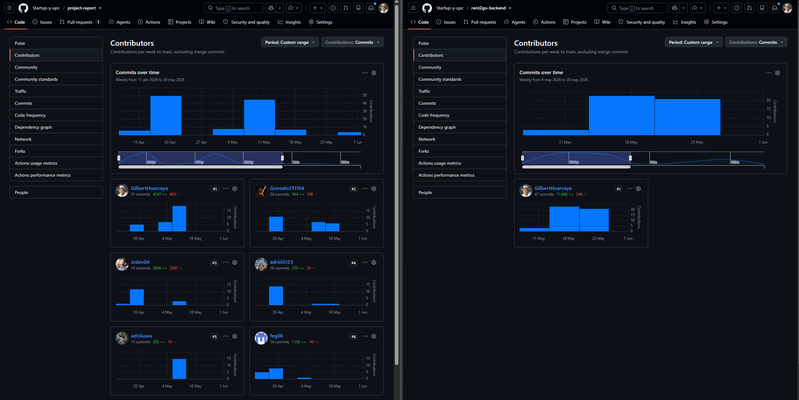
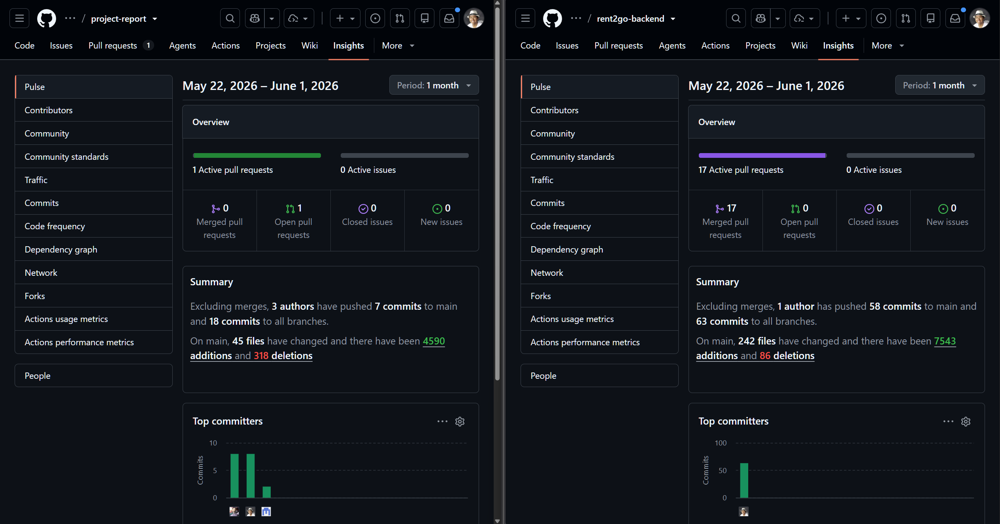

<h1 style="text-align: center;">Universidad Peruana de Ciencias Aplicadas</h1> 

<h3 style="text-align: center; font-weight: normal; font-size: 22px; margin-top: 0;">
  Ingeniería de Software – 202610
</h3>  

<strong>Curso:</strong> Aplicaciones para Dispositivos Móviles

<strong>Periodo:</strong> 202610

<strong>NRC:</strong> 3248

<strong>Profesor:</strong> Quevedo Velasco, David Gerardo
 

<h2 style="text-align: center; font-size: 24px; margin-top: 15px;">
  <strong>Informe de Trabajo Final</strong>
</h2>

<strong>StartUp:</strong> R2G Technologies

<strong>Producto:</strong> Rent2Go
 

<table style="display: flex; justify-content: center;"> 
<tr>
<th>Código</th>
<th>Integrantes</th>
</tr> 
<tr>
<td>U202210720</td>
<td>Carhuancote Dominguez, Gonzalo Alonso</td>
</tr>
<tr>
<td>U202322952</td>
<td>Castillo Vidal, Jesus Ivan</td>
</tr>
<tr>
<td>U202213468</td>
<td>Chavez Uribe, Ario Joel</td>
</tr>
<tr>
<td>U202218110</td>
<td>Diestra Zambrano, Adriana Maria</td>
</tr>
<tr>
<td>U202322187</td>
<td>Huarcaya Matias, Gilbert Alonso</td>
</tr>
</table>
  

 Junio 2026 

## **Registro de versiones del Informe**

<table style="width: 100%; table-layout: fixed;">
  <tr>
    <th style="width: 25%;">Version</th>
    <th style="width: 25%;">Fecha</th>
    <th style="width: 25%;">Autor</th>
    <th style="width: 25%;">Descripción de modificación </th>
  </tr>
   <tr>
    <td align="center">AV1</td>
    <td align="center">21/04/2026</td>
    <td>Castillo Vidal, Jesus Ivan Chavez Uribe, Ario Joel Carhuancote Dominguez, Gonzalo Alonso Diestra Zambrano, Adriana Maria Huarcaya Matias, Gilbert Alonso</td>
    <td>Primera version del informe: caratula, registro de versiones, collaboration insights, student outcome, objetivos SMART, Capitulo I con el perfil de la startup y Lean UX, y Capitulo II desarrollado segun el guideline (competidores, entrevistas, needfinding, requirements specification, DDD estrategico y tactico).</td>
  </tr>
  <tr>
    <td align="center">TB1</td>
    <td align="center">19/05/2026</td>
    <td>Castillo Vidal, Jesus Ivan Chavez Uribe, Ario Joel Carhuancote Dominguez, Gonzalo Alonso Diestra Zambrano, Adriana Maria Huarcaya Matias, Gilbert Alonso</td>
    <td>Segunda versión del informe. Se actualizaron el Registro de Versiones, Project Report, Collaboration Insights y Student Outcome. Se corrigieron y mejoraron los artefactos previamente presentados. Se desplegó el Landing Page y se alcanzó aproximadamente el 70% de implementación del backend. Se presentaron las pantallas core de la aplicación. Se desarrollaron el Capítulo III (Solution UI/UX Design) y el Capítulo IV (Product Implementation & Validation), incluyendo la documentación y evidencias correspondientes al Sprint 1. Además, se incorporaron conclusiones, bibliografía y anexos.</td>
  </tr>
  <tr>
    <td align="center">AV2</td>
    <td align="center">16/06/2026</td>
    <td>Castillo Vidal, Jesus Ivan Chavez Uribe, Ario Joel Carhuancote Dominguez, Gonzalo Alonso Diestra Zambrano, Adriana Maria Huarcaya Matias, Gilbert Alonso</td>
    <td>Tercera versión del informe. Se actualizaron el Registro de Versiones, Project Report, Collaboration Insights y Student Outcome. Se corrigieron y mejoraron los artefactos de entregas anteriores. Se mantuvo desplegado el Landing Page y se completó el 100% de implementación del backend en un entorno público con su respectiva documentación. Se presentaron las principales funcionalidades core de la aplicación, así como la primera versión de los videos de validación de la aplicación, About-the-Product y About-the-Team. Se actualizó el Capítulo IV (Product Implementation & Validation) con la documentación y evidencias correspondientes al Sprint 2, además de las conclusiones, bibliografía y anexos finales.</td>
  </tr>
</table>

## Project Report Collaboration Insights

## AV1

**URL de organizacion GitHub:** [https://github.com/Startup-y-upc](https://github.com/Startup-y-upc)

**Resumen de actividad:** Durante AV1 el equipo organizo el trabajo del reporte mediante ramas de trabajo y pull requests. En este periodo se registraron 3 pull requests mergeados, 0 issues activos y 5 autores con 59 commits en main (y 59 commits en todas las ramas). No se registraron cambios de archivos en main dentro de la ventana del analitico. Los PRs mergeados fueron: **AV1**, **Feature/chapter 2** y **Feature/chapter 1**.

**Evidencia (analiticos de colaboracion y commits):**

  

  

## TB1

**URL de organización GitHub:** [https://github.com/Startup-y-upc](https://github.com/Startup-y-upc)

**Resumen de actividad:** Durante TB1 el equipo amplió el alcance del proyecto incorporando el desarrollo de los principales componentes de la solución. Se continuó con la elaboración y mejora del **Project Report**, la implementación del **Landing Page**, el desarrollo del **Backend** en Java con Spring Boot, la construcción de la aplicación móvil en **Kotlin** y la definición de los **Gherkin Tests** para validar los escenarios funcionales del sistema. Durante este periodo se realizaron múltiples commits y actualizaciones distribuidas entre los repositorios del proyecto, permitiendo completar los entregables correspondientes al Sprint 1 y alcanzar aproximadamente el 70% de avance del backend.

**Repositorios:**

- project-report
- landing-page
- rent2go-backend
- rent2go-kotlin
- gherkin-tests

**Principales contribuciones realizadas:**

- Actualización y refinamiento de los capítulos del informe del proyecto.
- Implementación y despliegue del Landing Page institucional.
- Desarrollo de la arquitectura backend, endpoints REST y lógica de negocio inicial.
- Desarrollo de las primeras pantallas y funcionalidades móviles en Kotlin.
- Elaboración de escenarios Gherkin para la validación de historias de usuario.
- Gestión colaborativa mediante ramas de trabajo, commits y pull requests.

**Métricas de colaboración:**

| Repositorio     | Commits | Pull Requests | Contributors |
| --------------- | ------- | ------------- | ------------ |
| project-report  | 140     | 8             | 6            |
| landing-page    | 9       | 5             | 1            |
| rent2go-backend | 63      | 14            | 1            |
| rent2go-kotlin  | 1       | 0             | 1            |
| gherkin-tests   | 6       | 0             | 1            |

**Evidencia (analíticos de colaboración y commits):**

  

  

## AV2

**URL de organización GitHub:** [https://github.com/Startup-y-upc](https://github.com/Startup-y-upc)

**Resumen de actividad:** Durante AV2 el equipo consolidó la implementación completa de la solución desarrollada durante el ciclo. Se continuó con la mejora del **Project Report**, el mantenimiento y optimización del **Landing Page**, la culminación del **Backend** desplegado públicamente, el desarrollo de la aplicación móvil en **Kotlin**, la implementación de la aplicación principal en **Flutter** y la ampliación de los **Gherkin Tests** para validar los flujos funcionales críticos. Asimismo, se prepararon las evidencias necesarias para la validación de la aplicación y los videos About-the-Product y About-the-Team correspondientes al Sprint 2.

**Repositorios:**

- project-report
- landing-page
- rent2go-backend
- rent2go-kotlin
- rent2go-flutter
- gherkin-tests

**Principales contribuciones realizadas:**

- Actualización final del informe y corrección de entregables previos.
- Optimización y mantenimiento del Landing Page desplegado.
- Finalización del backend y documentación pública de la API.
- Continuación y refinamiento del cliente móvil desarrollado en Kotlin.
- Implementación de las funcionalidades core de la aplicación utilizando Flutter.
- Incorporación de integración con servicios externos y validación de flujos principales.
- Expansión de los escenarios Gherkin para pruebas funcionales y de aceptación.
- Elaboración de material de validación y demostración del producto.

**Métricas de colaboración:**

| Repositorio     | Commits | Pull Requests | Contributors |
| --------------- | ------- | ------------- | ------------ |
| project-report  | 140     | 8             | 6            |
| landing-page    | 9       | 5             | 1            |
| rent2go-backend | 63      | 14            | 1            |
| rent2go-kotlin  | 1       | 0             | 1            |
| rent2go-flutter | 1       | 0             | 1            |
| gherkin-tests   | 6       | 0             | 1            |

**Evidencia (analíticos de colaboración y commits):**

  

  

# Tabla de contenidos

## [Student Outcome (ver anexo A)](#student-outcome)

## [Objetivos SMART](#objetivos-smart)

## [Capítulo I: Presentación](Capitulo_1.md)

- [1.1. Startup Profile](Capitulo_1.md#11-startup-profile)
  - [1.1.1. Descripción de la Startup](Capitulo_1.md#111-description-de-la-startup)
  - [1.1.2. Perfiles de integrantes del equipo](Capitulo_1.md#112-perfiles-de-integrantes-del-equipo)
- [1.2. Solution Profile](Capitulo_1.md#12-solution-profile)
  - [1.2.1. Antecedentes y problemática](Capitulo_1.md#121-antecedentes-y-problemática)
  - [1.2.2. Lean UX Process](Capitulo_1.md#122-lean-ux-process)
    - [1.2.2.1. Lean UX Problem Statements](Capitulo_1.md#1221-lean-ux-problem-statements)
    - [1.2.2.2. Lean UX Assumptions](Capitulo_1.md#1222-lean-ux-assumptions)
    - [1.2.2.3. Lean UX Hypothesis Statements](Capitulo_1.md#1223-lean-ux-hypothesis-statements)
    - [1.2.2.4. Lean UX Canvas](Capitulo_1.md#1224-lean-ux-canvas)
- [1.3. Segmentos objetivo](Capitulo_1.md#13-segmentos-objetivo)

## [Capítulo II: Requirements Development and Software Solution Design](Capitulo_2.md)

- [2.1. Competidores](Capitulo_2.md#21-competidores)
  - [2.1.1. Análisis competitivo](Capitulo_2.md#211-análisis-competitivo)
  - [2.1.2. Estrategias y tácticas frente a competidores](Capitulo_2.md#212-estrategias-y-tácticas-frente-a-competidores)
- [2.2. Entrevistas](Capitulo_2.md#22-entrevistas)
  - [2.2.1. Diseño de entrevistas](Capitulo_2.md#221-diseño-de-entrevistas)
  - [2.2.2. Registro de entrevistas](Capitulo_2.md#222-registro-de-entrevistas)
  - [2.2.3. Análisis de entrevistas](Capitulo_2.md#223-análisis-de-entrevistas)
- [2.3. Needfinding](Capitulo_2.md#23-needfinding)
  - [2.3.1. User Personas](Capitulo_2.md#231-user-personas)
  - [2.3.2. User Task Matrix](Capitulo_2.md#232-user-task-matrix)
  - [2.3.3. User Journey Mapping](Capitulo_2.md#233-user-journey-mapping)
  - [2.3.4. Empathy Mapping](Capitulo_2.md#234-empathy-mapping)
  - [2.3.5. Big Picture EventStorming](Capitulo_2.md#235-big-picture-eventstorming)
  - [2.3.6. Ubiquitous Language](Capitulo_2.md#236-ubiquitous-language)
- [2.4. Requirements specification](Capitulo_2.md#24-requirements-specification)
  - [2.4.1. User Stories](Capitulo_2.md#241-user-stories)
  - [2.4.2. Impact Mapping](Capitulo_2.md#242-impact-mapping)
  - [2.4.3. Product Backlog](Capitulo_2.md#243-product-backlog)
- [2.5. Strategic-Level Domain-Driven Design](Capitulo_2.md#25-strategic-level-domain-driven-design)
  - [2.5.1. EventStorming](Capitulo_2.md#251-eventstorming)
    - [2.5.1.1. Candidate Context Discovery](Capitulo_2.md#2511-candidate-context-discovery)
    - [2.5.1.2. Domain Message Flows Modeling](Capitulo_2.md#2512-domain-message-flows-modeling)
    - [2.5.1.3. Bounded Context Canvases](Capitulo_2.md#2513-bounded-context-canvases)
  - [2.5.2. Context Mapping](Capitulo_2.md#252-context-mapping)
  - [2.5.3. Software Architecture](Capitulo_2.md#253-software-architecture)
    - [2.5.3.1. Software Architecture Context Level Diagrams](Capitulo_2.md#2531-software-architecture-context-level-diagrams)
    - [2.5.3.2. Software Architecture Container Level Diagrams](Capitulo_2.md#2532-software-architecture-container-level-diagrams)
    - [2.5.3.3. Software Architecture Deployment Diagrams](Capitulo_2.md#2533-software-architecture-deployment-diagrams)
- [2.6. Tactical-Level Domain-Driven Design](Capitulo_2.md#26-tactical-level-domain-driven-design)
  - [2.6.1. Bounded Context: Vehicle Catalog](Capitulo_2.md#261-bounded-context-vehicle-catalog)
    - [2.6.1.1. Domain Layer](Capitulo_2.md#2611-domain-layer)
    - [2.6.1.2. Interface Layer](Capitulo_2.md#2612-interface-layer)
    - [2.6.1.3. Application Layer](Capitulo_2.md#2613-application-layer)
    - [2.6.1.4. Infrastructure Layer](Capitulo_2.md#2614-infrastructure-layer)
    - [2.6.1.5. Bounded Context Software Architecture Component Level Diagrams](Capitulo_2.md#2615-bounded-context-software-architecture-component-level-diagrams)
    - [2.6.1.6. Bounded Context Software Architecture Code Level Diagrams](Capitulo_2.md#2616-bounded-context-software-architecture-code-level-diagrams)
      - [2.6.1.6.1. Bounded Context Domain Layer Class Diagrams](Capitulo_2.md#26161-bounded-context-domain-layer-class-diagrams)
      - [2.6.1.6.2. Bounded Context Database Design Diagram](Capitulo_2.md#26162-bounded-context-database-design-diagram)
  - [2.6.2. Bounded Context: Booking & Reservations](Capitulo_2.md#262-bounded-context-booking--reservations)
    - [2.6.2.1. Domain Layer](Capitulo_2.md#2621-domain-layer)
    - [2.6.2.2. Interface Layer](Capitulo_2.md#2622-interface-layer)
    - [2.6.2.3. Application Layer](Capitulo_2.md#2623-application-layer)
    - [2.6.2.4. Infrastructure Layer](Capitulo_2.md#2624-infrastructure-layer)
    - [2.6.2.5. Bounded Context Software Architecture Component Level Diagrams](Capitulo_2.md#2625-bounded-context-software-architecture-component-level-diagrams)
    - [2.6.2.6. Bounded Context Software Architecture Code Level Diagrams](Capitulo_2.md#2626-bounded-context-software-architecture-code-level-diagrams)
      - [2.6.2.6.1. Bounded Context Domain Layer Class Diagrams](Capitulo_2.md#26261-bounded-context-domain-layer-class-diagrams)
      - [2.6.2.6.2. Bounded Context Database Design Diagram](Capitulo_2.md#26262-bounded-context-database-design-diagram)
  - [2.6.3. Bounded Context: IAM (Identity & Access Management)](Capitulo_2.md#263-bounded-context-iam-identity--access-management)
    - [2.6.3.1. Domain Layer](Capitulo_2.md#2631-domain-layer)
    - [2.6.3.2. Interface Layer](Capitulo_2.md#2632-interface-layer)
    - [2.6.3.3. Application Layer](Capitulo_2.md#2633-application-layer)
    - [2.6.3.4. Infrastructure Layer](Capitulo_2.md#2634-infrastructure-layer)
    - [2.6.3.5. Bounded Context Software Architecture Component Level Diagrams](Capitulo_2.md#2635-bounded-context-software-architecture-component-level-diagrams)
    - [2.6.3.6. Bounded Context Software Architecture Code Level Diagrams](Capitulo_2.md#2636-bounded-context-software-architecture-code-level-diagrams)
      - [2.6.3.6.1. Bounded Context Domain Layer Class Diagrams](Capitulo_2.md#26361-bounded-context-domain-layer-class-diagrams)
      - [2.6.3.6.2. Bounded Context Database Design Diagram](Capitulo_2.md#26362-bounded-context-database-design-diagram)
  - [2.6.4. Bounded Context: Payments](Capitulo_2.md#264-bounded-context-payments)
    - [2.6.4.1. Domain Layer](Capitulo_2.md#2641-domain-layer)
    - [2.6.4.2. Interface Layer](Capitulo_2.md#2642-interface-layer)
    - [2.6.4.3. Application Layer](Capitulo_2.md#2643-application-layer)
    - [2.6.4.4. Infrastructure Layer](Capitulo_2.md#2644-infrastructure-layer)
    - [2.6.4.5. Bounded Context Software Architecture Component Level Diagrams](Capitulo_2.md#2645-bounded-context-software-architecture-component-level-diagrams)
    - [2.6.4.6. Bounded Context Software Architecture Code Level Diagrams](Capitulo_2.md#2646-bounded-context-software-architecture-code-level-diagrams)
      - [2.6.4.6.1. Bounded Context Domain Layer Class Diagrams](Capitulo_2.md#26461-bounded-context-domain-layer-class-diagrams)
      - [2.6.4.6.2. Bounded Context Database Design Diagram](Capitulo_2.md#26462-bounded-context-database-design-diagram)
  - [2.6.5. Bounded Context: Community & Trust](Capitulo_2.md#265-bounded-context-community--trust)
    - [2.6.5.1. Domain Layer](Capitulo_2.md#2651-domain-layer)
    - [2.6.5.2. Interface Layer](Capitulo_2.md#2652-interface-layer)
    - [2.6.5.3. Application Layer](Capitulo_2.md#2653-application-layer)
    - [2.6.5.4. Infrastructure Layer](Capitulo_2.md#2654-infrastructure-layer)
    - [2.6.5.5. Bounded Context Software Architecture Component Level Diagrams](Capitulo_2.md#2655-bounded-context-software-architecture-component-level-diagrams)
    - [2.6.5.6. Bounded Context Software Architecture Code Level Diagrams](Capitulo_2.md#2656-bounded-context-software-architecture-code-level-diagrams)
      - [2.6.5.6.1. Bounded Context Domain Layer Class Diagrams](Capitulo_2.md#26561-bounded-context-domain-layer-class-diagrams)
      - [2.6.5.6.2. Bounded Context Database Design Diagram](Capitulo_2.md#26562-bounded-context-database-design-diagram)

## [Capítulo III: Solution UI/UX Design](Capitulo_3.md)

- [3.1. Product design](Capitulo_3.md#31-product-design)
  - [3.1.1. Style Guidelines](Capitulo_3.md#311-style-guidelines)
    - [3.1.1.1. General Style Guidelines](Capitulo_3.md#3111-general-style-guidelines)
  - [3.1.2. Information Architecture](Capitulo_3.md#312-information-architecture)
    - [3.1.2.1. Organization Systems](Capitulo_3.md#3121-organization-systems)
    - [3.1.2.2. Labelling Systems](Capitulo_3.md#3122-labelling-systems)
    - [3.1.2.3. SEO Tags and Meta Tags](Capitulo_3.md#3123-seo-tags-and-meta-tags)
    - [3.1.2.4. Searching Systems](Capitulo_3.md#3124-searching-systems)
    - [3.1.2.5. Navigation Systems](Capitulo_3.md#3125-navigation-systems)
  - [3.1.3. Landing Page UI Design](Capitulo_3.md#313-landing-page-ui-design)
    - [3.1.3.1. Landing Page Wireframe](Capitulo_3.md#3131-landing-page-wireframe)
    - [3.1.3.2. Landing Page Mock-up](Capitulo_3.md#3132-landing-page-mock-up)
  - [3.1.4. Mobile Applications UX/UI Design](Capitulo_3.md#314-mobile-applications-uxui-design)
    - [3.1.4.1. Mobile Applications Wireframes](Capitulo_3.md#3141-mobile-applications-wireframes)
    - [3.1.4.2. Mobile Applications Wireflow Diagrams](Capitulo_3.md#3142-mobile-applications-wireflow-diagrams)
    - [3.1.4.3. Mobile Applications Mock-ups](Capitulo_3.md#3143-mobile-applications-mock-ups)
    - [3.1.4.4. Mobile Applications User Flow Diagrams](Capitulo_3.md#3144-mobile-applications-user-flow-diagrams)
    - [3.1.4.5. Mobile Applications Prototyping](Capitulo_3.md#3145-mobile-applications-prototyping)

## [Capítulo IV: Product Implementation & Validation](Capitulo_4.md)

- [4.1. Software Configuration Management](Capitulo_4.md#41-software-configuration-management)
  - [4.1.1. Software Development Environment Configuration](Capitulo_4.md#411-software-development-environment-configuration)
  - [4.1.2. Source Code Management](Capitulo_4.md#412-source-code-management)
  - [4.1.3. Source Code Style Guide & Conventions](Capitulo_4.md#413-source-code-style-guide--conventions)
  - [4.1.4. Software Deployment Configuration](Capitulo_4.md#414-software-deployment-configuration)
- [4.2. Landing Page & Mobile Application Implementation](Capitulo_4.md#42-landing-page--mobile-application-implementation)
  - [4.2.1. Sprint 1](Capitulo_4.md#421-sprint-1)
    - [4.2.1.1. Sprint Planning 1](Capitulo_4.md#4211-sprint-planning-1)
    - [4.2.1.2. Sprint Backlog 1](Capitulo_4.md#4212-sprint-backlog-1)
    - [4.2.1.3. Development Evidence for Sprint Review](Capitulo_4.md#4213-development-evidence-for-sprint-review)
    - [4.2.1.4. Testing Suite Evidence for Sprint Review](Capitulo_4.md#4214-testing-suite-evidence-for-sprint-review)
    - [4.2.1.5. Execution Evidence for Sprint Review](Capitulo_4.md#4215-execution-evidence-for-sprint-review)
    - [4.2.1.6. Services Documentation Evidence for Sprint Review](Capitulo_4.md#4216-services-documentation-evidence-for-sprint-review)
    - [4.2.1.7. Software Deployment Evidence for Sprint Review](Capitulo_4.md#4217-software-deployment-evidence-for-sprint-review)
    - [4.2.1.8. Team Collaboration Insights during Sprint 1](Capitulo_4.md#4218-team-collaboration-insights-during-sprint-1)
  - [4.2.2. Sprint 2](Capitulo_4.md#422-sprint-2)
    - [4.2.2.1. Sprint Planning 2](Capitulo_4.md#4221-sprint-planning-2)
    - [4.2.2.2. Sprint Backlog 2](Capitulo_4.md#4222-sprint-backlog-2)
    - [4.2.2.3. Development Evidence for Sprint Review](Capitulo_4.md#4223-development-evidence-for-sprint-review)
    - [4.2.2.4. Testing Suite Evidence for Sprint Review](Capitulo_4.md#4224-testing-suite-evidence-for-sprint-review)
    - [4.2.2.5. Execution Evidence for Sprint Review](Capitulo_4.md#4225-execution-evidence-for-sprint-review)
    - [4.2.2.6. Services Documentation Evidence for Sprint Review](Capitulo_4.md#4216-services-documentation-evidence-for-sprint-review)
    - [4.2.2.7. Software Deployment Evidence for Sprint Review](Capitulo_4.md#4217-software-deployment-evidence-for-sprint-review)
    - [4.2.2.8. Team Collaboration Insights during Sprint 2](Capitulo_4.md#4218-team-collaboration-insights-during-sprint-1)
- [4.3. Validation Interviews](Capitulo_4.md#43-validation-interviews)
  - [4.3.1. Diseño de Entrevistas](Capitulo_4.md#431-diseño-de-entrevistas)
  - [4.3.2. Registro de Entrevistas](Capitulo_4.md#432-registro-de-entrevistas)
  - [4.3.3. Evaluaciones según heurísticas](Capitulo_4.md#433-evaluaciones-según-heurísticas)

## [Conclusiones](Conclusiones.md#conclusiones)

- [Conclusiones y recomendaciones](Conclusiones.md#conclusiones-y-recomendaciones)
- [Video App Validation](Conclusiones.md#video-app-validation)
- [Video About the product](Conclusiones.md#video-about-the-product)
- [Video About the team](Conclusiones.md#video-about-the-team)
- [Glosario](Conclusiones.md#glosario)

## [Bibliografía](Conclusiones.md#bibliografía)

## [Anexos](Conclusiones.md#anexos)

# Student Outcome

ABET – EAC - Student Outcome 7 Criterio: Actualiza conceptos y conocimientos necesarios para su desarrollo profesional y en especial para su proyecto en soluciones de software. Reconoce la necesidad del aprendizaje permanente para el desempeño profesional y el desarrollo de proyectos en soluciones de software.

| Criterio                                                                                                                                | Acciones realizadas                                                                                                                                                                                                                                                                                                                                                                                                                                                                                                                                                                                                                                                                                                                                                                                                                                                                                                                                                                                                                                                                                                                                                                                                                                                                                                                                                                                                                                                                                                                                                                                                                                                                                                                                                                                                                                                                                                                                                                                                                                                                                                                                                                                                                                                                                                                                                                                                                                                                                                                                                                                                                                                                                                                                                                                                                                                                                                                                                                                                                                                                                                                                                                                                                                                                                                                                                                                                                                                                   | Conclusiones                                                                                                                                                                                                                                                                                                                                                                                                                                                                                                                                                                                                                                               |
| --------------------------------------------------------------------------------------------------------------------------------------- | ------------------------------------------------------------------------------------------------------------------------------------------------------------------------------------------------------------------------------------------------------------------------------------------------------------------------------------------------------------------------------------------------------------------------------------------------------------------------------------------------------------------------------------------------------------------------------------------------------------------------------------------------------------------------------------------------------------------------------------------------------------------------------------------------------------------------------------------------------------------------------------------------------------------------------------------------------------------------------------------------------------------------------------------------------------------------------------------------------------------------------------------------------------------------------------------------------------------------------------------------------------------------------------------------------------------------------------------------------------------------------------------------------------------------------------------------------------------------------------------------------------------------------------------------------------------------------------------------------------------------------------------------------------------------------------------------------------------------------------------------------------------------------------------------------------------------------------------------------------------------------------------------------------------------------------------------------------------------------------------------------------------------------------------------------------------------------------------------------------------------------------------------------------------------------------------------------------------------------------------------------------------------------------------------------------------------------------------------------------------------------------------------------------------------------------------------------------------------------------------------------------------------------------------------------------------------------------------------------------------------------------------------------------------------------------------------------------------------------------------------------------------------------------------------------------------------------------------------------------------------------------------------------------------------------------------------------------------------------------------------------------------------------------------------------------------------------------------------------------------------------------------------------------------------------------------------------------------------------------------------------------------------------------------------------------------------------------------------------------------------------------------------------------------------------------------------------------------------------------- | ---------------------------------------------------------------------------------------------------------------------------------------------------------------------------------------------------------------------------------------------------------------------------------------------------------------------------------------------------------------------------------------------------------------------------------------------------------------------------------------------------------------------------------------------------------------------------------------------------------------------------------------------------------- |
| Actualiza conceptos y conocimientos necesarios para su desarrollo profesional y en especial para su proyecto en soluciones de software. | - **Castillo Vidal, Jesus Ivan** &nbsp;&nbsp;- **AV1:** Cumplió el criterio al aplicar conceptos de análisis del contexto, competencia y validación inicial en la descripción de la startup y el diseño de entrevistas con enfoque mobile-first. &nbsp;&nbsp;- **TB1:** Cumplió el criterio al desarrollar las pantallas core de la aplicación móvil en Kotlin, implementando navegación funcional y consumo de servicios del backend desplegado. &nbsp;&nbsp;- **AV2:** Cumplió el criterio al completar la integración con el backend, alcanzando el 70% de funcionalidad implementada, validando consumo de servicios y persistencia de datos para la demostración del Sprint 2.  - **Chavez Uribe, Ario Joel** &nbsp;&nbsp;- **AV1:** Cumplió el criterio al incorporar enfoques de Lean UX y traducirlos en artefactos de requisitos (historias, impacto y backlog) según la guía. &nbsp;&nbsp;- **TB1:** Cumplió el criterio al desarrollar funcionalidades móviles en Kotlin, implementando pruebas técnicas y documentación de servicios consumidos. &nbsp;&nbsp;- **AV2:** Cumplió el criterio al completar la integración con el backend, garantizando estabilidad de funcionalidades desarrolladas y documentando pruebas realizadas con evidencias gráficas.  - **Carhuancote Dominguez, Gonzalo Alonso** &nbsp;&nbsp;- **AV1:** Cumplió el criterio al articular segmentos objetivo y al aplicar principios de DDD estratégico y táctico para la solución móvil. &nbsp;&nbsp;- **TB1:** Cumplió el criterio al desarrollar el Capítulo III (Solution UI/UX Design), elaborando wireframes, mockups y flujos de navegación móvil. &nbsp;&nbsp;- **AV2:** Cumplió el criterio al desarrollar las principales pantallas y funcionalidades móviles en Kotlin, implementando navegación funcional e integración con el backend desplegado, garantizando que las funcionalidades desarrolladas puedan ser utilizadas durante la demostración del Sprint 2. Adicionalmente, consolidó el Capítulo III con Wireflow Diagrams, User Flow Diagrams y prototipos interactivos en Figma, manteniendo consistencia entre diseño e implementación.  - **Diestra Zambrano, Adriana Maria** &nbsp;&nbsp;- **AV1:** Cumplió el criterio al estructurar la problemática y aplicar técnicas de needfinding y user stories para sustentar necesidades de usuarios. &nbsp;&nbsp;- **TB1:** Cumplió el criterio al desarrollar la aplicación móvil en Flutter, implementando funcionalidades core y recopilando evidencias visuales para Sprint Review. &nbsp;&nbsp;- **AV2:** Cumplió el criterio al completar la integración con el backend en Flutter, verificando navegación, consumo de servicios y experiencia de usuario, además de elaborar material audiovisual de validación.  - **Huarcaya Matias, Gilbert Alonso** &nbsp;&nbsp;- **AV1:** Cumplió el criterio al consolidar el Lean UX Canvas y organizar evidencias de entrevistas e impacto para asegurar trazabilidad. &nbsp;&nbsp;- **TB1:** Cumplió el criterio al desarrollar la arquitectura backend, endpoints REST y lógica de negocio inicial, documentando despliegue y evidencias de integración. &nbsp;&nbsp;- **AV2:** Cumplió el criterio al completar el 100% de implementación del backend en entorno público, documentar despliegue completo, incorporar evidencias de APIs implementadas y ayudar en integración con aplicaciones móviles. | En AV1, el equipo actualizó y aplicó conceptos del guideline y de Lean UX para alinear el reporte y el enfoque mobile-first con los criterios del curso.  En TB1, el equipo consolidó el aprendizaje al desarrollar las pantallas core de la aplicación móvil, desplegar el Landing Page y alcanzar el 70% del backend, aplicando conceptos de UI/UX, desarrollo móvil y arquitectura backend.  En AV2, el equipo demostró actualización continua al completar el 100% del backend, implementar funcionalidades core en Kotlin y Flutter, y elaborar videos de validación, consolidando conocimientos de integración, despliegue y validación. |
| Reconoce la necesidad del aprendizaje permanente para el desempeño profesional y el desarrollo de proyectos en soluciones de software.  | - **Castillo Vidal, Jesus Ivan** &nbsp;&nbsp;- **AV1:** Evidenció aprendizaje continuo al detectar vacíos en entrevistas y competencia y dejar acciones de mejora para la siguiente entrega. &nbsp;&nbsp;- **TB1:** Evidenció aprendizaje continuo al aprender desarrollo móvil en Kotlin, implementando navegación funcional y consumo de servicios del backend. &nbsp;&nbsp;- **AV2:** Evidenció aprendizaje continuo al profundizar en integración con backend, alcanzando el 70% de funcionalidad y validando persistencia de datos para demostración.  - **Chavez Uribe, Ario Joel** &nbsp;&nbsp;- **AV1:** Evidenció aprendizaje continuo al identificar que las hipótesis y la validación de impacto requieren mayor profundidad y planificar su refuerzo. &nbsp;&nbsp;- **TB1:** Evidenció aprendizaje continuo al aprender desarrollo móvil en Kotlin, documentando pruebas técnicas y servicios consumidos. &nbsp;&nbsp;- **AV2:** Evidenció aprendizaje continuo al profundizar en pruebas y documentación técnica, garantizando estabilidad y preparando funcionalidades para demostración del Sprint.  - **Carhuancote Dominguez, Gonzalo Alonso** &nbsp;&nbsp;- **AV1:** Evidenció aprendizaje continuo al planificar la ampliación de arquitectura y diagramas para mejorar la claridad del sistema en el siguiente avance. &nbsp;&nbsp;- **TB1:** Evidenció aprendizaje continuo al aprender técnicas de diseño UI/UX móvil, elaborando wireframes, mockups y flujos de navegación. &nbsp;&nbsp;- **AV2:** Evidenció aprendizaje continuo al desarrollar las principales pantallas y funcionalidades móviles en Kotlin, implementando navegación funcional e integración con el backend desplegado. Adicionalmente, consolidó el Capítulo III con Wireflow Diagrams, User Flow Diagrams y prototipado interactivo en Figma, manteniendo consistencia entre diseño e implementación.  - **Diestra Zambrano, Adriana Maria** &nbsp;&nbsp;- **AV1:** Evidenció aprendizaje continuo al dejar mejoras pendientes en eventstorming y lenguaje ubicuo con un plan de cierre para AV2/TB1. &nbsp;&nbsp;- **TB1:** Evidenció aprendizaje continuo al aprender desarrollo móvil en Flutter, implementando funcionalidades core y recopilando evidencias visuales. &nbsp;&nbsp;- **AV2:** Evidenció aprendizaje continuo al profundizar en integración con backend en Flutter, verificando experiencia de usuario y elaborando material audiovisual de validación.  - **Huarcaya Matias, Gilbert Alonso** &nbsp;&nbsp;- **AV1:** Evidenció aprendizaje continuo al definir el refinamiento de backlog y del análisis de entrevistas con nuevas evidencias. &nbsp;&nbsp;- **TB1:** Evidenció aprendizaje continuo al aprender arquitectura backend con Spring Boot, implementando endpoints REST y documentando despliegue. &nbsp;&nbsp;- **AV2:** Evidenció aprendizaje continuo al completar el 100% del backend, documentar APIs implementadas y ayudar en integración con aplicaciones móviles, consolidando conocimientos de despliegue y documentación.                                                                                                                                                                                                                                                                                                                                               | En AV1, el equipo documentó brechas y acciones de mejora para sostener el aprendizaje continuo y la calidad del reporte en las siguientes entregas.  En TB1, el equipo evidenció aprendizaje continuo al desarrollar competencias en Kotlin, Flutter, UI/UX móvil y arquitectura backend, aplicando lo aprendido en entregables concretos.  En AV2, el equipo demostró consolidación de aprendizaje al completar el 100% del backend, implementar funcionalidades core en múltiples plataformas y elaborar material de validación, evidenciando crecimiento profesional continuo.                                                              |

# Objetivos SMART

**Castillo Vidal, Jesus Ivan**

- Liderar el desarrollo de al menos 3 aplicaciones móviles nativas para Android antes de diciembre 2030, utilizando Kotlin, arquitectura limpia y patrones de diseño modernos, publicándolas en Google Play Store con al menos 10,000 descargas combinadas y calificación mínima de 4.5 estrellas, demostrando capacidad de liderazgo técnico y gestión de productos móviles como ingeniero senior.
- Obtener la certificación Google Professional Android Developer y al menos 2 especializaciones avanzadas en arquitectura de aplicaciones, rendimiento y seguridad móvil antes de junio 2029, aplicando estos conocimientos en proyectos reales con al menos 5 contribuciones a código abierto en el ecosistema Android y mentoría a desarrolladores junior.

**Chavez Uribe, Ario Joel**

- Establecer un laboratorio de pruebas automatizadas para aplicaciones móviles antes de diciembre 2029, implementando suites de pruebas unitarias, de integración y UI en al menos 8 proyectos con cobertura mínima del 95%, documentando métricas de calidad y obteniendo certificaciones en herramientas como Espresso, UI Automator o Detox, y liderando la implementación de pipelines de CI/CD para testing.
- Crear y publicar un portafolio profesional de diseño UX/UI mobile-first antes de noviembre 2028, con al menos 12 prototipos validados con usuarios reales, documentando procesos de investigación, decisiones de diseño y métricas de usabilidad, y obteniendo retroalimentación de profesionales del sector y participando en al menos 2 conferencias de diseño.

**Carhuancote Dominguez, Gonzalo Alonso**

- Diseñar e implementar una arquitectura de microservicios con DDD y CQRS antes de septiembre 2029, desplegando al menos 5 servicios en la nube con autenticación JWT, monitoreo en producción y pruebas de carga con 2,000+ usuarios concurrentes, documentando el proceso de diseño de dominio y obteniendo certificaciones en Spring Boot avanzado y arquitecturas distribuidas.
- Participar y ganar al menos 3 hackathons o competiciones de desarrollo de software antes de julio 2030, liderando equipos multidisciplinarios en la creación de soluciones tecnológicas innovadoras, demostrando habilidades de liderazgo, trabajo bajo presión y presentación de proyectos ante jurados profesionales, con al menos 1 solución implementada en producción.

**Diestra Zambrano, Adriana Maria**

- Desarrollar y publicar aplicaciones multiplataforma utilizando Flutter o Kotlin Multiplatform antes de abril 2029, creando al menos 5 aplicaciones publicadas simultáneamente en Google Play Store y Apple App Store con al menos 20 funcionalidades implementadas, 5,000 descargas combinadas y calificación mínima de 4.5 estrellas en ambas plataformas, demostrando dominio del desarrollo cross-platform.
- Especializarse en arquitectura limpia y patrones de diseño para aplicaciones móviles antes de marzo 2030, aplicando los patrones Clean Architecture, MVVM y Repository en al menos 6 proyectos con revisiones de código documentadas, métricas de calidad de código superiores al 90% y contribuciones a proyectos open source en el ecosistema móvil, con al menos 2 publicaciones técnicas.

**Huarcaya Matias, Gilbert Alonso**

- Establecer y mantener una plataforma de servicios externos integrada (pasarelas de pago, almacenamiento en la nube, mapas, geolocalización, autenticación) antes de diciembre 2028, implementando al menos 12 integraciones con APIs reales, documentando resultados de rendimiento, configurando monitoreo de errores en producción y obteniendo certificaciones en servicios cloud como AWS o Azure, con al menos 3 sistemas en producción.
- Liderar el desarrollo completo de un proyecto móvil con DDD y arquitectura hexagonal antes de septiembre 2029, definiendo bounded contexts, entregando un MVP funcional con al menos 8 módulos implementados, documentando el proceso de diseño de dominio y obteniendo retroalimentación de al menos 500 usuarios reales, demostrando capacidad de liderazgo técnico y gestión de productos como tech lead.
- Desplegar y mantener una aplicación móvil en iOS y Android simultáneamente antes de diciembre 2028, con actualizaciones mensuales durante al menos 24 meses, métricas de retención de usuarios superiores al 60%, calificación mínima de 4.7 estrellas en ambas plataformas y una comunidad activa de al menos 10,000 usuarios, demostrando capacidad de producto completos, demostrando capacidad de producto completos, demostrando capacidad de producto completos, demostrando capacidad de producto completo.

