

<h1 style="text-align: center;">Universidad Peruana de Ciencias Aplicadas</h1> 

<h3 style="text-align: center; font-weight: normal; font-size: 22px; margin-top: 0;">
  Ingeniería de Software – 202610
</h3>  

<strong>Curso:</strong> Aplicaciones para Dispositivos Móviles

 
<strong>NRC:</strong> 3248

 
<strong>Profesor:</strong>Quevedo Velasco, David Gerardo

  
<strong>StartUp:</strong> R2G Technologies

  
<strong>Producto:</strong> Rent2Go
  

<h2 style="text-align: center; font-size: 24px; margin-top: 30px;">
  <strong>Informe de Trabajo Final</strong>
</h2>

<table style="display: flex; justify-content: center;"> 
<tr>
<th>Código</th>
<th>Integrantes</th>
</tr> 
<tr>
<td>U202322952</td>
<td>Castillo Vidal, Jesus Ivan</td>
</tr>
<tr>
<td></td>
<td></td>
</tr>
<tr>
<td></td>
<td></td>
</tr>
<tr>
<td></td>
<td></td>
</tr>
<tr>
<td></td>
<td></td>
</tr>
</table>
  

 Abril 2026 

## **Registro de versiones del Informe**

<table style="width: 100%; table-layout: fixed;">
  <tr>
    <th style="width: 25%;">Version</th>
    <th style="width: 25%;">Fecha</th>
    <th style="width: 25%;">Autor</th>
    <th style="width: 25%;">Descripción de modificación </th>
  </tr>
   <tr>
    <td align="center"></td>
    <td align="center"></td>
    <td></td>
    <td></td>
  </tr>
</table>

## Project Report Collaboration Insights

## AV1

# Tabla de contenidos

## [Capítulo I: Introducción](README.md)

- [1.1 Startup Profile](README.md#11-startup-profile)
  - [1.1.1 Descripción de la Startup](README.md#111-descripción-de-la-startup)
  - [1.1.2 Perfiles de integrantes del equipo](README.md#112-perfiles-de-integrantes-del-equipo)
- [1.2 Solution Profile](README.md#12-solution-profile)
  - [1.2.1 Antecedentes y problemática](README.md#121-antecedentes-y-problemática)
  - [1.2.2 Lean UX Process](README.md#122-lean-ux-process)
    - [1.2.2.1 Lean UX Problem Statements](README.md#1221-lean-ux-problem-statements)
    - [1.2.2.2 Lean UX Assumptions](README.md#1222-lean-ux-assumptions)
    - [1.2.2.3 Lean UX Hypothesis Statements](README.md#1223-lean-ux-hypothesis-statements)
    - [1.2.2.4 Lean UX Canvas](README.md#1224-lean-ux-canvas)
- [1.3 Segmentos Objetivos](README.md#13-segmentos-objetivo)

## [Capítulo II: Requirements Development and Software Solution Design](README.md)

- [2.1 Competidores](README.md#21-competidores)
  - [2.1.1 Análisis competitivo](README.md#211-análisis-competitivo)
  - [2.1.2 Estrategias y tácticas frente a competidores](README.md#212-estrategias-y-tácticas-frente-a-competidores)
- [2.2 Entrevistas](README.md#22-entrevistas)
  - [2.2.1 Diseño de entrevistas](README.md#221-diseño-de-entrevistas)
  - [2.2.2 Registro de entrevistas](README.md#222-registro-de-entrevistas)
  - [2.2.3 Análisis de entrevistas](README.md#223-análisis-de-entrevistas)
- [2.3 Needfinding](README.md#23-needfinding)
  - [2.3.1 User Personas](README.md#231-user-personas)
  - [2.3.2 User Task Matrix](README.md#232-user-task-matrix)
  - [2.3.3 User Journey Mapping](README.md#233-user-journey-mapping)
  - [2.3.4 Empathy Mapping](README.md#234-empathy-mapping)
  - [2.3.5 Big Picture EventStorming](README.md#235-big-picture-eventstorming)
  - [2.3.6 Ubiquitous Language](README.md#236-ubiquitous-language)
- [2.4 Requirements specification](README.md#24-requirements-specification)
  - [2.4.1 User Stories](README.md#241-user-stories)
  - [2.4.2 Impact Mapping](README.md#242-impact-mapping)
  - [2.4.3 Product Backlog](README.md#243-product-backlog)
- [2.5 Strategic-Level Domain-Driven Design](README.md#25-strategic-level-domain-driven-design)
  - [2.5.1 EventStorming](README.md#251-eventstorming)
    - [2.5.1.1 Candidate Context Discovery](README.md#2511-candidate-context-discovery)
    - [2.5.1.2 Domain Message Flows Modeling](README.md#2512-domain-message-flows-modeling)
    - [2.5.1.3 Bounded Context Canvases](README.md#2513-bounded-context-canvases)
  - [2.5.2 Context Mapping](README.md#252-context-mapping)
  - [2.5.3 Software Architecture](README.md#253-software-architecture)
    - [2.5.3.1 Software Architecture Context Level Diagrams](README.md#2531-software-architecture-context-level-diagrams)
    - [2.5.3.2 Software Architecture Container Level Diagrams](README.md#2532-software-architecture-container-level-diagrams)
    - [2.5.3.3 Software Architecture Deployment Diagrams](README.md#2533-software-architecture-deployment-diagrams)
- [2.6 Tactical-Level Domain-Driven Design](README.md#26-tactical-level-domain-driven-design)
  - [2.6.x Bounded Context: <Bounded Context Name>](README.md#26x-bounded-context-bounded-context-name)
    - [2.6.x.1 Domain Layer](README.md#26x1-domain-layer)
    - [2.6.x.2 Interface Layer](README.md#26x2-interface-layer)
    - [2.6.x.3 Application Layer](README.md#26x3-application-layer)
    - [2.6.x.4 Infrastructure Layer](README.md#26x4-infrastructure-layer)
    - [2.6.x.5 Bounded Context Software Architecture Component Level Diagrams](README.md#26x5-bounded-context-software-architecture-component-level-diagrams)
    - [2.6.x.6 Bounded Context Software Architecture Code Level Diagrams](README.md#26x6-bounded-context-software-architecture-code-level-diagrams)
      - [2.6.x.6.1 Bounded Context Domain Layer Class Diagrams](README.md#26x61-bounded-context-domain-layer-class-diagrams)
      - [2.6.x.6.2 Bounded Context Database Design Diagram](README.md#26x62-bounded-context-database-design-diagram)

## [Conclusiones](Conclusiones_bibliografica.md#conclusiones)

- [Conclusiones y recomendaciones](Conclusiones_bibliografica.md#conclusiones-y-recomendaciones)
- [Video About-the-Team](Conclusiones_bibliografica.md#video-about-the-team)

## [Bibliografía](Conclusiones_bibliografica.md#bibliografía)

## [Anexos](Conclusiones_bibliografica.md#anexos)

## Student Outcome

ABET – EAC - Student Outcome 5 Criterio: La capacidad de funcionar efectivamente en un equipo cuyos miembros juntos proporcionan liderazgo, crean un entorno de colaboración e inclusivo, establecen objetivos, planifican tareas y cumplen objetivos.

| Criterio                                                                                        | Acciones realizadas | Conclusiones |
| ----------------------------------------------------------------------------------------------- | ------------------- | ------------ |
| Trabaja en equipo para proporcionar liderazgo en forma conjunta.                                |                     |              |
| Crea un entorno colaborativo e inclusivo, establece metas, planifica tareas y cumple objetivos. |                     |              |

# Capítulo II: Requirements Development and Software Solution Design

## 2.1. Competidores

A continuacion realizaremos un analisis de los productos digitales ofrecidos por la competencia directa e indirecta en el mercado de nuestra solucion y las tacticas preliminares que aplicariamos para destacar. El foco se mantiene en experiencias mobile-first y servicios P2P que compiten con la propuesta de Rent2Go.

### 2.1.1. Análisis competitivo

A continuacion se presenta un analisis competitivo de las empresas que ofrecen servicios similares a Rent2Go.

<table>
  <tr>
    <th colspan="6"><b>Competitive Analysis Landscape</b></th>
  </tr>
  <tr>
    <td>¿Por que llevar a cabo este analisis?</td>
    <td  colspan="5">Este analisis fue realizado con el proposito de estudiar el valor ofrecido por las empresas que compiten con nuestra solucion. La informacion obtenida nos proporcionara la perspectiva necesaria para la realizacion de un servicio innovador.</td>
  </tr>
  
  <tr>
    <td colspan="2"></td>
    <td ><b>Rent2Go</b></td>
    <td ><b>Rento</b></td>
    <td >
<b>Hertz</b>
</td>
    <td >
<b>Avis</b>
</td>
  </tr>

  <tr>
    <td colspan="2"></td>
    <td></td>
    <td></td>
    <td></td>
    <td></td>
  </tr>
  
  <tr>
    <td rowspan="2">
      <b>Perfil</b>
    </td>
    <td >
      <b>Overview</b>
    </td>
    <td >
      
Plataforma web y aplicacion movil para gestion de alquileres P2P, pagos y monitoreo de vehiculos.
    </td>
    <td >
      
Plataforma web y aplicacion movil que facilita el alquiler de vehiculos de particulares
    </td>
    <td >
      
Plataforma web y aplicacion movil que facilita el alquiler de vehiculos tanto en aeropuertos como en ciudades.
    </td>
    <td >
      
Aplicacion de reservas de autos en linea
    </td>
  </tr>
  
  <tr>
    <td >
      <b>Ventaja competitiva ¿Que valor ofrece a los clientes?</b>
    </td>
    <td >
      
Flexibilidad en precios y disponibilidad, y generacion de ingresos para los propietarios sin necesidad de inversion en flota.
    </td>
    <td >
      
Modelo peer-to-peer que permite a los propietarios generar ingresos pasivos con su vehiculo. Seguridad para ambas partes a traves de seguros todo riesgo y monitoreo GPS.
    </td>
    <td >
      
Red global de ubicaciones, servicio confiable y una amplia variedad de vehiculos. Reputacion consolidada y un fuerte programa de fidelizacion.
    </td>
    <td >
      
Enfoque en el servicio al cliente de alta calidad, con una variedad de opciones de vehiculos y soluciones tanto para clientes particulares como corporativos.
    </td>
  </tr>
  
  <tr>
    <td rowspan="2" >
      <b>Perfil de Marketing</b>
    </td>
    <td >
      <b>Mercado objetivo</b>
    </td>
    <td >
      
Propietarios de vehiculos que desean alquilarlos cuando no los usan.
      
Arrendatarios que buscan opciones mas economicas y flexibles que las ofrecidas por las grandes empresas de alquiler.
    </td>
    <td >
      
Propietarios de vehiculos que buscan generar ingresos cuando no usan sus autos.
      
Arrendatarios que buscan opciones mas economicas y flexibles que las ofrecidas por las grandes empresas de alquiler.
    </td>
    <td >
      
Turistas internacionales y locales.
Ejecutivos y viajeros de negocios.
      
Clientes que necesitan autos por periodos cortos o largos.
    </td>
    <td >
      
Turistas y viajeros de negocios.
      
Empresas que buscan alquileres a largo plazo o soluciones corporativas.
    </td>
  </tr>
  
  <tr>
    <td >
      <b>Estrategias de marketing</b>
    </td>
    <td >
      
Publicidad en redes sociales.
      
Promociones con descuentos en los primeros alquileres.
      
Alianzas estrategicas con aseguradoras para ofrecer seguridad y confianza.
    </td>
    <td >
      
Publicidad digital en redes sociales y campanas de concientizacion sobre la economia colaborativa.
      
Alianzas con aseguradoras para ofrecer seguros integrados.
    </td>
    <td >
      
Publicidad en aeropuertos, marketing digital, y promociones a traves de programas de fidelizacion.
      
Presencia en ferias y eventos de turismo.
      
Alianzas con aerolineas y agencias de viajes.
    </td>
    <td >
      
Marketing dirigido a clientes corporativos y viajeros frecuentes.
      
Promociones digitales y descuentos a traves de alianzas con aerolineas y hoteles.
      
Programas de fidelizacion
    </td>
  </tr>
  
  <tr>
    <td rowspan="3" >
      <b>Perfil de Producto</b>
    </td>
    <td >
      <b>Productos y Servicios</b>
    </td>
    <td >
      
Alquiler de vehiculos particulares.
      
Seguro y monitoreo GPS integrados.
      
Opciones de alquiler a corto y mediano plazo.
    </td>
    <td >
      
Alquiler de vehiculos particulares a corto y mediano plazo.
      
Seguro todo riesgo y monitoreo en tiempo real.
      
Opciones de reserva directa y pagos a traves de la app.
    </td>
    <td >
      
Alquiler de autos estandar, SUV, autos de lujo, y vehiculos comerciales.
      
Seguros, GPS, y recogida/entrega en ubicaciones seleccionadas.
    </td>
    <td >
      
Autos economicos, SUV, vehiculos de lujo, y comerciales.
      
Alquileres a largo plazo para clientes corporativos.
    </td>
  </tr>
  
  <tr>
    <td >
      <b>Precios y Costos</b>
    </td>
    <td >
      
Precios mas bajos que las companias tradicionales de alquiler debido a la ausencia de una flota fisica.
      
Bajos costos operativos gracias al modelo P2P.
    </td>
    <td >
      
Precios dinamicos y mas bajos que los de las empresas tradicionales de alquiler.
      
Bajos costos operativos debido a la ausencia de una flota fisica.
    </td>
    <td >
      
Tarifas diarias o semanales, generalmente mas altas que servicios P2P debido a la infraestructura y la cobertura global.
      
Descuentos para clientes recurrentes y programas de fidelizacion.
    </td>
    <td >
      
Precios premium, con descuentos para empresas y clientes recurrentes.
      
Altos costos operativos debido a la amplia infraestructura y mantenimiento de vehiculos.
    </td>
  </tr>
  
  <tr>
    <td >
      <b>Canales de distribucion (Web y/o movil)</b>
    </td>
    <td >
      
Plataforma web y aplicacion movil.
      
Colaboraciones con aseguradoras y promociones digitales.
    </td>
    <td >
      
Plataforma web y aplicacion movil.
      
Asociaciones con aseguradoras y redes sociales.
    </td>
    <td >
      
Plataforma web, aplicacion movil, y oficinas fisicas en aeropuertos y ciudades.
    </td>
    <td >
      
Plataforma web, aplicacion movil, y oficinas fisicas en aeropuertos y centros comerciales.
    </td>
  </tr>
  
  <tr>
    <td rowspan="5" >
      
<b>Analisis SWOT</b>
    </td>
    <td colspan="5" >
      
Realice esto para su startup y sus competidores. Sus fortalezas deberian apoyar sus oportunidades y contribuir a lo que ustedes definen como su posible ventaja competitiva.
    </td>
  </tr>
  <tr>
    <td ><b>Fortalezas</b></td>
    <td >
      
Modelo flexible y economico, bajos costos operativos, facilidad de uso.
    </td>
    <td >
      
Modelo flexible y seguro, costos operativos bajos.
    </td>
    <td>
      
Marca consolidada, presencia global, variedad de vehiculos.
    </td>
    <td>
      
Reputacion solida, servicio de alta calidad, fuerte presencia en el mercado corporativo.
    </td>
  </tr>
  <tr>
    <td ><b>Debilidades</b></td>
    <td >
      
Menor infraestructura y recursos comparados con las empresas tradicionales.
    </td>
    <td >
      
Dependencia de la confianza en la plataforma y en los seguros.
    </td>
    <td>
      
Altos costos comparados con opciones P2P.
    </td>
    <td>
      
Precios mas altos, lo que puede limitar a ciertos segmentos del mercado.
    </td>
  </tr>
  <tr>
    <td ><b>Oportunidades</b></td>
    <td >
      
Rapida adopcion de soluciones de movilidad compartida, especialmente en mercados emergentes.
    </td>
    <td >
      
Crecimiento del mercado de la economia colaborativa.
    </td>
    <td>
      
Expansion en mercados emergentes y adopcion de nuevas tecnologias para la gestion de flotas.
    </td>
    <td>
      
Crecimiento en servicios corporativos y soluciones de movilidad a largo plazo.
    </td>
  </tr>
  <tr>
    <td ><b>Amenazas</b></td>
    <td >
      
Regulaciones locales y competencia de otras plataformas P2P establecidas.
    </td>
    <td >
      
Regulaciones gubernamentales y competencia emergente en el sector P2P.
    </td>
    <td>
      
Creciente competencia de plataformas digitales P2P y modelos de movilidad compartida.
    </td>
    <td>
      
Competencia de plataformas P2P y otros modelos de alquiler mas flexibles.
    </td>
  </tr>
</table>

### 2.1.2. Estrategias y tácticas frente a competidores

## 2.2. Entrevistas

### 2.2.1. Diseño de entrevistas

### 2.2.2. Registro de entrevistas

### 2.2.3. Análisis de entrevistas

## 2.3. Needfinding

### 2.3.1. User Personas

### 2.3.2. User Task Matrix

A continuación se muestra el proceso para la realizacion del User Task Matrix para comprender las tareas que realizan los User Persona para cumplir sus objetivos.

| Tarea                         | María López  | Juan Pérez   |
| ----------------------------- | ------------ | ------------ |
| Explorar opciones de alquiler | Alta - Media | Baja - Media |
| Reservar-Alquilar un vehículo | Media - Alta | Baja - Alta  |
| Gestionar el alquiler         | Baja - Baja  | Baja - Media |
| Seguridad y monitoreo         | Alta - Alta  | Baja - Alta  |
| Devolución del vehículo       | Baja - Alta  | Baja - Media |

Tareas con mayor frecuencia e importancia

- Seguridad y monitoreo: Esta tarea es la más importante y frecuentemente realizada tanto para María como para Juan. Para ambos, la seguridad es una prioridad. En el caso de María, busca seguridad principalmente para ella como arrendataria, mientras que Juan se preocupa por el estado de su vehículo cuando es alquilado.

- Reservar/Alquilar un vehículo: La importancia de esta tarea es alta para ambos usuarios, ya que es un punto clave en la experiencia de uso de la plataforma. Sin embargo, para María, esta tarea no es tan frecuente, ya que solo alquila vehículos en ocasiones puntuales. Por su parte, Juan también la considera importante porque es fundamental para generar ingresos.

Principales diferencias

- Explorar opciones de alquiler: María explora opciones de alquiler con mayor frecuencia que Juan, pues ella es arrendataria y necesita encontrar un vehículo que se ajuste a sus necesidades y preferencias, como el costo y la seguridad. Juan, en cambio, es propietario de un vehículo y esta tarea no es tan relevante para él, ya que su enfoque está en alquilar su propio coche.

- Gestionar el alquiler: Para María, la gestión del alquiler es menos importante. Solo necesita asegurarse de que el vehículo que ha alquilado esté disponible y en buen estado. Juan, sin embargo, gestiona más frecuentemente este proceso porque busca mantener control sobre el uso de su vehículo mientras está alquilado, asegurándose de que no se dañe y se cumplan las condiciones acordadas.

Coincidencias

Ambos usuarios comparten una fuerte preocupación por la seguridad y el monitoreo del vehículo, aunque por motivos diferentes. María se enfoca en sentirse segura mientras usa el servicio, mientras que Juan se preocupa por el estado de su vehículo mientras está en manos de un arrendatario. Esto resalta que cualquier plataforma P2P debe priorizar funciones de seguridad para satisfacer tanto a los arrendatarios como a los propietarios.

### 2.3.3. User Journey Mapping

A continuacion se muestra el proceso para la realizacion del User Journey Mapping para los User Persona con el fin de entender las experiencias del usuario sin nuestra solucion. Se presentan los journeys As-Is y se vinculan con las fichas de User Persona descritas en la seccion 2.3.1, resaltando el end-to-end journey observado.

User Journey Mapping para Juan Perez:

  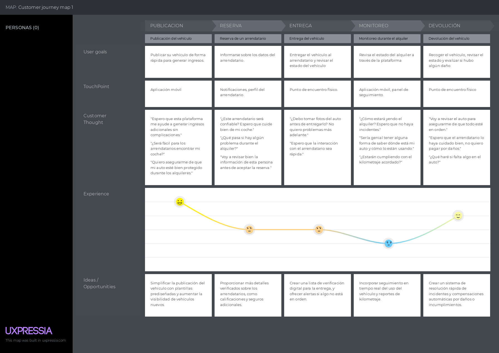

User Journey Mapping para Maria Lopez:

  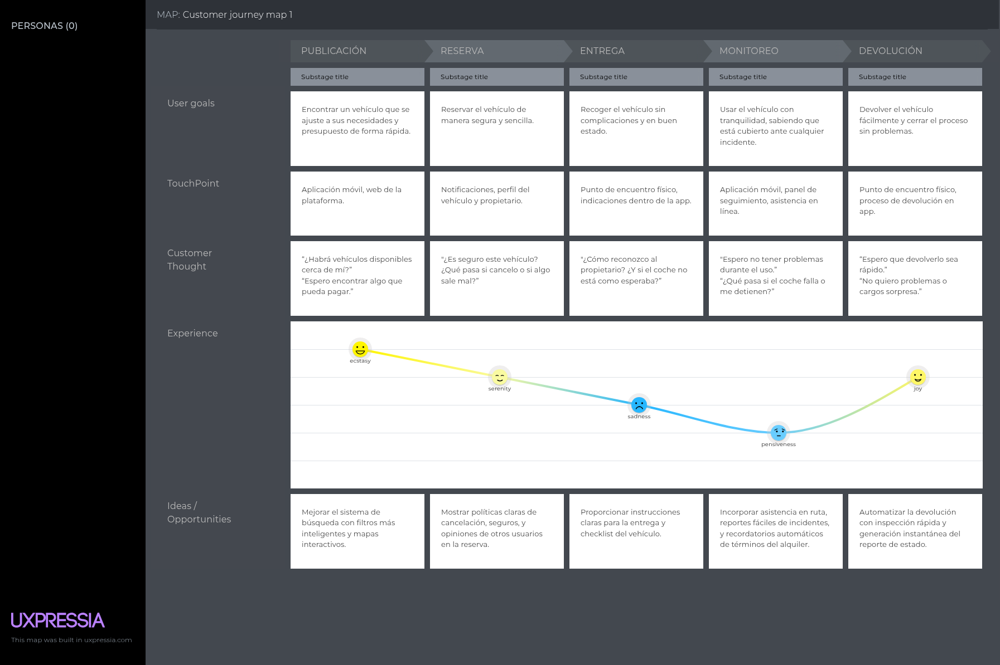

### 2.3.4. Empathy Mapping

### 2.3.5. Big Picture EventStorming

### 2.3.6. Ubiquitous Language

## 2.4. Requirements specification

### 2.4.1. User Stories

Esta seccion consolida las epicas, historias de usuario, historias tecnicas y spikes definidos para Rent2Go. Cada descripcion sigue el formato estandar y los criterios de aceptacion se presentan en Gherkin sin depender de detalles de interfaz.

| Story ID | User          | Priority | Epic | Title                                    | Description                                                                                                                   | Acceptance Criteria                                                                                                                                                                                                                                                                                                                                                                                                                                                                             |
| -------- | ------------- | -------- | ---- | ---------------------------------------- | ----------------------------------------------------------------------------------------------------------------------------- | ----------------------------------------------------------------------------------------------------------------------------------------------------------------------------------------------------------------------------------------------------------------------------------------------------------------------------------------------------------------------------------------------------------------------------------------------------------------------------------------------- |
| EP01     | -             | High     | EP01 | Registro de vehiculos                    | Conjunto de historias para el registro de vehiculos.                                                                          | N/A                                                                                                                                                                                                                                                                                                                                                                                                                                                                                             |
| EP02     | -             | High     | EP02 | Busqueda de vehiculos                    | Conjunto de historias de busqueda y filtros.                                                                                  | N/A                                                                                                                                                                                                                                                                                                                                                                                                                                                                                             |
| EP03     | -             | Medium   | EP03 | Detalles del vehiculo                    | Conjunto de historias para visualizar detalles del vehiculo.                                                                  | N/A                                                                                                                                                                                                                                                                                                                                                                                                                                                                                             |
| EP04     | -             | Medium   | EP04 | Favoritos y notificaciones               | Conjunto de historias de favoritos y alertas de disponibilidad.                                                               | N/A                                                                                                                                                                                                                                                                                                                                                                                                                                                                                             |
| EP05     | -             | High     | EP05 | Reservas                                 | Conjunto de historias para crear y gestionar reservas.                                                                        | N/A                                                                                                                                                                                                                                                                                                                                                                                                                                                                                             |
| EP06     | -             | High     | EP06 | Pagos                                    | Conjunto de historias de pagos y tarifas.                                                                                     | N/A                                                                                                                                                                                                                                                                                                                                                                                                                                                                                             |
| EP07     | -             | Medium   | EP07 | Resenas y calificaciones                 | Conjunto de historias para calificaciones y resenas.                                                                          | N/A                                                                                                                                                                                                                                                                                                                                                                                                                                                                                             |
| EP08     | -             | Medium   | EP08 | Mensajeria                               | Conjunto de historias para mensajeria segura.                                                                                 | N/A                                                                                                                                                                                                                                                                                                                                                                                                                                                                                             |
| EP09     | -             | Medium   | EP09 | Perfiles                                 | Conjunto de historias para gestion de perfiles.                                                                               | N/A                                                                                                                                                                                                                                                                                                                                                                                                                                                                                             |
| EP10     | -             | Medium   | EP10 | Verificacion de identidad                | Conjunto de historias de verificacion de identidad.                                                                           | N/A                                                                                                                                                                                                                                                                                                                                                                                                                                                                                             |
| EP11     | -             | Medium   | EP11 | Gestion de flota del propietario         | Conjunto de historias para la gestion del propietario.                                                                        | N/A                                                                                                                                                                                                                                                                                                                                                                                                                                                                                             |
| EP12     | -             | Medium   | EP12 | Administracion de reservas               | Conjunto de historias para la administracion de reservas.                                                                     | N/A                                                                                                                                                                                                                                                                                                                                                                                                                                                                                             |
| EP13     | -             | High     | EP13 | Autenticacion y recuperacion             | Conjunto de historias para registro e inicio de sesion.                                                                       | N/A                                                                                                                                                                                                                                                                                                                                                                                                                                                                                             |
| EP14     | -             | Low      | EP14 | Soporte y seguridad                      | Conjunto de historias de soporte e incidentes de seguridad.                                                                   | N/A                                                                                                                                                                                                                                                                                                                                                                                                                                                                                             |
| EP15     | -             | Medium   | EP15 | Landing page                             | Conjunto de historias del sitio web estatico.                                                                                 | N/A                                                                                                                                                                                                                                                                                                                                                                                                                                                                                             |
| HU01     | Propietario   | High     | EP01 | Registrar vehiculo                       | Como propietario quiero registrar un vehiculo para ofrecerlo en alquiler.                                                     | Escenario: Registro exitoso. Dado que el propietario proporciona los datos requeridos Cuando envia la solicitud de registro Entonces el sistema guarda el vehiculo y lo marca como disponible.  Escenario: Datos incompletos. Dado que el propietario omite datos requeridos Cuando envia la solicitud de registro Entonces el sistema rechaza el registro e informa la falta de datos.                                                                                 |
| HU02     | Arrendatario  | High     | EP02 | Buscar vehiculos disponibles             | Como arrendatario quiero buscar vehiculos disponibles para seleccionar uno adecuado a mis necesidades.                        | Escenario: Resultados con coincidencias. Dado que el arrendatario define criterios de busqueda Cuando ejecuta la busqueda Entonces el sistema lista vehiculos que cumplen los criterios.  Escenario: Sin resultados. Dado que no existen vehiculos disponibles para los criterios Cuando ejecuta la busqueda Entonces el sistema informa que no hay resultados.                                                                                                         |
| HU03     | Arrendatario  | Medium   | EP02 | Filtrar por precio                       | Como arrendatario quiero filtrar vehiculos por precio para ajustar el resultado a mi presupuesto.                             | Escenario: Filtro aplicado. Dado que el arrendatario define un rango de precios Cuando aplica el filtro Entonces el sistema muestra solo vehiculos dentro del rango.  Escenario: Sin coincidencias. Dado que no hay vehiculos en el rango Cuando aplica el filtro Entonces el sistema informa que no hay coincidencias.                                                                                                                                                 |
| HU04     | Arrendatario  | Medium   | EP03 | Ver detalles de vehiculo                 | Como arrendatario quiero ver detalles de un vehiculo para tomar una decision informada.                                       | Escenario: Detalle disponible. Dado que el arrendatario selecciona un vehiculo listado Cuando solicita el detalle Entonces el sistema muestra datos del vehiculo y condiciones del alquiler.  Escenario: Detalle no disponible. Dado que no se pueden recuperar los datos del vehiculo Cuando el arrendatario solicita el detalle Entonces el sistema informa el problema y no muestra datos incompletos.                                                               |
| HU05     | Arrendatario  | Medium   | EP04 | Agregar a favoritos                      | Como arrendatario quiero agregar vehiculos a favoritos para revisarlos mas tarde.                                             | Escenario: Favorito guardado. Dado que el arrendatario selecciona un vehiculo Cuando marca el vehiculo como favorito Entonces el sistema guarda el favorito en su lista.  Escenario: Error al guardar. Dado que ocurre un error al guardar Cuando intenta agregar a favoritos Entonces el sistema informa el error y no guarda el favorito.                                                                                                                             |
| HU06     | Arrendatario  | Medium   | EP07 | Calificar vehiculo                       | Como arrendatario quiero calificar un vehiculo al finalizar el alquiler para compartir mi experiencia.                        | Escenario: Calificacion exitosa. Dado que el alquiler esta completado Cuando el arrendatario envia una calificacion y comentario Entonces el sistema guarda la evaluacion asociada al vehiculo.  Escenario: Alquiler no completado. Dado que el alquiler no esta completado Cuando intenta calificar Entonces el sistema bloquea la calificacion.                                                                                                                       |
| HU07     | Arrendatario  | Medium   | EP08 | Contactar al propietario                 | Como arrendatario quiero contactar al propietario para coordinar detalles del alquiler.                                       | Escenario: Mensaje enviado. Dado que el arrendatario redacta un mensaje Cuando lo envia al propietario Entonces el sistema entrega el mensaje y confirma el envio.  Escenario: Error de envio. Dado que ocurre un fallo al enviar Cuando intenta contactar al propietario Entonces el sistema informa el error y no envia el mensaje.                                                                                                                                   |
| HU08     | Arrendatario  | High     | EP05 | Reservar vehiculo                        | Como arrendatario quiero reservar un vehiculo para asegurar disponibilidad en fechas definidas.                               | Escenario: Reserva exitosa. Dado que el vehiculo esta disponible en el rango solicitado Cuando el arrendatario confirma la reserva Entonces el sistema registra la reserva y bloquea las fechas.  Escenario: Conflicto de disponibilidad. Dado que el vehiculo ya no esta disponible Cuando intenta reservar Entonces el sistema rechaza la reserva e informa el conflicto.                                                                                             |
| HU09     | Arrendatario  | Medium   | EP05 | Ver historial de alquileres              | Como arrendatario quiero ver mi historial de alquileres para llevar control de mis transacciones.                             | Escenario: Historial disponible. Dado que el arrendatario tiene alquileres previos Cuando solicita el historial Entonces el sistema lista sus alquileres con fechas y estados.  Escenario: Historial vacio. Dado que no hay alquileres previos Cuando solicita el historial Entonces el sistema informa que no existe historial.                                                                                                                                        |
| HU10     | Arrendatario  | High     | EP06 | Administrar pagos                        | Como arrendatario quiero realizar el pago del alquiler para completar la transaccion.                                         | Escenario: Pago exitoso. Dado que el arrendatario confirma el pago con datos validos Cuando se procesa la transaccion Entonces el sistema confirma el pago y actualiza la reserva.  Escenario: Pago fallido. Dado que los datos son invalidos o el proveedor rechaza Cuando se procesa el pago Entonces el sistema informa el fallo y no confirma la reserva.                                                                                                           |
| HU11     | Usuario       | Medium   | EP09 | Ver perfil de usuario                    | Como usuario quiero ver mi perfil para confirmar mis datos y actividad.                                                       | Escenario: Perfil visible. Dado que el usuario tiene una cuenta activa Cuando solicita su perfil Entonces el sistema muestra datos personales y actividad relevante.  Escenario: Error de carga. Dado que ocurre un error del servicio Cuando solicita el perfil Entonces el sistema informa el error y no muestra datos incompletos.                                                                                                                                   |
| HU12     | Usuario       | Medium   | EP09 | Editar perfil de usuario                 | Como usuario quiero editar mi perfil para mantener mis datos actualizados.                                                    | Escenario: Actualizacion exitosa. Dado que el usuario envia datos validos Cuando confirma la edicion Entonces el sistema guarda los cambios y actualiza el perfil.  Escenario: Datos invalidos. Dado que el usuario envia datos invalidos Cuando intenta guardar Entonces el sistema rechaza la actualizacion e informa el error.                                                                                                                                       |
| HU13     | Propietario   | Medium   | EP11 | Gestionar vehiculos alquilados           | Como propietario quiero ver vehiculos alquilados para monitorear mis transacciones.                                           | Escenario: Lista de alquileres. Dado que el propietario tiene vehiculos alquilados Cuando solicita la lista Entonces el sistema muestra vehiculos con fechas y arrendatario.  Escenario: Sin alquileres. Dado que no hay alquileres activos o previos Cuando solicita la lista Entonces el sistema informa que no hay resultados.                                                                                                                                       |
| HU14     | Arrendatario  | Medium   | EP04 | Recibir notificaciones de disponibilidad | Como arrendatario quiero recibir notificaciones de disponibilidad para enterarme cuando un vehiculo favorito esta disponible. | Escenario: Notificacion enviada. Dado que el arrendatario tiene un favorito Cuando el vehiculo vuelve a estar disponible Entonces el sistema envia una notificacion de disponibilidad.  Escenario: Favorito no registrado. Dado que el vehiculo no esta en favoritos Cuando cambia la disponibilidad Entonces el sistema no envia notificaciones.                                                                                                                       |
| HU15     | Visitante     | Medium   | EP15 | Ver landing page informativa             | Como visitante quiero ver una landing page informativa para conocer el servicio.                                              | Escenario: Contenido disponible. Dado que el visitante accede al sitio Cuando carga la pagina Entonces el sistema muestra la informacion del servicio.  Escenario: Fallo de carga. Dado que ocurre un error de disponibilidad Cuando el visitante accede al sitio Entonces el sistema informa el fallo y no muestra contenido incompleto.                                                                                                                               |
| HU16     | Visitante     | Medium   | EP15 | Ver informacion de contacto              | Como visitante quiero ver informacion de contacto para comunicarme con la empresa.                                            | Escenario: Contacto visible. Dado que el visitante navega en la pagina Cuando busca la seccion de contacto Entonces el sistema muestra telefono, correo y redes sociales.  Escenario: Datos no disponibles. Dado que la informacion no esta disponible Cuando el visitante busca contacto Entonces el sistema informa que no hay datos de contacto.                                                                                                                     |
| HU17     | Visitante     | Low      | EP15 | Navegacion intuitiva en landing          | Como visitante quiero navegar facilmente la landing para encontrar contenido sin friccion.                                    | Escenario: Navegacion clara. Dado que el visitante usa la pagina Cuando explora las secciones principales Entonces el sistema permite acceder a cada seccion sin obstaculos.  Escenario: Seccion no disponible. Dado que una seccion no esta disponible Cuando el visitante intenta acceder Entonces el sistema informa la no disponibilidad.                                                                                                                           |
| HU18     | Visitante     | Low      | EP15 | Landing responsiva                       | Como visitante quiero que la landing sea responsiva para verla bien en distintos dispositivos.                                | Escenario: Ajuste correcto. Dado que el visitante abre la pagina en un dispositivo diferente Cuando se renderiza el contenido Entonces el sistema adapta la pagina al tamano de pantalla.  Escenario: Vista no soportada. Dado que el visitante usa un tamano de pantalla no comun Cuando se renderiza la pagina Entonces el sistema mantiene contenido legible sin superposiciones.                                                                                    |
| HU19     | Usuario       | High     | EP13 | Registro de usuario                      | Como nuevo usuario quiero registrarme para acceder a los servicios.                                                           | Escenario: Registro exitoso. Dado que el usuario ingresa datos validos Cuando envia el registro Entonces el sistema crea la cuenta y habilita el acceso.  Escenario: Correo duplicado. Dado que el correo ya existe Cuando intenta registrarse Entonces el sistema rechaza el registro e informa duplicidad.  Escenario: Campos incompletos. Dado que faltan datos requeridos Cuando envia el registro Entonces el sistema informa los campos faltantes. |
| HU20     | Usuario       | High     | EP13 | Inicio de sesion                         | Como usuario registrado quiero iniciar sesion para acceder a mi cuenta.                                                       | Escenario: Inicio exitoso. Dado que las credenciales son validas Cuando inicia sesion Entonces el sistema autoriza el acceso y crea la sesion.  Escenario: Credenciales invalidas. Dado que las credenciales son incorrectas Cuando intenta iniciar sesion Entonces el sistema rechaza el acceso e informa el error.                                                                                                                                                    |
| HU21     | Usuario       | Medium   | EP13 | Recuperar contrasena                     | Como usuario quiero recuperar mi contrasena para restablecer el acceso.                                                       | Escenario: Enlace enviado. Dado que el correo esta registrado Cuando solicita recuperacion Entonces el sistema envia un enlace de recuperacion.  Escenario: Correo no registrado. Dado que el correo no existe Cuando solicita recuperacion Entonces el sistema informa que el correo no esta registrado.                                                                                                                                                               |
| HU22     | Propietario   | Medium   | EP01 | Publicar vehiculo con especificaciones   | Como propietario quiero publicar un vehiculo con especificaciones para alquilarlo con informacion clara.                      | Escenario: Publicacion exitosa. Dado que el propietario ingresa datos validos Cuando confirma la publicacion Entonces el sistema registra el vehiculo con sus especificaciones.  Escenario: Datos invalidos. Dado que el propietario ingresa datos invalidos Cuando intenta publicar Entonces el sistema rechaza la publicacion e informa el error.                                                                                                                     |
| HU23     | Propietario   | Medium   | EP11 | Ver mis vehiculos publicados             | Como propietario quiero ver mis vehiculos publicados para gestionar su estado.                                                | Escenario: Vehiculos listados. Dado que el propietario tiene vehiculos publicados Cuando solicita la lista Entonces el sistema muestra los vehiculos con su estado.  Escenario: Sin vehiculos. Dado que el propietario no tiene vehiculos publicados Cuando solicita la lista Entonces el sistema informa que no hay vehiculos.                                                                                                                                         |
| HU24     | Administrador | Medium   | EP12 | Ver todas las reservaciones              | Como administrador quiero ver todas las reservaciones para monitorear el servicio.                                            | Escenario: Reservaciones listadas. Dado que el administrador tiene permisos de gestion Cuando solicita la lista general Entonces el sistema muestra todas las reservaciones existentes.  Escenario: Sin reservaciones. Dado que no hay reservaciones registradas Cuando solicita la lista general Entonces el sistema informa que no hay registros.                                                                                                                     |
| HU25     | Usuario       | Medium   | EP12 | Filtrar reservaciones por estado         | Como usuario quiero filtrar reservaciones por estado para visualizar resultados especificos.                                  | Escenario: Filtro aplicado. Dado que el usuario selecciona un estado Cuando aplica el filtro Entonces el sistema lista reservaciones con ese estado.  Escenario: Sin coincidencias. Dado que no existen reservaciones con ese estado Cuando aplica el filtro Entonces el sistema informa que no hay resultados.                                                                                                                                                         |
| HU26     | Arrendatario  | Medium   | EP02 | Buscar con filtros avanzados             | Como arrendatario quiero buscar vehiculos con filtros avanzados para encontrar el vehiculo ideal.                             | Escenario: Resultados filtrados. Dado que el arrendatario define filtros avanzados Cuando ejecuta la busqueda Entonces el sistema muestra resultados que cumplen todos los filtros.  Escenario: Sin resultados. Dado que no hay coincidencias Cuando ejecuta la busqueda Entonces el sistema informa la ausencia de resultados.                                                                                                                                         |
| HU27     | Arrendatario  | Medium   | EP05 | Ver mis reservaciones por estado         | Como arrendatario quiero ver mis reservaciones por estado para organizar mis alquileres.                                      | Escenario: Reservaciones por estado. Dado que el arrendatario selecciona un estado Cuando solicita sus reservaciones Entonces el sistema lista sus reservaciones en ese estado.  Escenario: Lista vacia. Dado que no hay reservaciones en ese estado Cuando solicita la lista Entonces el sistema informa que no hay registros.                                                                                                                                         |
| HU28     | Usuario       | Medium   | EP05 | Ver detalle de una reservacion           | Como usuario quiero ver el detalle de una reservacion para consultar fechas y condiciones.                                    | Escenario: Detalle visible. Dado que el usuario tiene acceso a la reservacion Cuando solicita el detalle Entonces el sistema muestra los datos completos de la reservacion.  Escenario: Acceso no permitido. Dado que la reservacion no pertenece al usuario Cuando intenta acceder Entonces el sistema rechaza el acceso e informa el error.                                                                                                                           |
| HU29     | Arrendatario  | Medium   | EP05 | Cancelar reservacion                     | Como arrendatario quiero cancelar una reservacion para evitar cargos si ya no la necesito.                                    | Escenario: Cancelacion exitosa. Dado que la reservacion esta dentro del plazo permitido Cuando el arrendatario solicita cancelacion Entonces el sistema cancela la reservacion sin penalizacion.  Escenario: Plazo vencido. Dado que el plazo permitido vencio Cuando solicita cancelacion Entonces el sistema rechaza la cancelacion e informa la politica aplicada.                                                                                                   |
| HU30     | Propietario   | Medium   | EP12 | Actualizar estado de reservacion         | Como propietario quiero actualizar el estado de una reservacion para gestionar el proceso de alquiler.                        | Escenario: Estado actualizado. Dado que el propietario tiene permisos Cuando actualiza el estado Entonces el sistema guarda el cambio y notifica al arrendatario.  Escenario: Conflicto de actualizacion. Dado que el estado fue actualizado por otro proceso Cuando intenta modificarlo Entonces el sistema informa el conflicto y no aplica cambios.                                                                                                                  |
| HU31     | Usuario       | Medium   | EP10 | Verificacion de identidad                | Como usuario quiero verificar mi identidad para aumentar la confianza en la plataforma.                                       | Escenario: Verificacion exitosa. Dado que el usuario envia documentos validos Cuando se procesa la verificacion Entonces el sistema marca la identidad como verificada.  Escenario: Verificacion rechazada. Dado que los documentos no son validos Cuando se procesa la verificacion Entonces el sistema informa el rechazo y solicita correccion.                                                                                                                      |
| HU32     | Arrendatario  | Medium   | EP06 | Calculo de tarifa total                  | Como arrendatario quiero ver el costo total del alquiler para decidir antes de confirmar.                                     | Escenario: Tarifa calculada. Dado que el arrendatario define fechas y vehiculo Cuando solicita el costo Entonces el sistema muestra el total con impuestos y comisiones.  Escenario: Datos insuficientes. Dado que faltan datos para el calculo Cuando solicita el costo Entonces el sistema indica la informacion faltante.                                                                                                                                            |
| HU33     | Usuario       | Low      | EP14 | Reportar incidente de seguridad          | Como usuario quiero reportar un incidente para recibir soporte y dejar constancia.                                            | Escenario: Reporte enviado. Dado que el usuario describe el incidente Cuando envia el reporte Entonces el sistema registra el caso y confirma la recepcion.  Escenario: Error al reportar. Dado que ocurre un fallo del sistema Cuando envia el reporte Entonces el sistema informa el error y no registra el caso.                                                                                                                                                     |
| HU34     | Usuario       | Medium   | EP13 | Guardar sesion local                     | Como usuario quiero mantener la sesion activa para no iniciar sesion cada vez que uso la app.                                 | Escenario: Sesion persistida. Dado que el usuario inicia sesion correctamente Cuando cierra y reabre la app Entonces el sistema recupera la sesion desde almacenamiento local.  Escenario: Sesion expirada. Dado que la sesion expiro Cuando abre la app nuevamente Entonces el sistema solicita autenticacion.                                                                                                                                                         |
| TS01     | Desarrollador | High     | EP06 | API de pagos                             | Como desarrollador quiero exponer un endpoint de pagos para procesar transacciones.                                           | Escenario: Transaccion aprobada. Dado que existe una solicitud valida con monto y token Cuando el servicio procesa la transaccion Entonces responde con estado aprobado y referencia.  Escenario: Transaccion rechazada. Dado que existe una solicitud con token invalido Cuando el servicio procesa la transaccion Entonces responde con estado rechazado y codigo de error.                                                                                           |
| TS02     | Desarrollador | High     | EP13 | API de autenticacion                     | Como desarrollador quiero exponer endpoints de autenticacion para gestionar sesiones seguras.                                 | Escenario: Inicio de sesion correcto. Dado que las credenciales son validas Cuando el servicio autentica Entonces responde con token y expiracion.  Escenario: Inicio de sesion incorrecto. Dado que las credenciales son invalidas Cuando el servicio autentica Entonces responde con error de autenticacion.                                                                                                                                                          |
| TS03     | Desarrollador | Medium   | EP02 | API de busqueda                          | Como desarrollador quiero exponer un endpoint de busqueda para filtrar vehiculos por criterios.                               | Escenario: Consulta con resultados. Dado que existe una solicitud con filtros validos Cuando el servicio procesa la busqueda Entonces responde con una lista paginada de vehiculos.  Escenario: Consulta sin resultados. Dado que existe una solicitud con filtros validos que no coincide con vehiculos Cuando el servicio procesa la busqueda Entonces responde con una lista vacia y estado exitoso.                                                                 |
| SP01     | Desarrollador | Medium   | EP06 | Spike integracion pasarela de pagos      | Como desarrollador quiero investigar una pasarela de pagos para validar viabilidad tecnica.                                   | Escenario: Spike completado. Dado que se prueban al menos dos proveedores Cuando se comparan costos, cobertura y SDKs Entonces se documenta una recomendacion con riesgos y compensaciones.  Escenario: Sin proveedor viable. Dado que los proveedores evaluados no cumplen requisitos Cuando se completa la evaluacion Entonces se documentan restricciones y alternativas.                                                                                            |
| SP02     | Desarrollador | Medium   | EP02 | Spike integracion servicio de mapas      | Como desarrollador quiero evaluar un servicio de mapas para validar busqueda por ubicacion.                                   | Escenario: PoC funcional. Dado que se integra un proveedor externo Cuando se consulta una ubicacion Entonces se obtienen coordenadas y resultados en pruebas.  Escenario: Limitacion del proveedor. Dado que el proveedor no soporta una region requerida Cuando se evalua la PoC Entonces se documenta la limitacion y opciones de mitigacion.                                                                                                                         |
| SP03     | Desarrollador | Medium   | EP13 | Spike almacenamiento seguro              | Como desarrollador quiero definir almacenamiento local seguro para proteger datos sensibles.                                  | Escenario: Estrategia definida. Dado que se identifican datos sensibles Cuando se define cifrado y politica de expiracion Entonces se documenta el esquema de almacenamiento local.  Escenario: Riesgos no mitigables. Dado que existen riesgos que no pueden mitigarse con los mecanismos disponibles Cuando se evalua la estrategia de almacenamiento Entonces se documentan las limitaciones y se propone una alternativa.                                           |

### 2.4.2. Impact Mapping

### 2.4.3. Product Backlog

Utilizamos la escala de Fibonacci para la estimación de los Story Points.

| Epic / Story ID | Título                                          | Descripción                                                                                                                                      | Story Points (1/2/3/5/8) |
| --------------- | ----------------------------------------------- | ------------------------------------------------------------------------------------------------------------------------------------------------ | ------------------------ |
| HU01            | Registrar cuenta                                | **Como** usuario, **deseo** crear una nueva cuenta para entrar a la plataforma.                                                                  | 3                        |
| HU02            | Iniciar sesión con autenticación segura         | **Como** usuario, **deseo** iniciar sesión con mi cuenta de forma segura para acceder a mis funcionalidades.                                     | 2                        |
| HU04            | Verificación de identidad                       | **Como** propietario y arrendatario, **deseo** que la plataforma verifique la identidad de los usuarios para asegurar la confiabilidad.          | 5                        |
| HU06            | Publicar un vehículo para alquiler              | **Como** propietario, **deseo** publicar mi vehículo para que pueda ser alquilado.                                                               | 3                        |
| HU07            | Buscar vehículos disponibles                    | **Como** arrendatario, **deseo** buscar vehículos disponibles cerca de mi ubicación para alquilar.                                               | 5                        |
| HU08            | Reservar un vehículo                            | **Como** arrendatario, **deseo** reservar un vehículo para una fecha y hora específicas.                                                         | 5                        |
| HU11            | Calcular tarifas de alquiler                    | **Como** usuario, **deseo** ver el costo total del alquiler antes de confirmar la reserva.                                                       | 5                        |
| HU13            | Ver historial de alquileres                     | **Como** arrendatario, **deseo** ver el historial de mis alquileres anteriores para llevar un registro de mis transacciones.                     | 1                        |
| HU14            | Recibir notificaciones de vehículos disponibles | **Como** arrendatario, **deseo** recibir notificaciones cuando un vehículo que me interesa esté disponible.                                      | 1                        |
| HU16            | Editar datos de vehículo publicado              | **Como** propietario, **deseo** editar los datos de mi vehículo publicado en caso de cambios.                                                    | 2                        |
| HU17            | Compartir vehículo por redes sociales           | **Como** propietario, **deseo** compartir mi anuncio en redes sociales para llegar a más personas.                                               | 1                        |
| HU18            | Ver ranking de usuarios confiables              | **Como** usuario, **deseo** ver la calificación promedio de otros usuarios para decidir con quién interactuar.                                   | 2                        |
| HU19            | Registro interno de usuario                     | **Como** nuevo usuario, **Quiero** registrarme en la plataforma **Para** acceder a los servicios.                                                | 3                        |
| HU20            | Registro interno de inicio de sesión            | **Como** usuario registrado, **Quiero** iniciar sesión **Para** acceder a mi cuenta.                                                             | 2                        |
| HU21            | Registro interno para recuperar contraseña      | **Como** usuario, **Quiero** recuperar mi contraseña **Para** restablecer acceso si la olvidé.                                                   | 2                        |
| HU22            | Publicar vehículo con especificaciones          | **Como** propietario, **Quiero** publicar un vehículo con datos y especificaciones **Para** alquilarlo.                                          | 3                        |
| HU23            | Ver mis vehículos publicados                    | **Como** propietario, **Quiero** ver mis vehículos publicados **Para** gestionar su estado.                                                      | 2                        |
| HU24            | Ver todas las reservaciones                     | **Como** administrador o propietario, **Quiero** ver todas las reservaciones **Para** monitorear.                                                | 3                        |
| HU25            | Filtrar reservaciones por estado                | **Como** usuario, **Quiero** filtrar las reservaciones por estado **Para** visualizarlas fácilmente.                                             | 2                        |
| HU26            | Buscar vehículos con filtros avanzados          | **Como** cliente, **Quiero** buscar vehículos aplicando filtros **Para** encontrar el ideal.                                                     | 5                        |
| HU27            | Ver mis reservaciones por estado                | **Como** cliente, **Quiero** ver mis reservaciones por estado **Para** organizar mis alquileres.                                                 | 2                        |
| HU28            | Ver detalle de una reservación                  | **Como** usuario, **Quiero** ver detalles de una reservación específica **Para** consultar fechas y vehículo.                                    | 2                        |
| HU29            | Cancelar reservación                            | **Como** cliente, **Quiero** cancelar una reservación **Para** evitar el cobro si ya no la necesito.                                             | 3                        |
| HU30            | Actualizar estado de reservación                | **Como** propietario, **Quiero** actualizar el estado de una reserva (aceptar, rechazar, marcar como completada) **Para** gestionar el alquiler. | 3                        |

## 2.5. Strategic-Level Domain-Driven Design

### 2.5.1. EventStorming

#### 2.5.1.1. Candidate Context Discovery

#### 2.5.1.2. Domain Message Flows Modeling

#### 2.5.1.3. Bounded Context Canvases

### 2.5.2. Context Mapping

### 2.5.3. Software Architecture

En esta seccion se presenta la arquitectura de software de Rent2Go aplicando C4 Model. Se cubren los diagramas de contexto, contenedores y despliegue, mostrando los productos en alcance (app movil, landing page, API Gateway, servicios backend, base de datos y servicios externos).

#### 2.5.3.1. Software Architecture Context Level Diagrams

Se muestra el sistema Rent2Go en el centro, rodeado por los actores principales (Propietario y Arrendatario) y los sistemas externos (Stripe y Email Service) con los que interactua el dominio de pagos y notificaciones.

  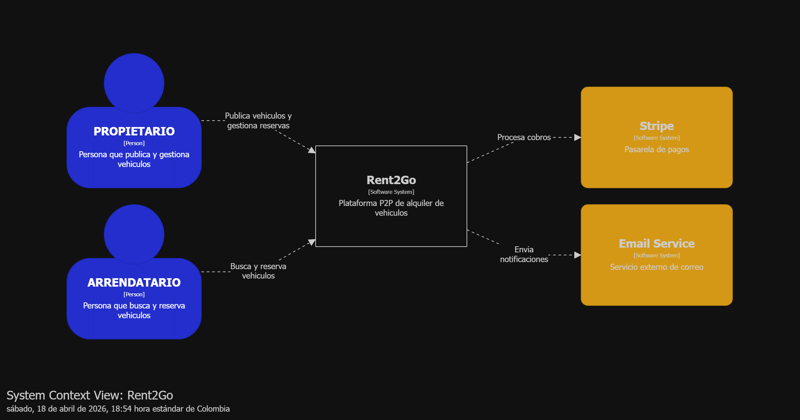

El diagrama evidencia que los usuarios interactuan con la plataforma para publicar y reservar vehiculos, mientras los servicios externos procesan pagos y envian notificaciones.

#### 2.5.3.2. Software Architecture Container Level Diagrams

El diagrama de contenedores detalla los elementos de alto nivel y la distribucion de responsabilidades: Landing Page y App Movil como canales, un API Gateway como punto de entrada, servicios backend por bounded context (IAM, Vehicle Catalog, Booking, Payments, Community) y una base de datos MySQL unica. Se resaltan las decisiones de tecnologia y las comunicaciones entre contenedores.

  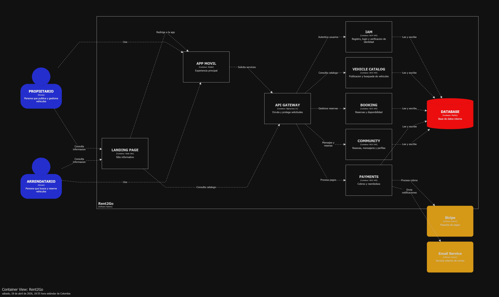

Como extension del diagrama de contenedores, se incluye el detalle de componentes del contenedor PAYMENTS para mostrar la conexion con servicios externos.

  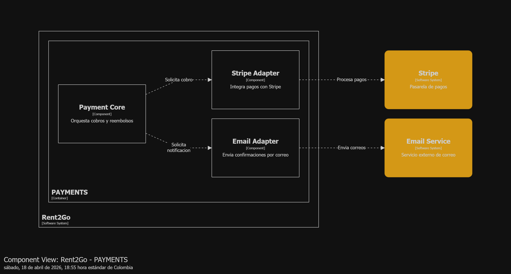

El componente Payment Core orquesta cobros y reembolsos, mientras Stripe Adapter integra con Stripe y Email Adapter envia notificaciones por correo.

#### 2.5.3.3. Software Architecture Deployment Diagrams

El diagrama de despliegue representa la distribucion fisica en infraestructura: app movil en dispositivo, landing page en navegador, un cluster de API en nube y la base de datos MySQL administrada. Se visualizan tambien las dependencias con los servicios externos.

  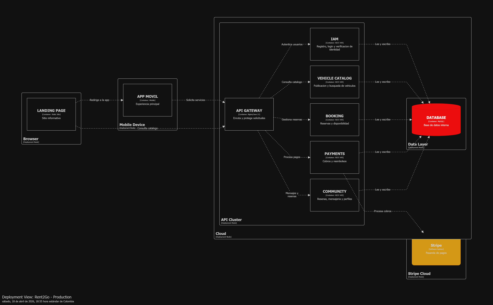

La vista de despliegue deja claro como se implementa el sistema en hardware y servicios administrados, manteniendo separadas las capas de presentacion, servicios y datos.

## 2.6. Tactical-Level Domain-Driven Design

En esta seccion se presenta la perspectiva tactica del diseno de la solucion. Se documentan las capas, clases y diagramas por bounded context, iniciando con Vehicle Catalog.

### 2.6.1. Bounded Context: Vehicle Catalog

Este bounded context gestiona el ciclo de vida del catalogo de vehiculos. A continuacion se presenta el diccionario de clases y las relaciones clave de la solucion.

**Diccionario de clases (resumen)**

| Clase                 | Proposito                                           | Atributos principales                              | Metodos principales                                         | Relaciones                                                      |
| --------------------- | --------------------------------------------------- | -------------------------------------------------- | ----------------------------------------------------------- | --------------------------------------------------------------- |
| Vehicle               | Aggregate Root que representa el vehiculo publicado | vehicleId, ownerId, specification, pricing, status | create(), getId(), getStatus()                              | contiene VehicleSpecification, PricingPolicy; usa VehicleStatus |
| VehicleSpecification  | Value Object con datos descriptivos                 | brand, model, year                                 | N/A                                                         | pertenece a Vehicle                                             |
| PricingPolicy         | Value Object con tarifa base                        | dailyRate                                          | N/A                                                         | usa Money                                                       |
| Money                 | Value Object monetario                              | amount, currency                                   | N/A                                                         | usado por PricingPolicy                                         |
| VehicleStatus         | Enum de estado                                      | DRAFT, PUBLISHED, UNAVAILABLE, DELETED             | N/A                                                         | usado por Vehicle                                               |
| VehicleController     | Controller REST del catalogo                        | N/A                                                | registerVehicle(), publishVehicle(), getVehicleById()       | usa VehicleCommandService y VehicleQueryService                 |
| VehicleCommandService | Domain Service de comandos                          | N/A                                                | handle(CreateVehicleCommand), handle(PublishVehicleCommand) | implementado por VehicleCommandServiceImpl                      |
| VehicleQueryService   | Domain Service de consultas                         | N/A                                                | handle(GetVehicleByIdQuery)                                 | implementado por VehicleQueryServiceImpl                        |
| VehicleRepository     | Repository del agregado                             | N/A                                                | findById(), save()                                          | maneja Vehicle                                                  |

#### 2.6.1.1. Domain Layer

El core del dominio se modela con el agregado Vehicle y sus Value Objects VehicleSpecification, PricingPolicy y Money. Las reglas de negocio se reflejan en el estado VehicleStatus y en la construccion del agregado al registrar o publicar vehiculos. Las abstracciones de acceso a datos se definen en VehicleRepository.

#### 2.6.1.2. Interface Layer

La capa de interfaz se representa con VehicleController y sus resources/assemblers para exponer endpoints REST de registro, publicacion y consulta de vehiculos.

#### 2.6.1.3. Application Layer

Los flujos de negocio se coordinan con VehicleCommandServiceImpl y VehicleQueryServiceImpl, que actuan como command handlers y query handlers para CreateVehicleCommand, PublishVehicleCommand y GetVehicleByIdQuery.

#### 2.6.1.4. Infrastructure Layer

La infraestructura contiene la implementacion de VehicleRepository y los adaptadores de persistencia para MySQL. Aqui se materializa el acceso a tablas y consultas requeridas por el catalogo.

#### 2.6.1.5. Bounded Context Software Architecture Component Level Diagrams

Se presenta el Component Diagram del container Vehicle Catalog, mostrando controllers, services, repositories y su interaccion interna.

  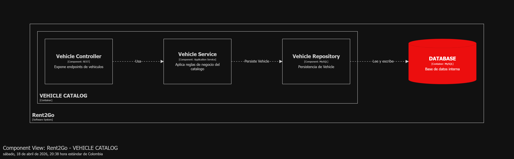

#### 2.6.1.6. Bounded Context Software Architecture Code Level Diagrams

Se detallan los diagramas de implementacion para el bounded context.

##### 2.6.1.6.1. Bounded Context Domain Layer Class Diagrams

  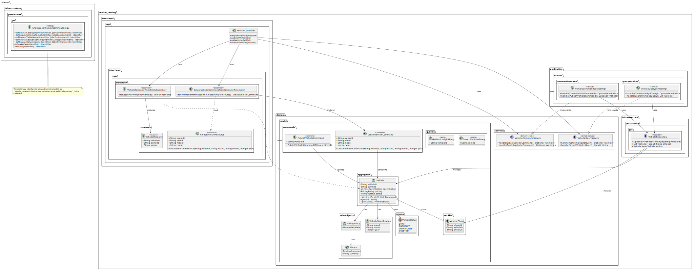

##### 2.6.1.6.2. Bounded Context Database Design Diagram

  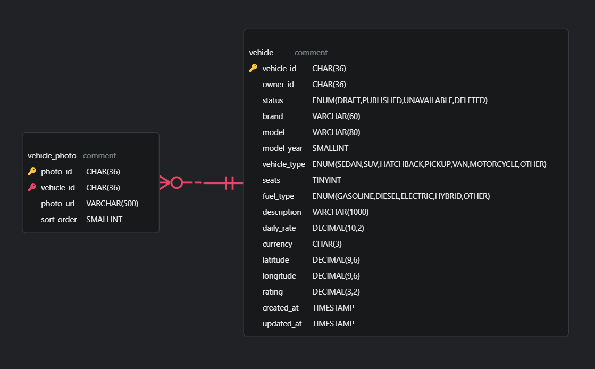

### 2.6.2. Bounded Context: Booking & Reservations

Este bounded context gestiona el ciclo de vida de las reservas de vehiculos, desde la solicitud inicial hasta la finalizacion o cancelacion. A continuacion se presenta el diccionario de clases y las relaciones clave de la solucion.

**Diccionario de clases (resumen)**

| Clase | Proposito | Atributos principales | Metodos principales | Relaciones |
| :--- | :--- | :--- | :--- | :--- |
| Booking | Aggregate Root que representa una reserva de vehiculo | bookingId, renterId, vehicleId, period, totalAmount, status | confirm(), cancel(), complete() | contiene BookingPeriod; usa BookingStatus |
| BookingPeriod | Value Object que define el rango de fechas | startDate, endDate | durationInDays() | pertenece a Booking |
| BookingStatus | Enum de estado de la reserva | PENDING, CONFIRMED, CANCELLED, COMPLETED | N/A | usado por Booking |
| BookingController | Controller REST para la gestion de reservas | N/A | createBooking(), getBookingById(), updateBookingStatus() | usa BookingCommandService y BookingQueryService |
| BookingCommandService | Domain Service de comandos para reservas | N/A | handle(CreateBookingCommand), handle(CancelBookingCommand) | implementado por BookingCommandServiceImpl |
| BookingQueryService | Domain Service de consultas para reservas | N/A | handle(GetBookingByIdQuery) | implementado por BookingQueryServiceImpl |
| BookingRepository | Repository del agregado Booking | N/A | findById(), save(), findByRenterId() | maneja Booking |

#### 2.6.2.1. Domain Layer

El core del dominio se modela con el agregado Booking, que coordina la relacion entre el arrendatario y el vehiculo reservado. Las reglas de negocio, como la validacion de fechas y el calculo de montos, se encapsulan en el agregado y en el Value Object BookingPeriod. El estado de la reserva se gestiona a traves del enum BookingStatus.

#### 2.6.2.2. Interface Layer

La capa de interfaz expone endpoints REST a traves de BookingController, permitiendo a los usuarios crear reservas, consultar su estado y realizar acciones de gestion (confirmacion/cancelacion). Se utilizan Resources y Assemblers para transformar los datos del dominio a formatos de respuesta API.

#### 2.6.2.3. Application Layer

Los flujos de negocio son orquestados por BookingCommandServiceImpl y BookingQueryServiceImpl. Estos servicios actuan como mediadores entre la capa de interfaz y el dominio, ejecutando comandos de cambio de estado y procesando consultas de informacion de reservas.

#### 2.6.2.4. Infrastructure Layer

La infraestructura maneja la persistencia de las reservas en la base de datos MySQL a traves de la implementacion de BookingRepository. Tambien incluye adaptadores para servicios externos si fuera necesario (por ejemplo, para integracion con calendarios o sistemas de notificacion).

#### 2.6.2.5. Bounded Context Software Architecture Component Level Diagrams

Se presenta el Component Diagram del container Booking & Reservations, detallando la interaccion entre controladores, servicios y repositorios.

  

#### 2.6.2.6. Bounded Context Software Architecture Code Level Diagrams

Se detallan los diagramas de implementacion para el bounded context de reservas.

##### 2.6.2.6.1. Bounded Context Domain Layer Class Diagrams

  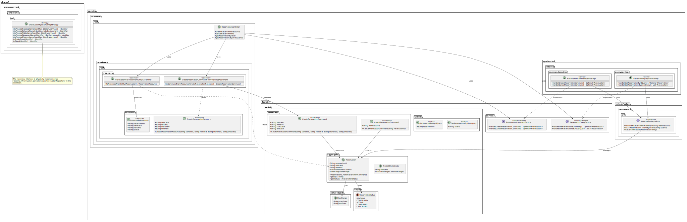

##### 2.6.2.6.2. Bounded Context Database Design Diagram

  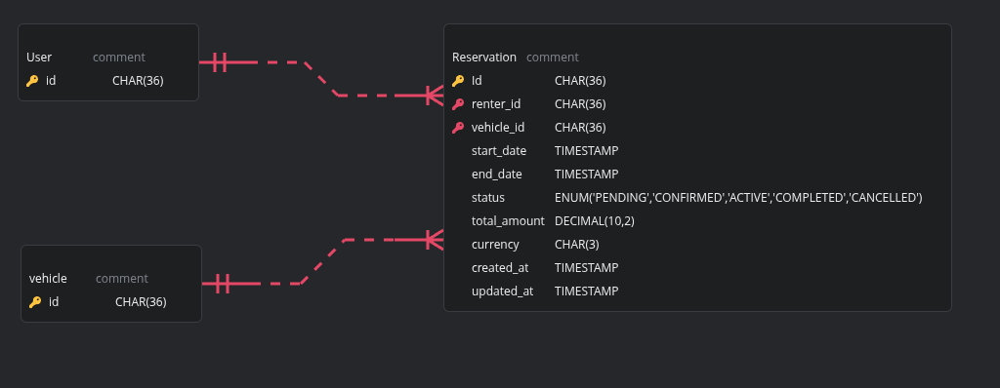

#### 2.6.x.1. Domain Layer

#### 2.6.x.2. Interface Layer

#### 2.6.x.3. Application Layer

#### 2.6.x.4. Infrastructure Layer

#### 2.6.x.5. Bounded Context Software Architecture Component Level Diagrams

#### 2.6.x.6. Bounded Context Software Architecture Code Level Diagrams

##### 2.6.x.6.1. Bounded Context Domain Layer Class Diagrams

##### 2.6.x.6.2. Bounded Context Database Design Diagram

