

<h1 style="text-align: center;">Universidad Peruana de Ciencias Aplicadas</h1> 

<h3 style="text-align: center; font-weight: normal; font-size: 22px; margin-top: 0;">
  Ingeniería de Software – 202610
</h3>  

<strong>Curso:</strong> Aplicaciones para Dispositivos Móviles

 
<strong>NRC:</strong> 3248

 
<strong>Profesor:</strong> Quevedo Velasco, David Gerardo

  
<strong>StartUp:</strong> R2G Technologies

  
<strong>Producto:</strong> Rent2Go
  

<h2 style="text-align: center; font-size: 24px; margin-top: 30px;">
  <strong>Informe de Trabajo Final</strong>
</h2>

<table style="display: flex; justify-content: center;"> 
<tr>
<th>Código</th>
<th>Integrantes</th>
</tr> 
<tr>
<td>U202210720</td>
<td>Carhuancote Dominguez, Gonzalo Alonso</td>
</tr>
<tr>
<td>U202322952</td>
<td>Castillo Vidal, Jesus Ivan</td>
</tr>
<tr>
<td>U202213468</td>
<td>Chavez Uribe, Ario</td>
</tr>
<tr>
<td>U202218110</td>
<td>Diestra Zambrano, Adriana Maria</td>
</tr>
<tr>
<td>U202322187</td>
<td>Huarcaya Matias, Gilbert Alonso</td>
</tr>
</table>
  

 Abril 2026 

## **Registro de versiones del Informe**

<table style="width: 100%; table-layout: fixed;">
  <tr>
    <th style="width: 25%;">Version</th>
    <th style="width: 25%;">Fecha</th>
    <th style="width: 25%;">Autor</th>
    <th style="width: 25%;">Descripción de modificación </th>
  </tr>
   <tr>
    <td align="center">AV1</td>
    <td align="center">21/04/2026</td>
    <td>Castillo Vidal, Jesus Ivan Chavez Uribe, Ario Joel Carhuancote Dominguez, Gonzalo Alonso Diestra Zambrano, Adriana Maria Huarcaya Matias, Gilbert Alonso</td>
    <td>Primera version del informe: caratula, registro de versiones, collaboration insights, student outcome, objetivos SMART, Capitulo I con el perfil de la startup y Lean UX, y Capitulo II desarrollado segun el guideline (competidores, entrevistas, needfinding, requirements specification, DDD estrategico y tactico).</td>
  </tr>
</table>

## Project Report Collaboration Insights

## AV1

**URL de organizacion GitHub:** [https://github.com/Startup-y-upc](https://github.com/Startup-y-upc)

**Resumen de actividad:** Durante AV1 el equipo organizo el trabajo del reporte mediante ramas de trabajo y pull requests. En este periodo se registraron 3 pull requests mergeados, 0 issues activos y 5 autores con 59 commits en main (y 59 commits en todas las ramas). No se registraron cambios de archivos en main dentro de la ventana del analitico. Los PRs mergeados fueron: **AV1**, **Feature/chapter 2** y **Feature/chapter 1**.

**Evidencia (analiticos de colaboracion y commits):**

  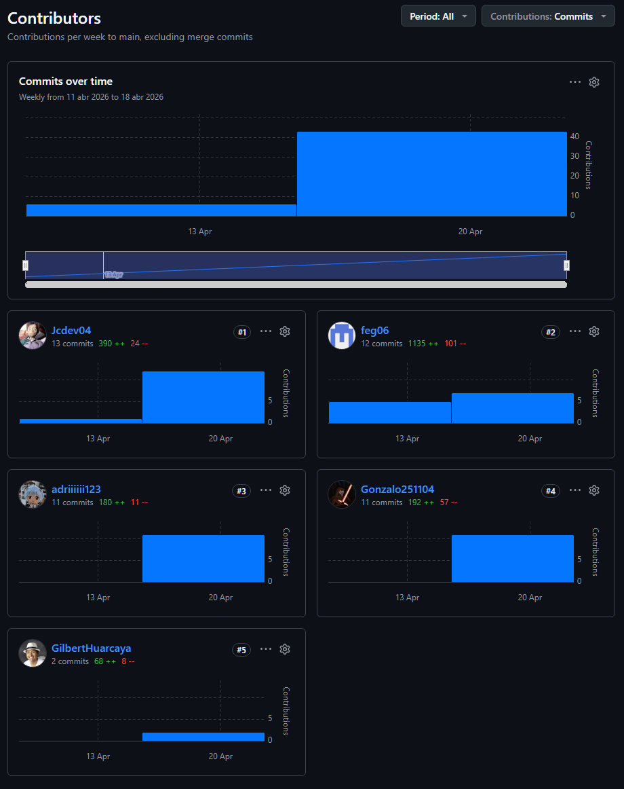

  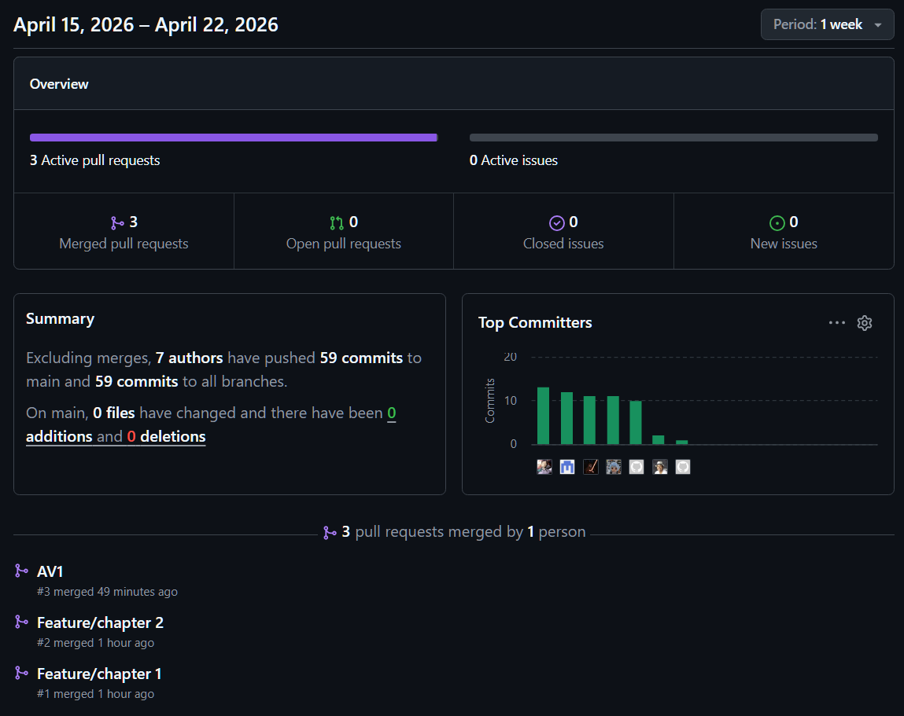

# Tabla de contenidos

## [Capítulo I: Introducción](README.md)

- [1.1 Startup Profile](README.md#11-startup-profile)
  - [1.1.1 Descripción de la Startup](README.md#111-descripción-de-la-startup)
  - [1.1.2 Perfiles de integrantes del equipo](README.md#112-perfiles-de-integrantes-del-equipo)
- [1.2 Solution Profile](README.md#12-solution-profile)
  - [1.2.1 Antecedentes y problemática](README.md#121-antecedentes-y-problemática)
  - [1.2.2 Lean UX Process](README.md#122-lean-ux-process)
    - [1.2.2.1 Lean UX Problem Statements](README.md#1221-lean-ux-problem-statements)
    - [1.2.2.2 Lean UX Assumptions](README.md#1222-lean-ux-assumptions)
    - [1.2.2.3 Lean UX Hypothesis Statements](README.md#1223-lean-ux-hypothesis-statements)
    - [1.2.2.4 Lean UX Canvas](README.md#1224-lean-ux-canvas)
- [1.3 Segmentos Objetivos](README.md#13-segmentos-objetivo)

## [Capítulo II: Requirements Development and Software Solution Design](README.md)

- [2.1 Competidores](README.md#21-competidores)
  - [2.1.1 Análisis competitivo](README.md#211-análisis-competitivo)
  - [2.1.2 Estrategias y tácticas frente a competidores](README.md#212-estrategias-y-tácticas-frente-a-competidores)
- [2.2 Entrevistas](README.md#22-entrevistas)
  - [2.2.1 Diseño de entrevistas](README.md#221-diseño-de-entrevistas)
  - [2.2.2 Registro de entrevistas](README.md#222-registro-de-entrevistas)
  - [2.2.3 Análisis de entrevistas](README.md#223-análisis-de-entrevistas)
- [2.3 Needfinding](README.md#23-needfinding)
  - [2.3.1 User Personas](README.md#231-user-personas)
  - [2.3.2 User Task Matrix](README.md#232-user-task-matrix)
  - [2.3.3 User Journey Mapping](README.md#233-user-journey-mapping)
  - [2.3.4 Empathy Mapping](README.md#234-empathy-mapping)
  - [2.3.5 Big Picture EventStorming](README.md#235-big-picture-eventstorming)
  - [2.3.6 Ubiquitous Language](README.md#236-ubiquitous-language)
- [2.4 Requirements specification](README.md#24-requirements-specification)
  - [2.4.1 User Stories](README.md#241-user-stories)
  - [2.4.2 Impact Mapping](README.md#242-impact-mapping)
  - [2.4.3 Product Backlog](README.md#243-product-backlog)
- [2.5 Strategic-Level Domain-Driven Design](README.md#25-strategic-level-domain-driven-design)
  - [2.5.1 EventStorming](README.md#251-eventstorming)
    - [2.5.1.1 Candidate Context Discovery](README.md#2511-candidate-context-discovery)
    - [2.5.1.2 Domain Message Flows Modeling](README.md#2512-domain-message-flows-modeling)
    - [2.5.1.3 Bounded Context Canvases](README.md#2513-bounded-context-canvases)
  - [2.5.2 Context Mapping](README.md#252-context-mapping)
  - [2.5.3 Software Architecture](README.md#253-software-architecture)
    - [2.5.3.1 Software Architecture Context Level Diagrams](README.md#2531-software-architecture-context-level-diagrams)
    - [2.5.3.2 Software Architecture Container Level Diagrams](README.md#2532-software-architecture-container-level-diagrams)
    - [2.5.3.3 Software Architecture Deployment Diagrams](README.md#2533-software-architecture-deployment-diagrams)
- [2.6 Tactical-Level Domain-Driven Design](README.md#26-tactical-level-domain-driven-design)
  - [2.6.x Bounded Context: <Bounded Context Name>](README.md#26x-bounded-context-bounded-context-name)
    - [2.6.x.1 Domain Layer](README.md#26x1-domain-layer)
    - [2.6.x.2 Interface Layer](README.md#26x2-interface-layer)
    - [2.6.x.3 Application Layer](README.md#26x3-application-layer)
    - [2.6.x.4 Infrastructure Layer](README.md#26x4-infrastructure-layer)
    - [2.6.x.5 Bounded Context Software Architecture Component Level Diagrams](README.md#26x5-bounded-context-software-architecture-component-level-diagrams)
    - [2.6.x.6 Bounded Context Software Architecture Code Level Diagrams](README.md#26x6-bounded-context-software-architecture-code-level-diagrams)
      - [2.6.x.6.1 Bounded Context Domain Layer Class Diagrams](README.md#26x61-bounded-context-domain-layer-class-diagrams)
      - [2.6.x.6.2 Bounded Context Database Design Diagram](README.md#26x62-bounded-context-database-design-diagram)

## [Conclusiones](README.md#conclusiones)

- [Conclusiones y recomendaciones](README.md#conclusiones-y-recomendaciones)
- [Video About-the-Team](README.md#video-about-the-team)

## [Bibliografia](README.md#bibliografia)

## [Anexos](README.md#anexos)

## [Bibliografía](README.md#bibliografía)

## [Anexos](README.md#anexos)

## Student Outcome

ABET – EAC - Student Outcome 7 Criterio: Actualiza conceptos y conocimientos necesarios para su desarrollo profesional y en especial para su proyecto en soluciones de software. Reconoce la necesidad del aprendizaje permanente para el desempeño profesional y el desarrollo de proyectos en soluciones de software.

| Criterio                                                                                        | Acciones realizadas | Conclusiones |
| ----------------------------------------------------------------------------------------------- | ------------------- | ------------ |
| Actualiza conceptos y conocimientos necesarios para su desarrollo profesional y en especial para su proyecto en soluciones de software. | - **Castillo Vidal, Jesus Ivan** &nbsp;&nbsp;- **AV1:** Cumplio el criterio al aplicar conceptos de analisis del contexto, competencia y validacion inicial en la descripcion de la startup y el diseno de entrevistas con enfoque mobile-first.  - **Chavez Uribe, Ario Joel** &nbsp;&nbsp;- **AV1:** Cumplio el criterio al incorporar enfoques de Lean UX y traducirlos en artefactos de requisitos (historias, impacto y backlog) segun la guia.  - **Carhuancote Dominguez, Gonzalo Alonso** &nbsp;&nbsp;- **AV1:** Cumplio el criterio al articular segmentos objetivo y al aplicar principios de DDD estrategico y tactico para la solucion movil.  - **Diestra Zambrano, Adriana Maria** &nbsp;&nbsp;- **AV1:** Cumplio el criterio al estructurar la problematica y aplicar tecnicas de needfinding y user stories para sustentar necesidades de usuarios.  - **Huarcaya Matias, Gilbert Alonso** &nbsp;&nbsp;- **AV1:** Cumplio el criterio al consolidar el Lean UX Canvas y organizar evidencias de entrevistas e impacto para asegurar trazabilidad. | En AV1, el equipo actualizó y aplicó conceptos del guideline y de Lean UX para alinear el reporte y el enfoque mobile-first con los criterios del curso. |
| Reconoce la necesidad del aprendizaje permanente para el desempeño profesional y el desarrollo de proyectos en soluciones de software. | - **Castillo Vidal, Jesus Ivan** &nbsp;&nbsp;- **AV1:** Evidencio aprendizaje continuo al detectar vacios en entrevistas y competencia y dejar acciones de mejora para la siguiente entrega.  - **Chavez Uribe, Ario Joel** &nbsp;&nbsp;- **AV1:** Evidencio aprendizaje continuo al identificar que las hipotesis y la validacion de impacto requieren mayor profundidad y planificar su refuerzo.   - **Carhuancote Dominguez, Gonzalo Alonso** &nbsp;&nbsp;- **AV1:** Evidencio aprendizaje continuo al planificar la ampliacion de arquitectura y diagramas para mejorar la claridad del sistema en el siguiente avance.  - **Diestra Zambrano, Adriana Maria** &nbsp;&nbsp;- **AV1:** Evidencio aprendizaje continuo al dejar mejoras pendientes en eventstorming y lenguaje ubicuo con un plan de cierre para AV2/TB1.  - **Huarcaya Matias, Gilbert Alonso** &nbsp;&nbsp;- **AV1:** Evidencio aprendizaje continuo al definir el refinamiento de backlog y del analisis de entrevistas con nuevas evidencias. | En AV1, el equipo documentó brechas y acciones de mejora para sostener el aprendizaje continuo y la calidad del reporte en las siguientes entregas. |

## Objetivos SMART

**Castillo Vidal, Jesus Ivan**

- Obtener la certificacion Associate Android Developer antes de diciembre 2026, completando al menos 2 cursos oficiales y aprobando el examen en el primer intento.
- Desarrollar y publicar una app movil en Google Play antes de marzo 2027 con al menos 500 descargas y calificacion alta.

**Chavez Uribe, Ario Joel**

- Especializarse en pruebas automatizadas para apps moviles antes de febrero 2027, implementando suites de pruebas en 2 proyectos academicos o personales.
- Completar un portafolio con 3 prototipos mobile-first en Figma antes de noviembre 2026, documentando decisiones de UX y validaciones.

**Carhuancote Dominguez, Gonzalo Alonso**

- Implementar un backend REST con autenticacion y despliegue en la nube antes de enero 2027, documentando endpoints y pruebas de carga basicas.
- Participar en 2 hackathons o retos de desarrollo movil antes de julio 2027 para fortalecer trabajo en equipo y entrega bajo tiempo.

**Diestra Zambrano, Adriana Maria**

- Certificarse en Flutter o Kotlin Multiplatform antes de abril 2027, completando un curso especializado y construyendo una app demo publicada.
- Mejorar competencias de arquitectura limpia para mobile antes de marzo 2027, aplicando patrones en al menos 2 proyectos con revision de codigo.

**Huarcaya Matias, Gilbert Alonso**

- Dominar integraciones con servicios externos para apps moviles antes de diciembre 2026, implementando 3 integraciones con APIs reales y documentando resultados.
- Liderar un proyecto movil con DDD antes de junio 2026, definiendo bounded contexts y entregando un MVP funcional.
- Desplegar una aplicacion movil en iOS y Android en simultaneo antes de diciembre 2026 y mantenerla con actualizaciones mensuales durante mas de 6 meses.

## 1.1. StartUp Profile

### 1.1.1. Description de la StartUp

Esta empresa ha desarrollado una plataforma digital que funciona como intermediario entre propietarios de vehículos y posibles arrendatarios. La plataforma integra vehículos bajo nuestro nombre, actuando como una flota virtual, pero sin la necesidad de una inversión inicial en vehículos. Nuestro modelo de negocio se basa en conectar a propietarios con arrendatarios interesados, ofreciendo precios competitivos y beneficios para ambas partes. Los propietarios reciben una remuneración únicamente cuando su vehículo es alquilado, lo que garantiza un enfoque eficiente y rentable.

### Misión:

Nuestra misión es facilitar el acceso a vehículos de alquiler de alta calidad, conectando a propietarios y arrendatarios de manera segura y eficiente. Nos esforzamos por ofrecer un servicio que maximice el valor para ambas partes, proporcionando una plataforma confiable y accesible para todos nuestros usuarios.

### Visión:

Convertirnos en la plataforma líder en el mercado de alquiler de vehículos en Perú, reconocidos por nuestra innovación y eficiencia en conectar a propietarios y arrendatarios. Queremos ser la referencia principal para aquellos que buscan alquilar un vehículo sin complicaciones, ofreciendo un servicio integral y de alta calidad.

### 1.1.2. Perfiles de integrantes del equipo

| Integrantes                                                                                                                            | Descripción                                                                                                                                                              | Conocimientos                                                                                                                   |
| :------------------------------------------------------------------------------------------------------------------------------------- | :----------------------------------------------------------------------------------------------------------------------------------------------------------------------- | :------------------------------------------------------------------------------------------------------------------------------ |
|   **Ario Joel Chavez Uribe**  u202213468                  | Soy estudiante de la carrera de Ingeniería de Software. Tengo interés en aprender sobre nuevas tecnologías y el desarrollo de aplicaciones móviles.                      | Poseo conocimientos en C++, GDScript, Python y desarrollo web (HTML, CSS y Javascript), útiles para el desarrollo del proyecto. |
|   **Jesús Iván Castillo Vidal**  u202322952                  | Desarrollador full-stack, emprendedor tecnológico y estudiante de Ingeniería de Software. Aporto al equipo experiencia práctica en el ciclo completo de desarrollo de software y en la creación de soluciones para la digitalización de negocios. | Conocimientos prácticos en Next.js, Angular, Vue, C#, Java, FastAPI y Tailwind CSS, combinados con una sólida visión de negocio para construir productos digitales (SaaS) 100% funcionales. |
|   **Gonzalo Alonso Carhuacnote Dominguez**  u202210720 | Soy estudiante de la carrera de Ingeniería de Software, actualmente tambén trabajo en Desarollo de Software, y tengo interés en las últimas novedades del mundo moderno. | Poseo conocimientos en desarrollo web, asi como en tecnologias como C++, Python y distintas tecnologías de uso de Intlegincia Artificial, así como herramientas clásicas para el desarrollo de software.                                    |
|   **Adriana Maria Diestra Zambrano**  u202218110                     |Estudiante de Ingeniería de Software y desarrolladora Full Stack con experiencia en proyectos reales. Me especializo en el desarrollo multiplataforma, integrando interfaces modernas con arquitecturas de backend robustas.                                                                                                                                           | Manejo de Node.js con HBS, Angular, Vue y Java. Poseo conocimientos en Kotlin y Flutter para aplicaciones móviles, además de JavaScript, HTML, CSS, Python y C++ aplicados al desarrollo del proyecto.                                                                                               |
|   **Gilbert Alonso Huarcaya Matías**  u202322187 | Mi nombre es Gilbert Alonso Huarcaya Matías y actualmente estudio la carrera de Ingeniería de Software en la Universidad Peruana de Ciencias Aplicadas (UPC). | He trabajado en proyectos utilizando JavaScript y TypeScript para el desarrollo front-end, así como en la implementación de soluciones con C++. Además, me destaco por mi capacidad de organización, trabajo en equipo y orientación a resultados, cualidades que me permiten adaptarme a entornos dinámicos y colaborar de manera efectiva en proyectos tecnológicos. |

## 1.2. Solution Profile

### 1.2.1. Antecedentes y problemática

Para describir nuestra startup de forma ordenada y organizada, emplearemos una técnica que responderá a preguntas básicas del 5W y 2H.

**Antecedentes**
Debido a un aumento significativo en la demanda de soluciones en cuanto a la movilidad temporal y flexible, existe la necesidad de una plataforma que simplifique las comunicaciones entre los dueños y los arrendatarios para el alquiler de vehículos mediante un aplicativo.

**Problemática**
El problema principal radica en la falta de plataformas que faciliten el alquiler de vehículos de manera directa entre propietarios y arrendatarios, lo cual ha creado una barrera para aquellos que requieran de un automóvil de manera rápida y temporal. Esto limita a los arrendatarios y perjudica a los propietarios al no poder rentabilizar sus vehículos.

**Técnica de las 5 'W's y 2 'H's**

| Categoría | Preguntas y Respuestas |
| :--- | :--- |
| **¿Qué?** | **¿Cuál es el problema?** Falta de plataformas que conecten directamente a propietarios de vehículos con arrendatarios, dificultando el acceso a opciones accesibles y confiables de alquiler.  **¿Cuál es la relación con los usuarios?** Los propietarios no cuentan con medios eficientes para ofrecer sus vehículos, mientras que los arrendatarios tienen problemas para encontrar alternativas viables y confiables. |
| **¿Cuándo?** | **¿Cuándo ocurre el problema?** Cuando los propietarios desean alquilar sus vehículos, pero no tienen un canal adecuado para hacerlo, y los arrendatarios requieren movilidad temporal sin opciones accesibles.  **¿Cuándo usan el producto?** Cuando los propietarios listan sus vehículos en la plataforma y los arrendatarios realizan búsquedas y reservas según sus necesidades, como viajes, emergencias o desplazamientos puntuales. |
| **¿Dónde?** | **¿Dónde usan el producto?** Desde cualquier lugar con acceso a internet: hogar, trabajo o en movimiento.  **¿A dónde se dirige la solución?** A propietarios que desean monetizar sus vehículos y a arrendatarios que buscan soluciones seguras y flexibles.  **¿Dónde surge el problema?** Principalmente en zonas urbanas, donde la demanda de movilidad es alta y la oferta de plataformas es limitada. |
| **¿Quiénes?** | **¿Quiénes están involucrados?** Propietarios de vehículos y arrendatarios que buscan alquilar de forma sencilla y rápida.  **¿A quiénes afecta el problema?** A los propietarios que no logran rentabilizar sus vehículos y a los arrendatarios que enfrentan dificultades para alquilar de forma inmediata y confiable.  **¿Quién usará la plataforma?** Ambos grupos: propietarios que desean generar ingresos y arrendatarios con necesidades temporales de transporte. |
| **¿Por qué?** | **¿Cuál es la causa del problema?** La ausencia de una plataforma que facilite una conexión eficiente y segura entre propietarios y arrendatarios, limitando la disponibilidad de opciones para ambas partes. |
| **¿Cómo?** | **¿En qué condiciones se utiliza?** Los propietarios acceden cuando desean obtener ingresos mediante el alquiler; los arrendatarios la usan cuando requieren un vehículo temporalmente.  **¿Cómo conocieron la plataforma?** A través de redes sociales, recomendaciones de usuarios y campañas de marketing enfocadas en movilidad.  **¿Qué motivó al usuario a buscar esta solución?** La necesidad de una alternativa confiable, accesible y directa para el alquiler de vehículos. |
| **¿Cuánto cuesta?** | **Costos para propietarios:** No hay costos iniciales; solo se aplica una comisión por alquiler concretado.  **Costos para arrendatarios:** Precios variables según el vehículo y la duración, generalmente más económicos y flexibles que las opciones tradicionales. |

### 1.2.2. Lean UX Process

#### 1.2.2.1. Lean UX Problem Statements

A partir del análisis del contexto y la investigación realizada, se identificaron los siguientes Problem Statements que dan forma a la propuesta de valor de **Rent2Go**, una plataforma peer-to-peer de alquiler de vehículos:

- **Problem Statement 1: Falta de acceso a opciones de alquiler accesibles y confiables**
  - **¿Qué sucede?** Arrendatarios en zonas urbanas del Perú no encuentran vehículos económicos y seguros para alquilar temporalmente.
  - **¿Por qué es un problema?** Las empresas tradicionales imponen precios elevados y requisitos rígidos.
  - **¿A quién afecta?** A personas que requieren movilidad flexible sin comprometerse a una compra.
  - **Solución propuesta:** Una plataforma digital que conecte directamente a arrendatarios con vehículos disponibles de propietarios particulares, eliminando intermediarios y reduciendo costos.

- **Problem Statement 2: Dificultad para monetizar vehículos no utilizados por parte de los propietarios**
  - **¿Qué sucede?** Propietarios de autos que usan poco sus vehículos no tienen medios simples y seguros para alquilarlos.
  - **¿Por qué es un problema?** Se desperdicia un activo valioso que podría generar ingresos pasivos.
  - **¿A quién afecta?** A propietarios con vehículos inactivos o de bajo uso.
  - **Solución propuesta:** Implementar una plataforma donde los propietarios puedan listar fácilmente sus vehículos, controlar condiciones de uso y recibir pagos automáticos.

- **Problem Statement 3: Modelos de negocio costosos y poco escalables**
  - **¿Qué sucede?** El modelo tradicional de alquiler exige tener flota propia, lo cual eleva los costos operativos.
  - **¿Por qué es un problema?** Dificulta escalar y reduce el margen de ganancias.
  - **¿A quién afecta?** A nuevas empresas que buscan entrar al mercado de movilidad sin grandes inversiones.
  - **Solución propuesta:** Desarrollar una solución peer-to-peer donde la plataforma actúe como intermediario tecnológico y no requiera vehículos propios.

- **Problem Statement 4: Falta de confianza y seguridad en plataformas similares**
  - **¿Qué sucede?** Los usuarios temen fraudes, daños a los vehículos o problemas legales.
  - **¿Por qué es un problema?** Reduce la adopción del servicio y frena el crecimiento.
  - **¿A quién afecta?** Tanto a propietarios como a arrendatarios.
  - **Solución propuesta:** Incorporar verificación de identidad, contratos digitales, seguros, políticas claras y soporte 24/7 para garantizar una experiencia segura.

- **Problem Statement 5: Crecimiento limitado por falta de validación social**
  - **¿Qué sucede?** Los usuarios nuevos se basan en recomendaciones y experiencias previas para tomar decisiones.
  - **¿Por qué es un problema?** Sin confianza, no hay expansión.
  - **¿A quién afecta?** A toda la comunidad de la plataforma.
  - **Solución propuesta:** Activar mecanismos de calificación, comentarios, referidos y recompensas que fortalezcan la reputación colectiva.

Rent2Go se propone como una solución innovadora, accesible y escalable dentro del sector del alquiler de vehículos, ofreciendo beneficios económicos tanto a propietarios como a arrendatarios, y resolviendo las limitaciones del modelo tradicional.

#### 1.2.2.2. Lean UX Assumptions

**Business Assumptions:**

- **Creemos que nuestros clientes tienen la necesidad de:**
  Monetizar sus vehículos sin encargarse de la gestión operativa, y acceder a opciones de alquiler accesibles y flexibles sin los compromisos de la propiedad.

- **Estas necesidades se pueden satisfacer con:**
  Una plataforma peer-to-peer que conecte directamente a propietarios de vehículos con personas que desean alquilarlos, automatizando procesos como pagos, seguros, reservas y verificaciones de usuarios.

- **Nuestros clientes iniciales son (o serán):**
  Propietarios de vehículos particulares con baja frecuencia de uso, interesados en generar ingresos pasivos, y arrendatarios que buscan soluciones económicas, prácticas y rápidas para alquilar vehículos por períodos cortos o medios.

- **El valor principal que un cliente quiere obtener de nuestro servicio es:**
  Generar ingresos de manera sencilla (para propietarios) y acceder a una solución de movilidad accesible y sin complicaciones (para arrendatarios).

- **Los clientes también pueden obtener estos beneficios adicionales:**
  Mayor control sobre su experiencia (precio, horarios, condiciones), disponibilidad de una variedad de vehículos y una experiencia más personalizada frente a las opciones tradicionales.

- **Adquiriremos a la mayoría de nuestros clientes a través de:**
  Campañas digitales, estrategias de referidos, marketing de contenido, y alianzas con comunidades urbanas, de viajeros o emprendedores.

- **Ganaremos dinero mediante:**
  Comisiones por cada transacción realizada en la plataforma, así como mediante servicios premium opcionales como seguros ampliados, visibilidad destacada de vehículos, y tarifas dinámicas inteligentes.

- **Nuestra competencia principal en el mercado será:**
  Empresas tradicionales de alquiler de autos, otras plataformas P2P con modelos similares, y servicios de movilidad como carsharing.

- **Les superaremos debido a:**
  Nuestro modelo sin flota propia, nuestra eficiencia operativa, la experiencia del usuario centrada en la simplicidad y accesibilidad, y un sistema de incentivos para ambos segmentos.

- **El mayor riesgo para nuestro producto es:**
  No generar suficiente confianza inicial entre usuarios (tanto propietarios como arrendatarios), especialmente en lo que respecta a la seguridad, el estado del vehículo y el cumplimiento de los términos acordados.

**User Assumptions:**

- **¿Quién es el usuario?**
  Propietarios de vehículos que desean generar ingresos pasivos, y arrendatarios que buscan soluciones de movilidad más económicas, cómodas y accesibles que las opciones tradicionales.

- **¿Dónde encaja nuestro producto en su trabajo o vida?**
  En la rutina diaria de los propietarios como una fuente secundaria de ingresos, y en la vida de los arrendatarios como una solución a necesidades puntuales o recurrentes de transporte.

- **¿Qué problemas resuelve nuestro producto?**
  El desaprovechamiento económico de vehículos poco usados, y la falta de opciones accesibles y flexibles para quienes necesitan alquilar un vehículo de forma ocasional o temporal.

- **¿Cuándo y cómo se utiliza nuestro producto?**
  Los propietarios ingresan a la plataforma para registrar y gestionar su vehículo, establecer disponibilidad y monitorear ingresos. Los arrendatarios usan la plataforma cuando necesitan un auto para ocasiones específicas como viajes, mudanzas, o necesidades diarias.

- **¿Qué características son importantes?**
  Seguridad, verificación de usuarios, facilidad de uso, disponibilidad variada de vehículos, opciones de filtrado y búsqueda eficiente, automatización de pagos y seguros.

- **¿Cómo debería verse y comportarse nuestro producto?**
  Debería ser visualmente atractivo, intuitivo, confiable y ofrecer una experiencia fluida en todos los dispositivos. Debe inspirar confianza desde el primer contacto y facilitar todo el proceso sin fricciones.

- **El valor principal que un usuario quiere obtener de nuestra funcionalidad es:**
  Confianza, control, comodidad y rentabilidad.

- **Los usuarios también pueden obtener estos beneficios adicionales:**
  Recompensas por fidelidad o referidos, retroalimentación transparente, y un sentido de comunidad colaborativa.

- **El mayor riesgo para el usuario es:**
  Que la experiencia no cumpla con sus expectativas en términos de seguridad, eficiencia o rentabilidad, generando desconfianza o abandono de la plataforma.

**User Outcomes:**

- **Monetización Pasiva Efectiva:** Los propietarios de vehículos lograrán generar ingresos de manera sencilla, sin involucrarse directamente en procesos logísticos o administrativos, lo cual les proporcionará una nueva fuente de ingresos sin comprometer su tiempo.

- **Movilidad Accesible y Flexible:** Los arrendatarios podrán acceder a vehículos en su zona con precios más bajos y condiciones personalizadas, lo que les permitirá satisfacer sus necesidades de transporte sin necesidad de adquirir un vehículo propio.

- **Confianza y Seguridad en la Comunidad:** La plataforma fomentará un entorno seguro para ambas partes, gracias a verificaciones, evaluaciones, pólizas de seguro y soporte activo, facilitando relaciones de confianza entre usuarios.

**Business Outcomes:**

- **Crecimiento Orgánico y Participativo:** Se espera que el 20% de los propietarios iniciales recomienden la plataforma a otros dentro de los primeros tres meses, generando un efecto de red positivo que amplíe la oferta de vehículos.

- **Conversión Sostenible de Usuarios:** Esperamos que al menos el 30% de los arrendatarios que realicen un primer alquiler regresen a usar la plataforma dentro de los siguientes 60 días, consolidando una base activa de usuarios frecuentes.

- **Reducción de Costos Operativos por Modelo P2P:** Al no requerir inversión en flota propia, se proyecta que los costos operativos sean al menos 50% menores respecto a modelos tradicionales, permitiendo márgenes más competitivos desde el inicio.

**Feature Assumptions:**

- **Gestión Autónoma de Vehículos para Propietarios:**
  - Panel para listar vehículos, establecer precios y disponibilidad.
  - Sistema automatizado de pagos y estadísticas de ingresos.

- **Proceso de Alquiler Simplificado para Arrendatarios:**
  - Búsqueda rápida por zona, tipo de vehículo, precio y disponibilidad.
  - Reserva inmediata con confirmación, verificación de identidad y opciones de seguro.

- **Sistema de Evaluación y Confianza Bidireccional:**
  - Calificaciones y comentarios para arrendatarios y propietarios.
  - Historial de transacciones y comportamiento.

- **Soporte y Seguridad Integrados:**
  - Integración con seguros para cobertura durante los alquileres.
  - Centro de ayuda automatizado y atención al cliente 24/7.

- **Programa de Referidos y Fidelización:**
  - Incentivos por invitar a nuevos usuarios y por uso recurrente.
  - Recompensas por buenos comportamientos y altas calificaciones.

#### 1.2.2.3. Lean UX Hypothesis Statements

1. **Creemos que lograremos** atraer a propietarios de vehículos interesados en generar ingresos pasivos **si** ofrecemos una plataforma que les permita listar sus vehículos de manera sencilla, con procesos claros y garantías de seguridad.  
   **Al proporcionar** un sistema confiable que minimice su involucramiento operativo y ofrezca visibilidad de ingresos, **con la implementación** de herramientas de monitoreo, seguros integrados y asistencia al cliente, facilitaremos la decisión de participación y retención en la plataforma.

2. **Creemos que lograremos** aumentar la preferencia y uso por parte de los arrendatarios **si** la plataforma ofrece una experiencia de alquiler fácil, rápida y económica, con altos estándares de seguridad y confianza.  
   **Al enfocarnos** en una interfaz amigable, opciones de búsqueda personalizadas y procesos de reserva eficientes, **con la incorporación** de valoraciones, verificaciones de identidad y soporte durante todo el proceso, podremos fidelizar a los usuarios y mejorar la percepción del servicio.

3. **Creemos que lograremos** una ventaja competitiva sostenible y un crecimiento escalable **si** mantenemos un modelo de negocio sin inversión directa en la adquisición de vehículos.  
   **Al eliminar** los costos operativos relacionados con la gestión de flota propia, **con la reinversión** en áreas como tecnología, marketing dirigido y soporte al cliente, podremos mantener precios competitivos y ofrecer una propuesta de valor sólida tanto para propietarios como para arrendatarios.

#### 1.2.2.4. Lean UX Canvas

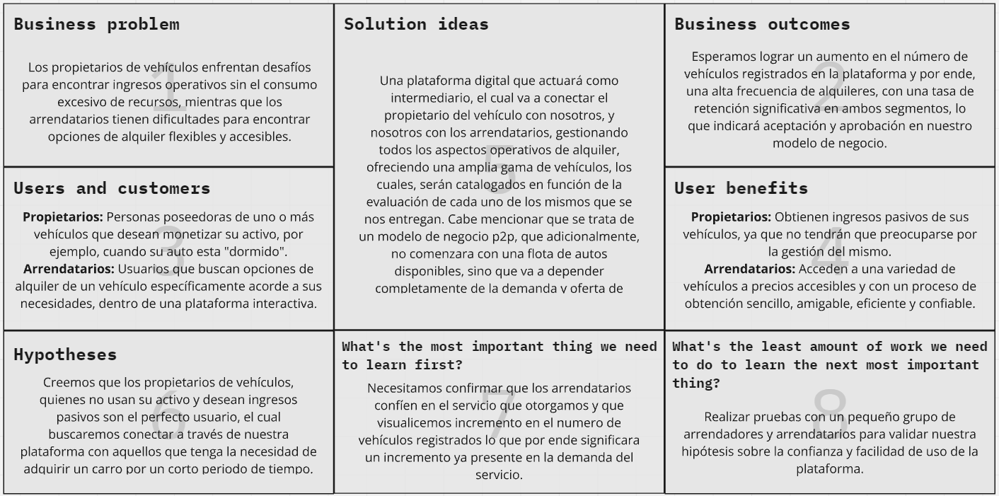

# 1.3. Segmentos Objetivo

### Segmento Objetivo #1: Propietarios de Vehículos

**Aspectos demográficos:**

- Sexo: Masculino y femenino
- Edad: Entre 18 y 60 años
- Nivel socioeconómico: Clases A, B y C (alta, media alta y media)

**Aspectos geográficos:**

- Nacionalidad: Peruana
- Residencia: Zonas urbanas a nivel nacional

**Aspectos psicográficos:**

- Personas naturales o jurídicas que poseen vehículos que no utilizan con frecuencia.
- Interesados en generar ingresos pasivos sin invertir demasiado tiempo o esfuerzo.
- Buscan una solución segura, rápida y confiable para alquilar sus vehículos de manera ocasional o constante.

---

### Segmento Objetivo #2: Arrendatarios de Vehículos

**Aspectos demográficos:**

- Sexo: Masculino y femenino
- Edad: Entre 18 y 50 años
- Nivel socioeconómico: Clases A, B y C (alta, media alta y media)

**Aspectos geográficos:**

- Nacionalidad: Peruana
- Residencia: Zonas urbanas a nivel nacional

**Aspectos psicográficos:**

- Personas que utilizan transporte público pero desean evitar la incomodidad y pérdida de tiempo en el tráfico diario.
- Usuarios que no cuentan con un vehículo propio, pero requieren uno temporalmente para trabajo, viajes o actividades puntuales.
- Interesados en una alternativa accesible, flexible y confiable para el alquiler de vehículos por cortos periodos.

---

# Capítulo II: Requirements Development and Software Solution Design

## 2.1. Competidores

A continuacion realizaremos un analisis de los productos digitales ofrecidos por la competencia directa e indirecta en el mercado de nuestra solucion y las tacticas preliminares que aplicariamos para destacar. El foco se mantiene en experiencias mobile-first y servicios P2P que compiten con la propuesta de Rent2Go.

### 2.1.1. Análisis competitivo

A continuacion se presenta un analisis competitivo de las empresas que ofrecen servicios similares a Rent2Go.

<table>
  <tr>
    <th colspan="6"><b>Competitive Analysis Landscape</b></th>
  </tr>
  <tr>
    <td>¿Por que llevar a cabo este analisis?</td>
    <td  colspan="5">Este analisis fue realizado con el proposito de estudiar el valor ofrecido por las empresas que compiten con nuestra solucion. La informacion obtenida nos proporcionara la perspectiva necesaria para la realizacion de un servicio innovador.</td>
  </tr>
  
  <tr>
    <td colspan="2"></td>
    <td ><b>Rent2Go</b></td>
    <td ><b>Rento</b></td>
    <td >
<b>Hertz</b>
</td>
    <td >
<b>Avis</b>
</td>
  </tr>

  <tr>
    <td colspan="2"></td>
    <td></td>
    <td></td>
    <td></td>
    <td></td>
  </tr>
  
  <tr>
    <td rowspan="2">
      <b>Perfil</b>
    </td>
    <td >
      <b>Overview</b>
    </td>
    <td >
      
Plataforma web y aplicacion movil para gestion de alquileres P2P, pagos y monitoreo de vehiculos.
    </td>
    <td >
      
Plataforma web y aplicacion movil que facilita el alquiler de vehiculos de particulares
    </td>
    <td >
      
Plataforma web y aplicacion movil que facilita el alquiler de vehiculos tanto en aeropuertos como en ciudades.
    </td>
    <td >
      
Aplicacion de reservas de autos en linea
    </td>
  </tr>
  
  <tr>
    <td >
      <b>Ventaja competitiva ¿Que valor ofrece a los clientes?</b>
    </td>
    <td >
      
Flexibilidad en precios y disponibilidad, y generacion de ingresos para los propietarios sin necesidad de inversion en flota.
    </td>
    <td >
      
Modelo peer-to-peer que permite a los propietarios generar ingresos pasivos con su vehiculo. Seguridad para ambas partes a traves de seguros todo riesgo y monitoreo GPS.
    </td>
    <td >
      
Red global de ubicaciones, servicio confiable y una amplia variedad de vehiculos. Reputacion consolidada y un fuerte programa de fidelizacion.
    </td>
    <td >
      
Enfoque en el servicio al cliente de alta calidad, con una variedad de opciones de vehiculos y soluciones tanto para clientes particulares como corporativos.
    </td>
  </tr>
  
  <tr>
    <td rowspan="2" >
      <b>Perfil de Marketing</b>
    </td>
    <td >
      <b>Mercado objetivo</b>
    </td>
    <td >
      
Propietarios de vehiculos que desean alquilarlos cuando no los usan.
      
Arrendatarios que buscan opciones mas economicas y flexibles que las ofrecidas por las grandes empresas de alquiler.
    </td>
    <td >
      
Propietarios de vehiculos que buscan generar ingresos cuando no usan sus autos.
      
Arrendatarios que buscan opciones mas economicas y flexibles que las ofrecidas por las grandes empresas de alquiler.
    </td>
    <td >
      
Turistas internacionales y locales.
Ejecutivos y viajeros de negocios.
      
Clientes que necesitan autos por periodos cortos o largos.
    </td>
    <td >
      
Turistas y viajeros de negocios.
      
Empresas que buscan alquileres a largo plazo o soluciones corporativas.
    </td>
  </tr>
  
  <tr>
    <td >
      <b>Estrategias de marketing</b>
    </td>
    <td >
      
Publicidad en redes sociales.
      
Promociones con descuentos en los primeros alquileres.
      
Alianzas estrategicas con aseguradoras para ofrecer seguridad y confianza.
    </td>
    <td >
      
Publicidad digital en redes sociales y campanas de concientizacion sobre la economia colaborativa.
      
Alianzas con aseguradoras para ofrecer seguros integrados.
    </td>
    <td >
      
Publicidad en aeropuertos, marketing digital, y promociones a traves de programas de fidelizacion.
      
Presencia en ferias y eventos de turismo.
      
Alianzas con aerolineas y agencias de viajes.
    </td>
    <td >
      
Marketing dirigido a clientes corporativos y viajeros frecuentes.
      
Promociones digitales y descuentos a traves de alianzas con aerolineas y hoteles.
      
Programas de fidelizacion
    </td>
  </tr>
  
  <tr>
    <td rowspan="3" >
      <b>Perfil de Producto</b>
    </td>
    <td >
      <b>Productos y Servicios</b>
    </td>
    <td >
      
Alquiler de vehiculos particulares.
      
Seguro y monitoreo GPS integrados.
      
Opciones de alquiler a corto y mediano plazo.
    </td>
    <td >
      
Alquiler de vehiculos particulares a corto y mediano plazo.
      
Seguro todo riesgo y monitoreo en tiempo real.
      
Opciones de reserva directa y pagos a traves de la app.
    </td>
    <td >
      
Alquiler de autos estandar, SUV, autos de lujo, y vehiculos comerciales.
      
Seguros, GPS, y recogida/entrega en ubicaciones seleccionadas.
    </td>
    <td >
      
Autos economicos, SUV, vehiculos de lujo, y comerciales.
      
Alquileres a largo plazo para clientes corporativos.
    </td>
  </tr>
  
  <tr>
    <td >
      <b>Precios y Costos</b>
    </td>
    <td >
      
Precios mas bajos que las companias tradicionales de alquiler debido a la ausencia de una flota fisica.
      
Bajos costos operativos gracias al modelo P2P.
    </td>
    <td >
      
Precios dinamicos y mas bajos que los de las empresas tradicionales de alquiler.
      
Bajos costos operativos debido a la ausencia de una flota fisica.
    </td>
    <td >
      
Tarifas diarias o semanales, generalmente mas altas que servicios P2P debido a la infraestructura y la cobertura global.
      
Descuentos para clientes recurrentes y programas de fidelizacion.
    </td>
    <td >
      
Precios premium, con descuentos para empresas y clientes recurrentes.
      
Altos costos operativos debido a la amplia infraestructura y mantenimiento de vehiculos.
    </td>
  </tr>
  
  <tr>
    <td >
      <b>Canales de distribucion (Web y/o movil)</b>
    </td>
    <td >
      
Plataforma web y aplicacion movil.
      
Colaboraciones con aseguradoras y promociones digitales.
    </td>
    <td >
      
Plataforma web y aplicacion movil.
      
Asociaciones con aseguradoras y redes sociales.
    </td>
    <td >
      
Plataforma web, aplicacion movil, y oficinas fisicas en aeropuertos y ciudades.
    </td>
    <td >
      
Plataforma web, aplicacion movil, y oficinas fisicas en aeropuertos y centros comerciales.
    </td>
  </tr>
  
  <tr>
    <td rowspan="5" >
      
<b>Analisis SWOT</b>
    </td>
    <td colspan="5" >
      
Realice esto para su startup y sus competidores. Sus fortalezas deberian apoyar sus oportunidades y contribuir a lo que ustedes definen como su posible ventaja competitiva.
    </td>
  </tr>
  <tr>
    <td ><b>Fortalezas</b></td>
    <td >
      
Modelo flexible y economico, bajos costos operativos, facilidad de uso.
    </td>
    <td >
      
Modelo flexible y seguro, costos operativos bajos.
    </td>
    <td>
      
Marca consolidada, presencia global, variedad de vehiculos.
    </td>
    <td>
      
Reputacion solida, servicio de alta calidad, fuerte presencia en el mercado corporativo.
    </td>
  </tr>
  <tr>
    <td ><b>Debilidades</b></td>
    <td >
      
Menor infraestructura y recursos comparados con las empresas tradicionales.
    </td>
    <td >
      
Dependencia de la confianza en la plataforma y en los seguros.
    </td>
    <td>
      
Altos costos comparados con opciones P2P.
    </td>
    <td>
      
Precios mas altos, lo que puede limitar a ciertos segmentos del mercado.
    </td>
  </tr>
  <tr>
    <td ><b>Oportunidades</b></td>
    <td >
      
Rapida adopcion de soluciones de movilidad compartida, especialmente en mercados emergentes.
    </td>
    <td >
      
Crecimiento del mercado de la economia colaborativa.
    </td>
    <td>
      
Expansion en mercados emergentes y adopcion de nuevas tecnologias para la gestion de flotas.
    </td>
    <td>
      
Crecimiento en servicios corporativos y soluciones de movilidad a largo plazo.
    </td>
  </tr>
  <tr>
    <td ><b>Amenazas</b></td>
    <td >
      
Regulaciones locales y competencia de otras plataformas P2P establecidas.
    </td>
    <td >
      
Regulaciones gubernamentales y competencia emergente en el sector P2P.
    </td>
    <td>
      
Creciente competencia de plataformas digitales P2P y modelos de movilidad compartida.
    </td>
    <td>
      
Competencia de plataformas P2P y otros modelos de alquiler mas flexibles.
    </td>
  </tr>
</table>

### 2.1.2. Estrategias y tácticas frente a competidores

A continuación se muestran las tácticas que deberá aplicar nuestra startup para afrontar las fortalezas de la competencia.

Táctica: Mientras las grandes compañías cuentan con sistemas sofisticados, Rent2Go puede enfocarse en mejorar la usabilidad y simplicidad de su plataforma digital, ofreciendo un proceso de alquiler más ágil. Se debe invertir en el desarrollo de una aplicación intuitiva y fácil de usar, con un proceso de reserva fluido. Agregar funcionalidades como la reserva en pocos clics y recomendaciones personalizadas basadas en el historial de alquileres.

Táctica: Fomentar reseñas y recomendaciones dentro de la plataforma. La confianza es clave en el modelo P2P. Se debe crear un entorno seguro y confiable para todos los usuarios.

## 2.2. Entrevistas

### 2.2.1. Diseño de entrevistas

A continuación se presentan las preguntas diseñadas para las entrevistas a los segmentos objetivo.

Con el objetivo de comprender la necesidad y la demanda en nuestro sector por parte de nuestro publico objetivo. Por ello, elaboramos las siguientes preguntas con el fin de recolectar información cualitativa y/o cuantitativa, la cual se verá divida por nuestros segmentos objetivos.

**Preguntas Generales**

- ¿Cuál es su nombre?
- ¿Cuántos años tiene usted?
- ¿En que ciudad y distrito reside?
- ¿A qué se dedica o cual es su ocupación?

**Preguntas Específicas**

**Segmento 1: Propietarios de vehículos**

- ¿Cuántos vehículos posee usted?
- ¿Con que frecuencia se transporta de su(s) vehículos(s)?
- ¿Cuándo no utiliza su vehículo, donde permanece el mismo?
- ¿Ha usted alquilado su vehículo anteriormente? Si la respuesta es:  
  Si: ¿Qué dificultades presento alquilarlo?  
  No: ¿Cuan dispuesto se encuentra usted a alquilar su vehículo?
- ¿Conoce alguna plataforma para el alquiler de vehículos en su entorno?
- ¿Qué tipo de garantías y compensación esperarías sobre alquilar tu vehículo?
- ¿Considera una opción llamativa el no tener que preocuparse por su vehículo y además, recibir ingresos por ello?

**Segmento 2: Usuarios arrendatarios**

- ¿Con que frecuencia te transportas en el día a día?
- ¿Cuánto dinero crees que gastas en movilizarte cada semana?
- ¿Si tuvieras un auto, cuál sería el principal uso que le darías?
- ¿Alguna vez pensaste en alquilar un auto? Si la respuesta es:   Si: ¿Nos podrías contar acerca de tu experiencia y tu opinión?   No: ¿Cuáles son los motivos por los que no opto por alquilar un vehículo?
- ¿Qué aspectos negativos encuentra al alquilar un vehículo para uso propio?
- ¿Conoce alguna plataforma de confianza donde puede hallar el vehículo adecuado a su necesidad?

**Preguntas sobre la idea del proyecto**

- ¿Qué opina acerca de Rent2Go, una plataforma donde podrás alquilar y confiar tu vehículo de forma segura y confiable?
- ¿Qué aspecto le llama más la atención?
- ¿Nos podría brindan alguna recomendación para mejorar la idea de la plataforma?
- ¿Recomendaría el uso de nuestra aplicación a sus conocidos?

### 2.2.2. Registro de entrevistas

<b> Segmento Objetivo 1: </b> Propietarios de vehículos

<b> Entrevista 1 </b>

- Nombre: Juan Carlos
- Apellidos: Alvarado
- Edad: 21
- Distrito: Callao
- Link de la entrevista: <a href="">https://upcedupe-my.sharepoint.com/:v:/g/personal/u202210720_upc_edu_pe/IQChZzoqQoMyS7ZxtiANa0JaAcWMBAzl2aYXkY7X5AlN9Gs?e=nPdump&nav=eyJyZWZlcnJhbEluZm8iOnsicmVmZXJyYWxBcHAiOiJTdHJlYW1XZWJBcHAiLCJyZWZlcnJhbFZpZXciOiJTaGFyZURpYWxvZy1MaW5rIiwicmVmZXJyYWxBcHBQbGF0Zm9ybSI6IldlYiIsInJlZmVycmFsTW9kZSI6InZpZXcifX0%3D</a>
- Duración: 3:03

Evidencia de la reunión:

    

Resumen de la entrevista:

- Posee un vehículo que utiliza de forma moderada durante la semana.
- Mantiene su auto guardado en casa cuando no lo usa, sin generar ingresos.
- No ha alquilado su vehículo antes debido a falta de confianza en el proceso.
- Estaría dispuesto a alquilarlo si existen garantías como seguro y monitoreo.
- Considera atractiva la idea de generar ingresos pasivos con su vehículo.

<b> Entrevista 2 </b>

- Nombre: Fiorella
- Apellidos: Cordova Pinchi
- Edad: 30
- Distrito: Chorrillos
- Link de la entrevista: <a href="">https://upcedupe-my.sharepoint.com/:v:/g/personal/u202322187_upc_edu_pe/IQBUrzmcVd74TqoRwx7YMLY_ARt8mfHi8aBNXDYfvWYP08k?nav=eyJyZWZlcnJhbEluZm8iOnsicmVmZXJyYWxBcHAiOiJPbmVEcml2ZUZvckJ1c2luZXNzIiwicmVmZXJyYWxBcHBQbGF0Zm9ybSI6IldlYiIsInJlZmVycmFsTW9kZSI6InZpZXciLCJyZWZlcnJhbFZpZXciOiJNeUZpbGVzTGlua0NvcHkifX0&e=cZbAZv</a>
- Duración: 5:40
- Inicio de la entrevista: 0:48

Evidencia de la reunión:

    

Resumen de la entrevista:

- La entrevistada posee un vehiculo que usa con poca frecuencia
- No ha alquilado su vehiculo anteriormente debido a la falta de confianza
- No conoce plataformas actuales para alquilar vehiculos
- Considera atractiva la idea de generar ingresos con su auto
- Menciona que su principal preocupacion es la seguridad y proteccion del vehiculo
- Valora positivamente la propuesta y la considera innovadora y util
- Estaria dispuesta a recomendar la aplicacion si cumple con lo prometido

<b> Entrevista 3 </b>

- Nombre: Josué
- Apellidos: Cordova Ypanaque
- Edad: 28
- Distrito: Trujillo
- Link de la entrevista: <a href="https://upcedupe-my.sharepoint.com/personal/u202322952_upc_edu_pe/_layouts/15/stream.aspx?id=%2Fpersonal%2Fu202322952%5Fupc%5Fedu%5Fpe%2FDocuments%2FAplicaciones%20m%C3%B3viles%2Fentrevista%5Fsegmento%5F1%2Emp4&referrer=StreamWebApp%2EWeb&referrerScenario=AddressBarCopied%2Eview%2Eeab1acb7%2Dac3c%2D4dac%2D9e30%2D0c591a7ffbe7">https://upcedupe-my.sharepoint.com/personal/u202322952_upc_edu_pe/_layouts/15/stream.aspx?id=%2Fpersonal%2Fu202322952%5Fupc%5Fedu%5Fpe%2FDocuments%2FAplicaciones%20m%C3%B3viles%2Fentrevista%5Fsegmento%5F1%2Emp4&referrer=StreamWebApp%2EWeb&referrerScenario=AddressBarCopied%2Eview%2Eeab1acb7%2Dac3c%2D4dac%2D9e30%2D0c591a7ffbe7</a>

- Duración: 10:20
- Inicio de la entrevista: 0:48

    

Resumen de la entrevista:

- El entrevistado cuenta con un vehículo que utiliza con escasa frecuencia
- Por falta de confianza, no ha rentado su automóvil en el pasado
- Desconoce las plataformas que existen actualmente para el alquiler de autos
- Le resulta muy atractiva la posibilidad de generar ingresos extra con su vehículo
- Resalta que su mayor preocupación es la seguridad y el cuidado de su automóvil
- Tiene una opinión muy favorable de la propuesta, considerándola útil y novedosa
- Estaría dispuesto a recomendar la aplicación si esta cumple con las expectativas  ---

<b> Segmento Objetivo 2: </b> Usuarios arrendatarios

<b> Entrevista 4 </b>

- Nombre: Esaut
- Apellidos: Salhuana
- Edad: 26
- Distrito: Ate
- Link de la entrevista: <a href="https://shorturl.at/PcRe6">[Entrevista]</a>
- Duración: 2:11 minutos
- Inicio de la entrevista: 0:01

Evidencia de la reunión:

  

Resumen de la entrevista:

- Usa transporte publico de forma diaria y considera alquilar vehiculos para trabajo y viajes cortos.
- No ha utilizado plataformas similares y percibe barreras por precio y falta de confianza.
- Valora que la plataforma ofrezca verificacion de identidad y soporte durante el alquiler.
- Indica que la transparencia en tarifas y condiciones influye en su decision de uso.
- Recomendaría la aplicacion si mantiene disponibilidad y procesos simples.

<b> Entrevista 5 </b>

- Nombre: Daniela
- Apellidos: Huaman
- Edad: 24
- Distrito: San Miguel
- Link de la entrevista: <a href="https://shorturl.at/PcRe6">[Entrevista]</a>
- Duracion: 3:12 minutos
- Inicio de la entrevista: 0:22

Evidencia de la reunion:

  

Resumen de la entrevista:

- Se moviliza principalmente en transporte publico, pero necesita autos para viajes cortos y visitas familiares.
- No ha alquilado antes por falta de confianza y desconocimiento de procesos claros.
- Considera clave la transparencia en tarifas, deposito y politicas de cancelacion.
- Valora verificacion de identidad y soporte rapido en caso de incidentes.
- Usaria la aplicacion si puede comparar precios y reservar en pocos pasos.

<b> Entrevista 6 </b>

- Nombre: Karla
- Apellidos: Lopez
- Edad: 22
- Distrito: Huaraz
- Link de la entrevista: <a href="">https://shorturl.at/PcRe6</a>
- Duración: 3:21 minutos
- Inicio de la entrevista: 0:37

Evidencia de la reunión:

    

Resumen de la entrevista:

- En la entrevista se menciona el uso constante del transporte público para movilizarse a su lugar objetivo
- No realizó ningún alquiler en algún otro lado
- No existen aplicaciones que brinden estas características en su zona
- Menciona que la propuesta de la aplicación es buena y la recomendaría
- Menciona que uno de sus temores son los posibles daños relacionados con el vehículo

### 2.2.3. Análisis de entrevistas

**Segmento 1: Propietarios de vehiculos**

Las entrevistas confirman un perfil de propietario potencial con vehiculo subutilizado y motivacion por monetizarlo. La principal barrera es la confianza, asociada al temor de danos o mal uso del vehiculo.

Factores mas importantes identificados:

- Seguro vehicular incluido
- Proteccion ante danos
- Respaldo legal

Tambien se evidencia una oportunidad de mercado por el desconocimiento de plataformas similares, lo que refuerza la innovacion de la propuesta y su valor de ingresos pasivos.

**Segmento 2: Arrendatarios de vehiculos**

Las entrevistas de arrendatarios muestran una necesidad clara de movilidad flexible y economica para viajes cortos, con preferencia por procesos simples y tarifas transparentes. La confianza y la seguridad del vehiculo son el principal freno para adoptar una plataforma nueva.

Factores mas importantes identificados:

- Transparencia en tarifas, deposito y politicas de cancelacion
- Verificacion de identidad y soporte rapido
- Estado del vehiculo y cobertura de seguros

Se observa una disposicion positiva a usar la aplicacion si el flujo de reserva es rapido y las condiciones de uso son claras, reforzando la necesidad de una experiencia mobile-first sin fricciones.

## 2.3. Needfinding

### 2.3.1. User Personas

    

    

### 2.3.2. User Task Matrix

A continuación se muestra el proceso para la realizacion del User Task Matrix para comprender las tareas que realizan los User Persona para cumplir sus objetivos.

| Tarea                         | María López  | Juan Pérez   |
| ----------------------------- | ------------ | ------------ |
| Explorar opciones de alquiler | Alta - Media | Baja - Media |
| Reservar-Alquilar un vehículo | Media - Alta | Baja - Alta  |
| Gestionar el alquiler         | Baja - Baja  | Baja - Media |
| Seguridad y monitoreo         | Alta - Alta  | Baja - Alta  |
| Devolución del vehículo       | Baja - Alta  | Baja - Media |

Tareas con mayor frecuencia e importancia

- Seguridad y monitoreo: Esta tarea es la más importante y frecuentemente realizada tanto para María como para Juan. Para ambos, la seguridad es una prioridad. En el caso de María, busca seguridad principalmente para ella como arrendataria, mientras que Juan se preocupa por el estado de su vehículo cuando es alquilado.

- Reservar/Alquilar un vehículo: La importancia de esta tarea es alta para ambos usuarios, ya que es un punto clave en la experiencia de uso de la plataforma. Sin embargo, para María, esta tarea no es tan frecuente, ya que solo alquila vehículos en ocasiones puntuales. Por su parte, Juan también la considera importante porque es fundamental para generar ingresos.

Principales diferencias

- Explorar opciones de alquiler: María explora opciones de alquiler con mayor frecuencia que Juan, pues ella es arrendataria y necesita encontrar un vehículo que se ajuste a sus necesidades y preferencias, como el costo y la seguridad. Juan, en cambio, es propietario de un vehículo y esta tarea no es tan relevante para él, ya que su enfoque está en alquilar su propio coche.

- Gestionar el alquiler: Para María, la gestión del alquiler es menos importante. Solo necesita asegurarse de que el vehículo que ha alquilado esté disponible y en buen estado. Juan, sin embargo, gestiona más frecuentemente este proceso porque busca mantener control sobre el uso de su vehículo mientras está alquilado, asegurándose de que no se dañe y se cumplan las condiciones acordadas.

Coincidencias

Ambos usuarios comparten una fuerte preocupación por la seguridad y el monitoreo del vehículo, aunque por motivos diferentes. María se enfoca en sentirse segura mientras usa el servicio, mientras que Juan se preocupa por el estado de su vehículo mientras está en manos de un arrendatario. Esto resalta que cualquier plataforma P2P debe priorizar funciones de seguridad para satisfacer tanto a los arrendatarios como a los propietarios.

### 2.3.3. User Journey Mapping

A continuacion se muestra el proceso para la realizacion del User Journey Mapping para los User Persona con el fin de entender las experiencias del usuario sin nuestra solucion. Se presentan los journeys As-Is y se vinculan con las fichas de User Persona descritas en la seccion 2.3.1, resaltando el end-to-end journey observado.

User Journey Mapping para Juan Perez:

  

User Journey Mapping para Maria Lopez:

  

### 2.3.4. Empathy Mapping

A continuación se muestra el proceso del Empathy Mapping para los User Persona con el fin de entender lo que piensa, siente, oye, hace y observa.

**Segmento 1** Propietarios de Vehículos

    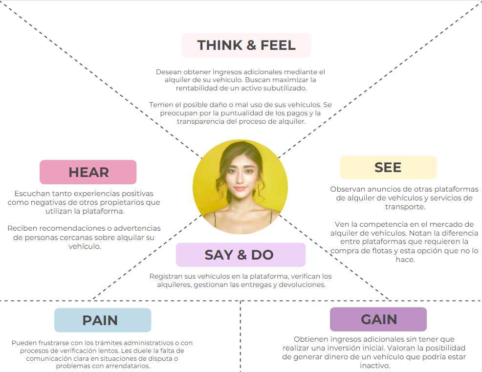

**Segmento 2** Arrendatarios de Vehículos

    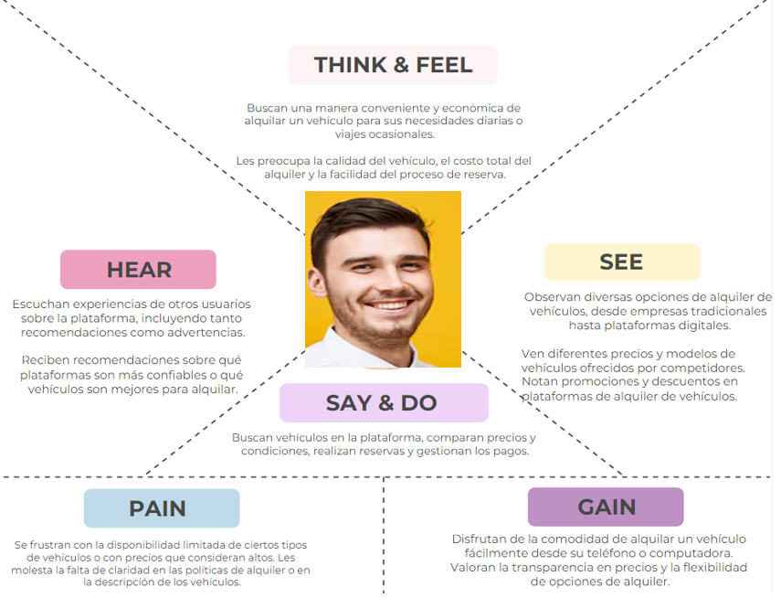

### 2.3.5. Big Picture EventStorming

### 2.3.6. Ubiquitous Language

En esta sección definiremos los términos y conceptos que utilizaremos en nuestro business domain. Este glosario permitirá la comunicación entre los stakeholders y los miembros del equipo.

- Car (auto)
  Vehículo motorizado utilizado para el transporte.
- Rental (alquiler)
  Contrato en el cual dos partes se obligan de manera recíproca y por un tiempo determinado la cesión de un bien o servicio quedando obligada la parte que aprovecha la posesión a pagar un precio cierto.​
- Peer to Peer
  Plataforma en la que dos personas interactúan directamente entre sí, sin la intermediación de un tercero.

## 2.4. Requirements specification

### 2.4.1. User Stories

Esta seccion consolida las epicas, historias de usuario, historias tecnicas y spikes definidos para Rent2Go. Cada descripcion sigue el formato estandar y los criterios de aceptacion se presentan en Gherkin sin depender de detalles de interfaz.

| Story ID | User          | Priority | Epic | Title                                    | Description                                                                                                                   | Acceptance Criteria                                                                                                                                                                                                                                                                                                                                                                                                                                                                             |
| -------- | ------------- | -------- | ---- | ---------------------------------------- | ----------------------------------------------------------------------------------------------------------------------------- | ----------------------------------------------------------------------------------------------------------------------------------------------------------------------------------------------------------------------------------------------------------------------------------------------------------------------------------------------------------------------------------------------------------------------------------------------------------------------------------------------- |
| EP01     | -             | High     | EP01 | Registro de vehiculos                    | Conjunto de historias para el registro de vehiculos.                                                                          | N/A                                                                                                                                                                                                                                                                                                                                                                                                                                                                                             |
| EP02     | -             | High     | EP02 | Busqueda de vehiculos                    | Conjunto de historias de busqueda y filtros.                                                                                  | N/A                                                                                                                                                                                                                                                                                                                                                                                                                                                                                             |
| EP03     | -             | Medium   | EP03 | Detalles del vehiculo                    | Conjunto de historias para visualizar detalles del vehiculo.                                                                  | N/A                                                                                                                                                                                                                                                                                                                                                                                                                                                                                             |
| EP04     | -             | Medium   | EP04 | Favoritos y notificaciones               | Conjunto de historias de favoritos y alertas de disponibilidad.                                                               | N/A                                                                                                                                                                                                                                                                                                                                                                                                                                                                                             |
| EP05     | -             | High     | EP05 | Reservas                                 | Conjunto de historias para crear y gestionar reservas.                                                                        | N/A                                                                                                                                                                                                                                                                                                                                                                                                                                                                                             |
| EP06     | -             | High     | EP06 | Pagos                                    | Conjunto de historias de pagos y tarifas.                                                                                     | N/A                                                                                                                                                                                                                                                                                                                                                                                                                                                                                             |
| EP07     | -             | Medium   | EP07 | Resenas y calificaciones                 | Conjunto de historias para calificaciones y resenas.                                                                          | N/A                                                                                                                                                                                                                                                                                                                                                                                                                                                                                             |
| EP08     | -             | Medium   | EP08 | Mensajeria                               | Conjunto de historias para mensajeria segura.                                                                                 | N/A                                                                                                                                                                                                                                                                                                                                                                                                                                                                                             |
| EP09     | -             | Medium   | EP09 | Perfiles                                 | Conjunto de historias para gestion de perfiles.                                                                               | N/A                                                                                                                                                                                                                                                                                                                                                                                                                                                                                             |
| EP10     | -             | Medium   | EP10 | Verificacion de identidad                | Conjunto de historias de verificacion de identidad.                                                                           | N/A                                                                                                                                                                                                                                                                                                                                                                                                                                                                                             |
| EP11     | -             | Medium   | EP11 | Gestion de flota del propietario         | Conjunto de historias para la gestion del propietario.                                                                        | N/A                                                                                                                                                                                                                                                                                                                                                                                                                                                                                             |
| EP12     | -             | Medium   | EP12 | Administracion de reservas               | Conjunto de historias para la administracion de reservas.                                                                     | N/A                                                                                                                                                                                                                                                                                                                                                                                                                                                                                             |
| EP13     | -             | High     | EP13 | Autenticacion y recuperacion             | Conjunto de historias para registro e inicio de sesion.                                                                       | N/A                                                                                                                                                                                                                                                                                                                                                                                                                                                                                             |
| EP14     | -             | Low      | EP14 | Soporte y seguridad                      | Conjunto de historias de soporte e incidentes de seguridad.                                                                   | N/A                                                                                                                                                                                                                                                                                                                                                                                                                                                                                             |
| EP15     | -             | Medium   | EP15 | Landing page                             | Conjunto de historias del sitio web estatico.                                                                                 | N/A                                                                                                                                                                                                                                                                                                                                                                                                                                                                                             |
| HU01     | Propietario   | High     | EP01 | Registrar vehiculo                       | Como propietario quiero registrar un vehiculo para ofrecerlo en alquiler.                                                     | Escenario: Registro exitoso. Dado que el propietario proporciona los datos requeridos Cuando envia la solicitud de registro Entonces el sistema guarda el vehiculo y lo marca como disponible.  Escenario: Datos incompletos. Dado que el propietario omite datos requeridos Cuando envia la solicitud de registro Entonces el sistema rechaza el registro e informa la falta de datos.                                                                                 |
| HU02     | Arrendatario  | High     | EP02 | Buscar vehiculos disponibles             | Como arrendatario quiero buscar vehiculos disponibles para seleccionar uno adecuado a mis necesidades.                        | Escenario: Resultados con coincidencias. Dado que el arrendatario define criterios de busqueda Cuando ejecuta la busqueda Entonces el sistema lista vehiculos que cumplen los criterios.  Escenario: Sin resultados. Dado que no existen vehiculos disponibles para los criterios Cuando ejecuta la busqueda Entonces el sistema informa que no hay resultados.                                                                                                         |
| HU03     | Arrendatario  | Medium   | EP02 | Filtrar por precio                       | Como arrendatario quiero filtrar vehiculos por precio para ajustar el resultado a mi presupuesto.                             | Escenario: Filtro aplicado. Dado que el arrendatario define un rango de precios Cuando aplica el filtro Entonces el sistema muestra solo vehiculos dentro del rango.  Escenario: Sin coincidencias. Dado que no hay vehiculos en el rango Cuando aplica el filtro Entonces el sistema informa que no hay coincidencias.                                                                                                                                                 |
| HU04     | Arrendatario  | Medium   | EP03 | Ver detalles de vehiculo                 | Como arrendatario quiero ver detalles de un vehiculo para tomar una decision informada.                                       | Escenario: Detalle disponible. Dado que el arrendatario selecciona un vehiculo listado Cuando solicita el detalle Entonces el sistema muestra datos del vehiculo y condiciones del alquiler.  Escenario: Detalle no disponible. Dado que no se pueden recuperar los datos del vehiculo Cuando el arrendatario solicita el detalle Entonces el sistema informa el problema y no muestra datos incompletos.                                                               |
| HU05     | Arrendatario  | Medium   | EP04 | Agregar a favoritos                      | Como arrendatario quiero agregar vehiculos a favoritos para revisarlos mas tarde.                                             | Escenario: Favorito guardado. Dado que el arrendatario selecciona un vehiculo Cuando marca el vehiculo como favorito Entonces el sistema guarda el favorito en su lista.  Escenario: Error al guardar. Dado que ocurre un error al guardar Cuando intenta agregar a favoritos Entonces el sistema informa el error y no guarda el favorito.                                                                                                                             |
| HU06     | Arrendatario  | Medium   | EP07 | Calificar vehiculo                       | Como arrendatario quiero calificar un vehiculo al finalizar el alquiler para compartir mi experiencia.                        | Escenario: Calificacion exitosa. Dado que el alquiler esta completado Cuando el arrendatario envia una calificacion y comentario Entonces el sistema guarda la evaluacion asociada al vehiculo.  Escenario: Alquiler no completado. Dado que el alquiler no esta completado Cuando intenta calificar Entonces el sistema bloquea la calificacion.                                                                                                                       |
| HU07     | Arrendatario  | Medium   | EP08 | Contactar al propietario                 | Como arrendatario quiero contactar al propietario para coordinar detalles del alquiler.                                       | Escenario: Mensaje enviado. Dado que el arrendatario redacta un mensaje Cuando lo envia al propietario Entonces el sistema entrega el mensaje y confirma el envio.  Escenario: Error de envio. Dado que ocurre un fallo al enviar Cuando intenta contactar al propietario Entonces el sistema informa el error y no envia el mensaje.                                                                                                                                   |
| HU08     | Arrendatario  | High     | EP05 | Reservar vehiculo                        | Como arrendatario quiero reservar un vehiculo para asegurar disponibilidad en fechas definidas.                               | Escenario: Reserva exitosa. Dado que el vehiculo esta disponible en el rango solicitado Cuando el arrendatario confirma la reserva Entonces el sistema registra la reserva y bloquea las fechas.  Escenario: Conflicto de disponibilidad. Dado que el vehiculo ya no esta disponible Cuando intenta reservar Entonces el sistema rechaza la reserva e informa el conflicto.                                                                                             |
| HU09     | Arrendatario  | Medium   | EP05 | Ver historial de alquileres              | Como arrendatario quiero ver mi historial de alquileres para llevar control de mis transacciones.                             | Escenario: Historial disponible. Dado que el arrendatario tiene alquileres previos Cuando solicita el historial Entonces el sistema lista sus alquileres con fechas y estados.  Escenario: Historial vacio. Dado que no hay alquileres previos Cuando solicita el historial Entonces el sistema informa que no existe historial.                                                                                                                                        |
| HU10     | Arrendatario  | High     | EP06 | Administrar pagos                        | Como arrendatario quiero realizar el pago del alquiler para completar la transaccion.                                         | Escenario: Pago exitoso. Dado que el arrendatario confirma el pago con datos validos Cuando se procesa la transaccion Entonces el sistema confirma el pago y actualiza la reserva.  Escenario: Pago fallido. Dado que los datos son invalidos o el proveedor rechaza Cuando se procesa el pago Entonces el sistema informa el fallo y no confirma la reserva.                                                                                                           |
| HU11     | Usuario       | Medium   | EP09 | Ver perfil de usuario                    | Como usuario quiero ver mi perfil para confirmar mis datos y actividad.                                                       | Escenario: Perfil visible. Dado que el usuario tiene una cuenta activa Cuando solicita su perfil Entonces el sistema muestra datos personales y actividad relevante.  Escenario: Error de carga. Dado que ocurre un error del servicio Cuando solicita el perfil Entonces el sistema informa el error y no muestra datos incompletos.                                                                                                                                   |
| HU12     | Usuario       | Medium   | EP09 | Editar perfil de usuario                 | Como usuario quiero editar mi perfil para mantener mis datos actualizados.                                                    | Escenario: Actualizacion exitosa. Dado que el usuario envia datos validos Cuando confirma la edicion Entonces el sistema guarda los cambios y actualiza el perfil.  Escenario: Datos invalidos. Dado que el usuario envia datos invalidos Cuando intenta guardar Entonces el sistema rechaza la actualizacion e informa el error.                                                                                                                                       |
| HU13     | Propietario   | Medium   | EP11 | Gestionar vehiculos alquilados           | Como propietario quiero ver vehiculos alquilados para monitorear mis transacciones.                                           | Escenario: Lista de alquileres. Dado que el propietario tiene vehiculos alquilados Cuando solicita la lista Entonces el sistema muestra vehiculos con fechas y arrendatario.  Escenario: Sin alquileres. Dado que no hay alquileres activos o previos Cuando solicita la lista Entonces el sistema informa que no hay resultados.                                                                                                                                       |
| HU14     | Arrendatario  | Medium   | EP04 | Recibir notificaciones de disponibilidad | Como arrendatario quiero recibir notificaciones de disponibilidad para enterarme cuando un vehiculo favorito esta disponible. | Escenario: Notificacion enviada. Dado que el arrendatario tiene un favorito Cuando el vehiculo vuelve a estar disponible Entonces el sistema envia una notificacion de disponibilidad.  Escenario: Favorito no registrado. Dado que el vehiculo no esta en favoritos Cuando cambia la disponibilidad Entonces el sistema no envia notificaciones.                                                                                                                       |
| HU15     | Visitante     | Medium   | EP15 | Ver landing page informativa             | Como visitante quiero ver una landing page informativa para conocer el servicio.                                              | Escenario: Contenido disponible. Dado que el visitante accede al sitio Cuando carga la pagina Entonces el sistema muestra la informacion del servicio.  Escenario: Fallo de carga. Dado que ocurre un error de disponibilidad Cuando el visitante accede al sitio Entonces el sistema informa el fallo y no muestra contenido incompleto.                                                                                                                               |
| HU16     | Visitante     | Medium   | EP15 | Ver informacion de contacto              | Como visitante quiero ver informacion de contacto para comunicarme con la empresa.                                            | Escenario: Contacto visible. Dado que el visitante navega en la pagina Cuando busca la seccion de contacto Entonces el sistema muestra telefono, correo y redes sociales.  Escenario: Datos no disponibles. Dado que la informacion no esta disponible Cuando el visitante busca contacto Entonces el sistema informa que no hay datos de contacto.                                                                                                                     |
| HU17     | Visitante     | Low      | EP15 | Navegacion intuitiva en landing          | Como visitante quiero navegar facilmente la landing para encontrar contenido sin friccion.                                    | Escenario: Navegacion clara. Dado que el visitante usa la pagina Cuando explora las secciones principales Entonces el sistema permite acceder a cada seccion sin obstaculos.  Escenario: Seccion no disponible. Dado que una seccion no esta disponible Cuando el visitante intenta acceder Entonces el sistema informa la no disponibilidad.                                                                                                                           |
| HU18     | Visitante     | Low      | EP15 | Landing responsiva                       | Como visitante quiero que la landing sea responsiva para verla bien en distintos dispositivos.                                | Escenario: Ajuste correcto. Dado que el visitante abre la pagina en un dispositivo diferente Cuando se renderiza el contenido Entonces el sistema adapta la pagina al tamano de pantalla.  Escenario: Vista no soportada. Dado que el visitante usa un tamano de pantalla no comun Cuando se renderiza la pagina Entonces el sistema mantiene contenido legible sin superposiciones.                                                                                    |
| HU19     | Usuario       | High     | EP13 | Registro de usuario                      | Como nuevo usuario quiero registrarme para acceder a los servicios.                                                           | Escenario: Registro exitoso. Dado que el usuario ingresa datos validos Cuando envia el registro Entonces el sistema crea la cuenta y habilita el acceso.  Escenario: Correo duplicado. Dado que el correo ya existe Cuando intenta registrarse Entonces el sistema rechaza el registro e informa duplicidad.  Escenario: Campos incompletos. Dado que faltan datos requeridos Cuando envia el registro Entonces el sistema informa los campos faltantes. |
| HU20     | Usuario       | High     | EP13 | Inicio de sesion                         | Como usuario registrado quiero iniciar sesion para acceder a mi cuenta.                                                       | Escenario: Inicio exitoso. Dado que las credenciales son validas Cuando inicia sesion Entonces el sistema autoriza el acceso y crea la sesion.  Escenario: Credenciales invalidas. Dado que las credenciales son incorrectas Cuando intenta iniciar sesion Entonces el sistema rechaza el acceso e informa el error.                                                                                                                                                    |
| HU21     | Usuario       | Medium   | EP13 | Recuperar contrasena                     | Como usuario quiero recuperar mi contrasena para restablecer el acceso.                                                       | Escenario: Enlace enviado. Dado que el correo esta registrado Cuando solicita recuperacion Entonces el sistema envia un enlace de recuperacion.  Escenario: Correo no registrado. Dado que el correo no existe Cuando solicita recuperacion Entonces el sistema informa que el correo no esta registrado.                                                                                                                                                               |
| HU22     | Propietario   | Medium   | EP01 | Publicar vehiculo con especificaciones   | Como propietario quiero publicar un vehiculo con especificaciones para alquilarlo con informacion clara.                      | Escenario: Publicacion exitosa. Dado que el propietario ingresa datos validos Cuando confirma la publicacion Entonces el sistema registra el vehiculo con sus especificaciones.  Escenario: Datos invalidos. Dado que el propietario ingresa datos invalidos Cuando intenta publicar Entonces el sistema rechaza la publicacion e informa el error.                                                                                                                     |
| HU23     | Propietario   | Medium   | EP11 | Ver mis vehiculos publicados             | Como propietario quiero ver mis vehiculos publicados para gestionar su estado.                                                | Escenario: Vehiculos listados. Dado que el propietario tiene vehiculos publicados Cuando solicita la lista Entonces el sistema muestra los vehiculos con su estado.  Escenario: Sin vehiculos. Dado que el propietario no tiene vehiculos publicados Cuando solicita la lista Entonces el sistema informa que no hay vehiculos.                                                                                                                                         |
| HU24     | Administrador | Medium   | EP12 | Ver todas las reservaciones              | Como administrador quiero ver todas las reservaciones para monitorear el servicio.                                            | Escenario: Reservaciones listadas. Dado que el administrador tiene permisos de gestion Cuando solicita la lista general Entonces el sistema muestra todas las reservaciones existentes.  Escenario: Sin reservaciones. Dado que no hay reservaciones registradas Cuando solicita la lista general Entonces el sistema informa que no hay registros.                                                                                                                     |
| HU25     | Usuario       | Medium   | EP12 | Filtrar reservaciones por estado         | Como usuario quiero filtrar reservaciones por estado para visualizar resultados especificos.                                  | Escenario: Filtro aplicado. Dado que el usuario selecciona un estado Cuando aplica el filtro Entonces el sistema lista reservaciones con ese estado.  Escenario: Sin coincidencias. Dado que no existen reservaciones con ese estado Cuando aplica el filtro Entonces el sistema informa que no hay resultados.                                                                                                                                                         |
| HU26     | Arrendatario  | Medium   | EP02 | Buscar con filtros avanzados             | Como arrendatario quiero buscar vehiculos con filtros avanzados para encontrar el vehiculo ideal.                             | Escenario: Resultados filtrados. Dado que el arrendatario define filtros avanzados Cuando ejecuta la busqueda Entonces el sistema muestra resultados que cumplen todos los filtros.  Escenario: Sin resultados. Dado que no hay coincidencias Cuando ejecuta la busqueda Entonces el sistema informa la ausencia de resultados.                                                                                                                                         |
| HU27     | Arrendatario  | Medium   | EP05 | Ver mis reservaciones por estado         | Como arrendatario quiero ver mis reservaciones por estado para organizar mis alquileres.                                      | Escenario: Reservaciones por estado. Dado que el arrendatario selecciona un estado Cuando solicita sus reservaciones Entonces el sistema lista sus reservaciones en ese estado.  Escenario: Lista vacia. Dado que no hay reservaciones en ese estado Cuando solicita la lista Entonces el sistema informa que no hay registros.                                                                                                                                         |
| HU28     | Usuario       | Medium   | EP05 | Ver detalle de una reservacion           | Como usuario quiero ver el detalle de una reservacion para consultar fechas y condiciones.                                    | Escenario: Detalle visible. Dado que el usuario tiene acceso a la reservacion Cuando solicita el detalle Entonces el sistema muestra los datos completos de la reservacion.  Escenario: Acceso no permitido. Dado que la reservacion no pertenece al usuario Cuando intenta acceder Entonces el sistema rechaza el acceso e informa el error.                                                                                                                           |
| HU29     | Arrendatario  | Medium   | EP05 | Cancelar reservacion                     | Como arrendatario quiero cancelar una reservacion para evitar cargos si ya no la necesito.                                    | Escenario: Cancelacion exitosa. Dado que la reservacion esta dentro del plazo permitido Cuando el arrendatario solicita cancelacion Entonces el sistema cancela la reservacion sin penalizacion.  Escenario: Plazo vencido. Dado que el plazo permitido vencio Cuando solicita cancelacion Entonces el sistema rechaza la cancelacion e informa la politica aplicada.                                                                                                   |
| HU30     | Propietario   | Medium   | EP12 | Actualizar estado de reservacion         | Como propietario quiero actualizar el estado de una reservacion para gestionar el proceso de alquiler.                        | Escenario: Estado actualizado. Dado que el propietario tiene permisos Cuando actualiza el estado Entonces el sistema guarda el cambio y notifica al arrendatario.  Escenario: Conflicto de actualizacion. Dado que el estado fue actualizado por otro proceso Cuando intenta modificarlo Entonces el sistema informa el conflicto y no aplica cambios.                                                                                                                  |
| HU31     | Usuario       | Medium   | EP10 | Verificacion de identidad                | Como usuario quiero verificar mi identidad para aumentar la confianza en la plataforma.                                       | Escenario: Verificacion exitosa. Dado que el usuario envia documentos validos Cuando se procesa la verificacion Entonces el sistema marca la identidad como verificada.  Escenario: Verificacion rechazada. Dado que los documentos no son validos Cuando se procesa la verificacion Entonces el sistema informa el rechazo y solicita correccion.                                                                                                                      |
| HU32     | Arrendatario  | Medium   | EP06 | Calculo de tarifa total                  | Como arrendatario quiero ver el costo total del alquiler para decidir antes de confirmar.                                     | Escenario: Tarifa calculada. Dado que el arrendatario define fechas y vehiculo Cuando solicita el costo Entonces el sistema muestra el total con impuestos y comisiones.  Escenario: Datos insuficientes. Dado que faltan datos para el calculo Cuando solicita el costo Entonces el sistema indica la informacion faltante.                                                                                                                                            |
| HU33     | Usuario       | Low      | EP14 | Reportar incidente de seguridad          | Como usuario quiero reportar un incidente para recibir soporte y dejar constancia.                                            | Escenario: Reporte enviado. Dado que el usuario describe el incidente Cuando envia el reporte Entonces el sistema registra el caso y confirma la recepcion.  Escenario: Error al reportar. Dado que ocurre un fallo del sistema Cuando envia el reporte Entonces el sistema informa el error y no registra el caso.                                                                                                                                                     |
| HU34     | Usuario       | Medium   | EP13 | Guardar sesion local                     | Como usuario quiero mantener la sesion activa para no iniciar sesion cada vez que uso la app.                                 | Escenario: Sesion persistida. Dado que el usuario inicia sesion correctamente Cuando cierra y reabre la app Entonces el sistema recupera la sesion desde almacenamiento local.  Escenario: Sesion expirada. Dado que la sesion expiro Cuando abre la app nuevamente Entonces el sistema solicita autenticacion.                                                                                                                                                         |
| TS01     | Desarrollador | High     | EP06 | API de pagos                             | Como desarrollador quiero exponer un endpoint de pagos para procesar transacciones.                                           | Escenario: Transaccion aprobada. Dado que existe una solicitud valida con monto y token Cuando el servicio procesa la transaccion Entonces responde con estado aprobado y referencia.  Escenario: Transaccion rechazada. Dado que existe una solicitud con token invalido Cuando el servicio procesa la transaccion Entonces responde con estado rechazado y codigo de error.                                                                                           |
| TS02     | Desarrollador | High     | EP13 | API de autenticacion                     | Como desarrollador quiero exponer endpoints de autenticacion para gestionar sesiones seguras.                                 | Escenario: Inicio de sesion correcto. Dado que las credenciales son validas Cuando el servicio autentica Entonces responde con token y expiracion.  Escenario: Inicio de sesion incorrecto. Dado que las credenciales son invalidas Cuando el servicio autentica Entonces responde con error de autenticacion.                                                                                                                                                          |
| TS03     | Desarrollador | Medium   | EP02 | API de busqueda                          | Como desarrollador quiero exponer un endpoint de busqueda para filtrar vehiculos por criterios.                               | Escenario: Consulta con resultados. Dado que existe una solicitud con filtros validos Cuando el servicio procesa la busqueda Entonces responde con una lista paginada de vehiculos.  Escenario: Consulta sin resultados. Dado que existe una solicitud con filtros validos que no coincide con vehiculos Cuando el servicio procesa la busqueda Entonces responde con una lista vacia y estado exitoso.                                                                 |
| SP01     | Desarrollador | Medium   | EP06 | Spike integracion pasarela de pagos      | Como desarrollador quiero investigar una pasarela de pagos para validar viabilidad tecnica.                                   | Escenario: Spike completado. Dado que se prueban al menos dos proveedores Cuando se comparan costos, cobertura y SDKs Entonces se documenta una recomendacion con riesgos y compensaciones.  Escenario: Sin proveedor viable. Dado que los proveedores evaluados no cumplen requisitos Cuando se completa la evaluacion Entonces se documentan restricciones y alternativas.                                                                                            |
| SP02     | Desarrollador | Medium   | EP02 | Spike integracion servicio de mapas      | Como desarrollador quiero evaluar un servicio de mapas para validar busqueda por ubicacion.                                   | Escenario: PoC funcional. Dado que se integra un proveedor externo Cuando se consulta una ubicacion Entonces se obtienen coordenadas y resultados en pruebas.  Escenario: Limitacion del proveedor. Dado que el proveedor no soporta una region requerida Cuando se evalua la PoC Entonces se documenta la limitacion y opciones de mitigacion.                                                                                                                         |
| SP03     | Desarrollador | Medium   | EP13 | Spike almacenamiento seguro              | Como desarrollador quiero definir almacenamiento local seguro para proteger datos sensibles.                                  | Escenario: Estrategia definida. Dado que se identifican datos sensibles Cuando se define cifrado y politica de expiracion Entonces se documenta el esquema de almacenamiento local.  Escenario: Riesgos no mitigables. Dado que existen riesgos que no pueden mitigarse con los mecanismos disponibles Cuando se evalua la estrategia de almacenamiento Entonces se documentan las limitaciones y se propone una alternativa.                                           |

### 2.4.2. Impact Mapping

Impact map de nuestros segmentos objetivos

    

### 2.4.3. Product Backlog

Utilizamos la escala de Fibonacci para la estimación de los Story Points.

| Epic / Story ID | Título                                          | Descripción                                                                                                                                      | Story Points (1/2/3/5/8) |
| --------------- | ----------------------------------------------- | ------------------------------------------------------------------------------------------------------------------------------------------------ | ------------------------ |
| HU01            | Registrar cuenta                                | **Como** usuario, **deseo** crear una nueva cuenta para entrar a la plataforma.                                                                  | 3                        |
| HU02            | Iniciar sesión con autenticación segura         | **Como** usuario, **deseo** iniciar sesión con mi cuenta de forma segura para acceder a mis funcionalidades.                                     | 2                        |
| HU04            | Verificación de identidad                       | **Como** propietario y arrendatario, **deseo** que la plataforma verifique la identidad de los usuarios para asegurar la confiabilidad.          | 5                        |
| HU06            | Publicar un vehículo para alquiler              | **Como** propietario, **deseo** publicar mi vehículo para que pueda ser alquilado.                                                               | 3                        |
| HU07            | Buscar vehículos disponibles                    | **Como** arrendatario, **deseo** buscar vehículos disponibles cerca de mi ubicación para alquilar.                                               | 5                        |
| HU08            | Reservar un vehículo                            | **Como** arrendatario, **deseo** reservar un vehículo para una fecha y hora específicas.                                                         | 5                        |
| HU11            | Calcular tarifas de alquiler                    | **Como** usuario, **deseo** ver el costo total del alquiler antes de confirmar la reserva.                                                       | 5                        |
| HU13            | Ver historial de alquileres                     | **Como** arrendatario, **deseo** ver el historial de mis alquileres anteriores para llevar un registro de mis transacciones.                     | 1                        |
| HU14            | Recibir notificaciones de vehículos disponibles | **Como** arrendatario, **deseo** recibir notificaciones cuando un vehículo que me interesa esté disponible.                                      | 1                        |
| HU16            | Editar datos de vehículo publicado              | **Como** propietario, **deseo** editar los datos de mi vehículo publicado en caso de cambios.                                                    | 2                        |
| HU17            | Compartir vehículo por redes sociales           | **Como** propietario, **deseo** compartir mi anuncio en redes sociales para llegar a más personas.                                               | 1                        |
| HU18            | Ver ranking de usuarios confiables              | **Como** usuario, **deseo** ver la calificación promedio de otros usuarios para decidir con quién interactuar.                                   | 2                        |
| HU19            | Registro interno de usuario                     | **Como** nuevo usuario, **Quiero** registrarme en la plataforma **Para** acceder a los servicios.                                                | 3                        |
| HU20            | Registro interno de inicio de sesión            | **Como** usuario registrado, **Quiero** iniciar sesión **Para** acceder a mi cuenta.                                                             | 2                        |
| HU21            | Registro interno para recuperar contraseña      | **Como** usuario, **Quiero** recuperar mi contraseña **Para** restablecer acceso si la olvidé.                                                   | 2                        |
| HU22            | Publicar vehículo con especificaciones          | **Como** propietario, **Quiero** publicar un vehículo con datos y especificaciones **Para** alquilarlo.                                          | 3                        |
| HU23            | Ver mis vehículos publicados                    | **Como** propietario, **Quiero** ver mis vehículos publicados **Para** gestionar su estado.                                                      | 2                        |
| HU24            | Ver todas las reservaciones                     | **Como** administrador o propietario, **Quiero** ver todas las reservaciones **Para** monitorear.                                                | 3                        |
| HU25            | Filtrar reservaciones por estado                | **Como** usuario, **Quiero** filtrar las reservaciones por estado **Para** visualizarlas fácilmente.                                             | 2                        |
| HU26            | Buscar vehículos con filtros avanzados          | **Como** cliente, **Quiero** buscar vehículos aplicando filtros **Para** encontrar el ideal.                                                     | 5                        |
| HU27            | Ver mis reservaciones por estado                | **Como** cliente, **Quiero** ver mis reservaciones por estado **Para** organizar mis alquileres.                                                 | 2                        |
| HU28            | Ver detalle de una reservación                  | **Como** usuario, **Quiero** ver detalles de una reservación específica **Para** consultar fechas y vehículo.                                    | 2                        |
| HU29            | Cancelar reservación                            | **Como** cliente, **Quiero** cancelar una reservación **Para** evitar el cobro si ya no la necesito.                                             | 3                        |
| HU30            | Actualizar estado de reservación                | **Como** propietario, **Quiero** actualizar el estado de una reserva (aceptar, rechazar, marcar como completada) **Para** gestionar el alquiler. | 3                        |

## 2.5. Strategic-Level Domain-Driven Design

### 2.5.1. EventStorming

#### 2.5.1.1. Candidate Context Discovery
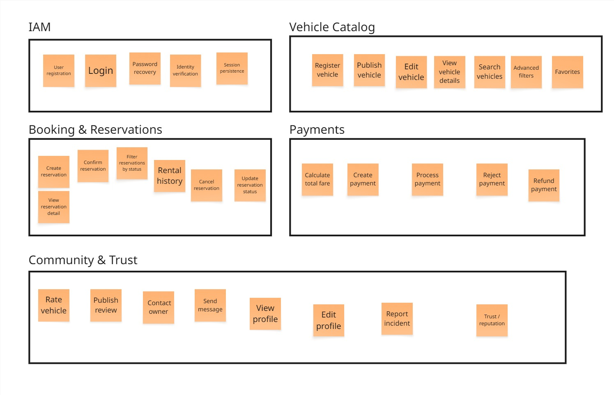

A partir del análisis del dominio y de las historias de usuario, se identificaron cinco bounded contexts candidatos: IAM, Vehicle Catalog, Booking & Reservations, Payments y Community & Trust. Cada uno agrupa capacidades del negocio con lenguaje, reglas y responsabilidades propias, lo que permite una mejor modularización del sistema.

A partir del análisis del dominio y de las historias de usuario, se identificaron cinco bounded contexts candidatos: IAM, Vehicle Catalog, Booking & Reservations, Payments y Community & Trust. Cada uno agrupa capacidades del negocio con lenguaje, reglas y responsabilidades propias, lo que permite una mejor modularización del sistema.

| Candidate Bounded Context | Purpose                                                   |
| ------------------------- | --------------------------------------------------------- |
| IAM                       | Gestiona autenticación, identidad y sesiones              |
| Vehicle Catalog           | Gestiona el registro, publicación y búsqueda de vehículos |
| Booking & Reservations    | Gestiona el ciclo de vida de las reservas                 |
| Payments                  | Gestiona el cálculo y procesamiento de pagos              |
| Community & Trust         | Gestiona perfiles, reseñas, mensajería e incidentes       |

#### 2.5.1.2. Domain Message Flows Modeling

En esta sección se modelan los principales flujos de mensajes del dominio entre los bounded contexts identificados en Rent2Go. El objetivo es representar cómo se coordinan las capacidades del negocio sin entrar aún en detalles de implementación técnica. Los flujos muestran la interacción entre Vehicle Catalog, Booking & Reservations, Payments, IAM y Community & Trust, especialmente en procesos clave como la validación de disponibilidad, el procesamiento de pagos, la confirmación de reservas y la habilitación de reseñas posteriores al alquiler.

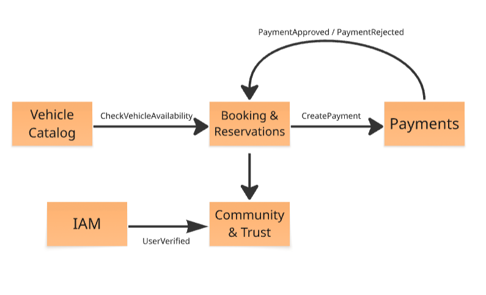

| Source Context         | Message                  | Message Type    | Target Context         | Purpose                                                                                                                         |
| ---------------------- | ------------------------ | --------------- | ---------------------- | ------------------------------------------------------------------------------------------------------------------------------- |
| Vehicle Catalog        | CheckVehicleAvailability | Query / Command | Booking & Reservations | Permite validar si el vehículo seleccionado se encuentra disponible en el rango de fechas solicitado antes de crear la reserva. |
| Booking & Reservations | CreatePayment            | Command         | Payments               | Solicita la creación y procesamiento del pago asociado a una reserva que requiere confirmación económica.                       |
| Payments               | PaymentApproved          | Domain Event    | Booking & Reservations | Informa que el pago fue procesado exitosamente para que la reserva pueda ser confirmada o activada.                             |
| Payments               | PaymentRejected          | Domain Event    | Booking & Reservations | Informa que el pago no fue aprobado para que la reserva no continúe con el flujo de confirmación.                               |
| Booking & Reservations | ReservationCompleted     | Domain Event    | Community & Trust      | Habilita funcionalidades posteriores al alquiler, como reseñas, calificaciones o interacciones de confianza entre usuarios.     |
| IAM                    | UserVerified             | Domain Event    | Community & Trust      | Comunica que la identidad del usuario ha sido validada, permitiendo reflejar atributos de confianza en el perfil público.       |

#### 2.5.1.3. Bounded Context Canvases
Los bounded context canvases permiten documentar de manera estratégica los principales contextos del dominio de Rent2Go. Cada canvas resume el propósito, responsabilidades, conceptos del dominio, mensajes de entrada y salida, dependencias y actores asociados a cada bounded context. Esta vista facilita comprender el alcance funcional de cada contexto antes de pasar al modelado táctico y arquitectónico.

### IAM
| Campo                      | Descripción                                                                                                                       |
| -------------------------- | --------------------------------------------------------------------------------------------------------------------------------- |
| **Bounded Context Name**   | IAM                                                                                                                               |
| **Purpose**                | Gestionar la identidad, autenticación y verificación de usuarios dentro de la plataforma.                                         |
| **Responsibilities**       | Registrar usuarios, autenticar usuarios, gestionar recuperación de contraseña, mantener sesiones activas y verificar identidad.   |
| **Domain Concepts**        | User, Credentials, Session, Identity Verification, Verification Status                                                            |
| **Inbound Messages**       | RegisterUser, LoginUser, RecoverPassword, VerifyIdentity                                                                          |
| **Outbound Messages**      | UserRegistered, UserAuthenticated, UserVerified                                                                                   |
| **Dependencies**           | No presenta dependencias funcionales principales dentro del dominio core, pero provee información de identidad a otros contextos. |
| **Primary Users / Actors** | Usuario, Arrendatario, Propietario                                                                                                |

### Vehicle Catalog
| Campo                      | Descripción                                                                                                                  |
| -------------------------- | ---------------------------------------------------------------------------------------------------------------------------- |
| **Bounded Context Name**   | Vehicle Catalog                                                                                                              |
| **Purpose**                | Gestionar el registro, publicación, consulta y visualización de vehículos disponibles para alquiler.                         |
| **Responsibilities**       | Registrar vehículos, publicar vehículos, editar información del vehículo, consultar detalles y soportar búsquedas y filtros. |
| **Domain Concepts**        | Vehicle, VehicleSpecification, PricingPolicy, VehicleStatus, Availability                                                    |
| **Inbound Messages**       | RegisterVehicle, PublishVehicle, UpdateVehicle, GetVehicleDetails, SearchVehicles                                            |
| **Outbound Messages**      | VehicleRegistered, VehiclePublished, VehicleUpdated, VehicleAvailabilityProvided                                             |
| **Dependencies**           | Provee información operativa al contexto Booking & Reservations para validar disponibilidad y selección de vehículos.        |
| **Primary Users / Actors** | Propietario, Arrendatario                                                                                                    |
### Booking & Reservations
| Campo                      | Descripción                                                                                                                                           |
| -------------------------- | ----------------------------------------------------------------------------------------------------------------------------------------------------- |
| **Bounded Context Name**   | Booking & Reservations                                                                                                                                |
| **Purpose**                | Gestionar el ciclo de vida de las reservas, desde la solicitud inicial hasta la finalización o cancelación del alquiler.                              |
| **Responsibilities**       | Crear reservas, confirmar reservas, cancelar reservas, consultar detalle de reservas, gestionar estados de reserva y coordinar disponibilidad y pago. |
| **Domain Concepts**        | Reservation, DateRange, ReservationStatus, Renter, Owner                                                                                              |
| **Inbound Messages**       | CreateReservation, CancelReservation, UpdateReservationStatus, PaymentApproved, PaymentRejected, VehicleAvailabilityProvided                          |
| **Outbound Messages**      | ReservationRequested, ReservationConfirmed, ReservationCancelled, ReservationCompleted, CreatePayment, CheckVehicleAvailability                       |
| **Dependencies**           | Depende de Vehicle Catalog para validar disponibilidad y de Payments para completar el flujo económico de la reserva.                                 |
| **Primary Users / Actors** | Arrendatario, Propietario, Administrador                                                                                                              |

### Payments
| Campo                      | Descripción                                                                                                                                                 |
| -------------------------- | ----------------------------------------------------------------------------------------------------------------------------------------------------------- |
| **Bounded Context Name**   | Payments                                                                                                                                                    |
| **Purpose**                | Gestionar el cálculo, procesamiento y seguimiento de pagos asociados a las reservas dentro de la plataforma.                                                |
| **Responsibilities**       | Calcular el monto total del alquiler, crear pagos, procesar transacciones, registrar operaciones, gestionar estados de pago y atender reembolsos si aplica. |
| **Domain Concepts**        | Payment, FeeBreakdown, Money, PaymentStatus, PaymentTransaction                                                                                             |
| **Inbound Messages**       | CreatePayment, RefundPayment                                                                                                                                |
| **Outbound Messages**      | PaymentCreated, PaymentApproved, PaymentRejected, PaymentRefunded                                                                                           |
| **Dependencies**           | Depende de Stripe Sandbox como proveedor externo para el procesamiento de pagos en entorno de prueba.                                                       |
| **Primary Users / Actors** | Arrendatario, Booking & Reservations                                                                                                                        |

### Community & Trust
| Campo                      | Descripción                                                                                                                                              |
| -------------------------- | -------------------------------------------------------------------------------------------------------------------------------------------------------- |
| **Bounded Context Name**   | Community & Trust                                                                                                                                        |
| **Purpose**                | Gestionar los mecanismos de confianza y comunidad entre usuarios, incluyendo perfiles, reseñas, mensajería e incidentes.                                 |
| **Responsibilities**       | Gestionar perfiles públicos, publicar reseñas, administrar mensajería entre usuarios, registrar incidentes y reflejar atributos de confianza.            |
| **Domain Concepts**        | UserProfile, Review, MessageThread, Message, IncidentReport, TrustScore, VerificationBadge                                                               |
| **Inbound Messages**       | ReservationCompleted, UserVerified, StartThread, SendMessage, CreateReview, ReportIncident                                                               |
| **Outbound Messages**      | ReviewPublished, MessageSent, IncidentReported, TrustScoreUpdated                                                                                        |
| **Dependencies**           | Depende de Booking & Reservations para habilitar reseñas después de una reserva completada y de IAM para reflejar atributos de verificación e identidad. |
| **Primary Users / Actors** | Arrendatario, Propietario, Usuario                                                                                                                       |

### 2.5.2. Context Mapping
El context map de Rent2Go permite representar la relación entre los bounded contexts identificados durante el análisis estratégico del dominio. Esta vista muestra cómo cada contexto conserva responsabilidades específicas, pero al mismo tiempo colabora con otros a través de dependencias funcionales e intercambios de información. En particular, Booking & Reservations actúa como eje del proceso de alquiler, conectando la autenticación de usuarios, la consulta de vehículos, el procesamiento de pagos y la habilitación de mecanismos de confianza posteriores a la reserva.

El siguiente context map muestra la relación entre los bounded contexts identificados en Rent2Go. En esta vista, **Booking & Reservations** actúa como el eje del proceso de alquiler, articulando la interacción con autenticación, catálogo de vehículos, pagos y comunidad.

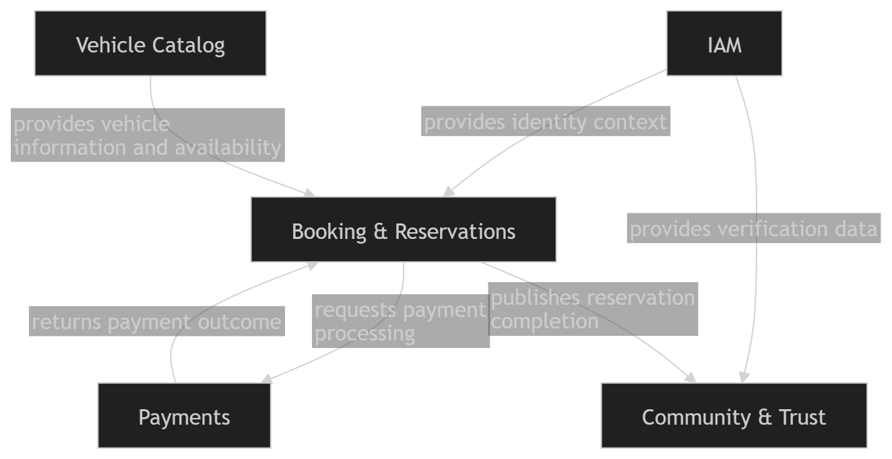

### 2.5.3. Software Architecture

En esta seccion se presenta la arquitectura de software de Rent2Go aplicando C4 Model. Se cubren los diagramas de contexto, contenedores y despliegue, mostrando los productos en alcance (app movil, landing page, API Gateway, servicios backend, base de datos y servicios externos).

#### 2.5.3.1. Software Architecture Context Level Diagrams

Se muestra el sistema Rent2Go en el centro, rodeado por los actores principales (Propietario y Arrendatario) y los sistemas externos (Stripe y Email Service) con los que interactua el dominio de pagos y notificaciones.

  

El diagrama evidencia que los usuarios interactuan con la plataforma para publicar y reservar vehiculos, mientras los servicios externos procesan pagos y envian notificaciones.

#### 2.5.3.2. Software Architecture Container Level Diagrams

El diagrama de contenedores detalla los elementos de alto nivel y la distribucion de responsabilidades: Landing Page y App Movil como canales, un API Gateway como punto de entrada, servicios backend por bounded context (IAM, Vehicle Catalog, Booking, Payments, Community) y una base de datos MySQL unica. Se resaltan las decisiones de tecnologia y las comunicaciones entre contenedores.

  

Como extension del diagrama de contenedores, se incluye el detalle de componentes del contenedor PAYMENTS para mostrar la conexion con servicios externos.

  

El componente Payment Core orquesta cobros y reembolsos, mientras Stripe Adapter integra con Stripe y Email Adapter envia notificaciones por correo.

#### 2.5.3.3. Software Architecture Deployment Diagrams

El diagrama de despliegue representa la distribucion fisica en infraestructura: app movil en dispositivo, landing page en navegador, un cluster de API en nube y la base de datos MySQL administrada. Se visualizan tambien las dependencias con los servicios externos.

  

La vista de despliegue deja claro como se implementa el sistema en hardware y servicios administrados, manteniendo separadas las capas de presentacion, servicios y datos.

## 2.6. Tactical-Level Domain-Driven Design

En esta seccion se presenta la perspectiva tactica del diseno de la solucion. Se documentan las capas, clases y diagramas por bounded context, iniciando con Vehicle Catalog.

### 2.6.1. Bounded Context: Vehicle Catalog

Este bounded context gestiona el ciclo de vida del catalogo de vehiculos. A continuacion se presenta el diccionario de clases y las relaciones clave de la solucion.

**Diccionario de clases (resumen)**

| Clase                 | Proposito                                           | Atributos principales                              | Metodos principales                                         | Relaciones                                                      |
| --------------------- | --------------------------------------------------- | -------------------------------------------------- | ----------------------------------------------------------- | --------------------------------------------------------------- |
| Vehicle               | Aggregate Root que representa el vehiculo publicado | vehicleId, ownerId, specification, pricing, status | create(), getId(), getStatus()                              | contiene VehicleSpecification, PricingPolicy; usa VehicleStatus |
| VehicleSpecification  | Value Object con datos descriptivos                 | brand, model, year                                 | N/A                                                         | pertenece a Vehicle                                             |
| PricingPolicy         | Value Object con tarifa base                        | dailyRate                                          | N/A                                                         | usa Money                                                       |
| Money                 | Value Object monetario                              | amount, currency                                   | N/A                                                         | usado por PricingPolicy                                         |
| VehicleStatus         | Enum de estado                                      | DRAFT, PUBLISHED, UNAVAILABLE, DELETED             | N/A                                                         | usado por Vehicle                                               |
| VehicleController     | Controller REST del catalogo                        | N/A                                                | registerVehicle(), publishVehicle(), getVehicleById()       | usa VehicleCommandService y VehicleQueryService                 |
| VehicleCommandService | Domain Service de comandos                          | N/A                                                | handle(CreateVehicleCommand), handle(PublishVehicleCommand) | implementado por VehicleCommandServiceImpl                      |
| VehicleQueryService   | Domain Service de consultas                         | N/A                                                | handle(GetVehicleByIdQuery)                                 | implementado por VehicleQueryServiceImpl                        |
| VehicleRepository     | Repository del agregado                             | N/A                                                | findById(), save()                                          | maneja Vehicle                                                  |

#### 2.6.1.1. Domain Layer

El core del dominio se modela con el agregado Vehicle y sus Value Objects VehicleSpecification, PricingPolicy y Money. Las reglas de negocio se reflejan en el estado VehicleStatus y en la construccion del agregado al registrar o publicar vehiculos. Las abstracciones de acceso a datos se definen en VehicleRepository.

#### 2.6.1.2. Interface Layer

La capa de interfaz se representa con VehicleController y sus resources/assemblers para exponer endpoints REST de registro, publicacion y consulta de vehiculos.

#### 2.6.1.3. Application Layer

Los flujos de negocio se coordinan con VehicleCommandServiceImpl y VehicleQueryServiceImpl, que actuan como command handlers y query handlers para CreateVehicleCommand, PublishVehicleCommand y GetVehicleByIdQuery.

#### 2.6.1.4. Infrastructure Layer

La infraestructura contiene la implementacion de VehicleRepository y los adaptadores de persistencia para MySQL. Aqui se materializa el acceso a tablas y consultas requeridas por el catalogo.

#### 2.6.1.5. Bounded Context Software Architecture Component Level Diagrams

Se presenta el Component Diagram del container Vehicle Catalog, mostrando controllers, services, repositories y su interaccion interna.

  

#### 2.6.1.6. Bounded Context Software Architecture Code Level Diagrams

Se detallan los diagramas de implementacion para el bounded context.

##### 2.6.1.6.1. Bounded Context Domain Layer Class Diagrams

  

##### 2.6.1.6.2. Bounded Context Database Design Diagram

  

### 2.6.2. Bounded Context: Booking & Reservations

Este contexto se encarga de gestionar el proceso de las reservas de vehículos, desde que el usuario realiza la solicitud inicial hasta que el servicio finaliza. Se organiza siguiendo las clases definidas en el diagrama para asegurar un flujo de trabajo claro.

**Diccionario de clases (resumen)**

| Clase                                  | Propósito                                                  | Atributos principales                                 | Métodos principales                       | Relaciones                                |
| :------------------------------------- | :--------------------------------------------------------- | :---------------------------------------------------- | :---------------------------------------- | :---------------------------------------- |
| Reservation                            | Clase principal que representa una reserva de vehículo     | reservationId, vehicleId, renterId, status, dateRange | getId(), getStatus()                      | contiene DateRange; usa ReservationStatus |
| DateRange                              | Objeto que define el rango de fechas de la reserva         | startDate, endDate                                    | N/A                                       | pertenece a Reservation                   |
| ReservationStatus                      | Lista de estados (PENDING, ACTIVE, etc.)                   | N/A                                                   | N/A                                       | usado por Reservation                     |
| ReservationController                  | Controlador que expone la API para gestionar reservas      | N/A                                                   | createReservation(), getReservationById() | usa servicios y transformadores           |
| ReservationCommandService              | Servicio para realizar cambios en las reservas             | N/A                                                   | handle(CreateReservationCommand)          | implementado en la capa de aplicación     |
| ReservationQueryService                | Servicio para consultar información de las reservas        | N/A                                                   | handle(GetReservationByIdQuery)           | implementado en la capa de aplicación     |
| ReservationRepository                  | Encargado de guardar los datos en la base de datos         | N/A                                                   | findById(), save(), findAllByUserId()     | gestiona la clase Reservation             |
| ReservationResource                    | Formato de datos para enviar respuestas a los usuarios     | reservationId, vehicleId, renterId, status            | N/A                                       | generado por el transformador             |
| ReservationResourceFromEntityAssembler | Transformador que convierte los datos internos para la API | N/A                                                   | toResourceFromEntity()                    | conecta Reservation con Resource          |

#### 2.6.2.1. Domain Layer

El núcleo del dominio se basa en la clase **Reservation**, que organiza la relación entre el arrendatario y el vehículo seleccionado. Para controlar el tiempo de uso se utiliza el objeto **DateRange**, mientras que el estado del proceso se maneja a través de **ReservationStatus**. Esta capa define las reglas básicas y los contratos para el acceso a los datos.

#### 2.6.2.2. Interface Layer

La capa de interfaz permite la interacción con los usuarios mediante el **ReservationController**. Se utilizan recursos y transformadores para que la comunicación sea sencilla, asegurando que los datos internos del sistema se adapten correctamente a lo que el usuario necesita ver o enviar.

#### 2.6.2.3. Application Layer

Esta capa se encarga de organizar las tareas del sistema. Separa las acciones que modifican la información de las que solo sirven para consultar datos, permitiendo que cada proceso, como crear o buscar una reserva, se ejecute de manera ordenada a través de sus servicios correspondientes.

#### 2.6.2.4. Infrastructure Layer

La capa de infraestructura garantiza que toda la información de las reservaciones se guarde de forma segura en la base de datos MySQL. También se encarga de los aspectos técnicos de conexión y permite integrar funciones adicionales, como el envío de notificaciones si fuera necesario.

#### 2.6.2.5. Bounded Context Software Architecture Component Level Diagrams

Se presenta el Component Diagram del container Booking & Reservations, ilustrando la interacción entre controladores, servicios y repositorios.

  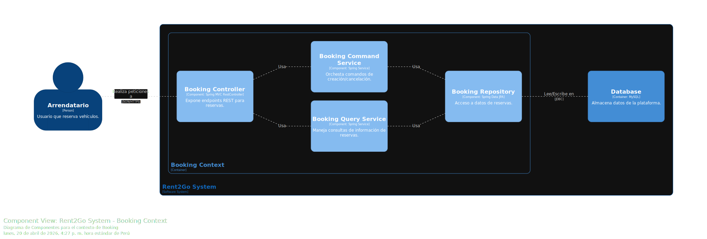

#### 2.6.2.6. Bounded Context Software Architecture Code Level Diagrams

Se detallan los diagramas de implementación para el bounded context de reservas.

##### 2.6.2.6.1. Bounded Context Domain Layer Class Diagrams

  

##### 2.6.2.6.2. Bounded Context Database Design Diagram

  

### 2.6.3. Bounded Context: IAM (Identity & Access Management)

Este contexto se encarga de gestionar la identidad y el acceso de los usuarios dentro de la plataforma, incluyendo el registro, autenticación y control de permisos. Se organiza siguiendo las entidades definidas en el dominio para garantizar un acceso seguro y controlado al sistema.

| Clase             | Propósito                                                 | Atributos principales            | Métodos principales                             | Relaciones                                        |
| ----------------- | --------------------------------------------------------- | -------------------------------- | ----------------------------------------------- | ------------------------------------------------- |
| User              | Aggregate Root que representa al usuario del sistema      | userId, email, role, isActive    | register(), activate(), deactivate(), getRole() | contiene Credential, Session; usa Role            |
| Credential        | Value Object que almacena la información de autenticación | passwordHash                     | validatePassword()                              | pertenece a User                                  |
| Role              | Entidad que define el tipo de usuario                     | roleId, name                     | getPermissions()                                | usado por User                                    |
| Session           | Entidad que representa una sesión activa                  | sessionId, token, expirationDate | create(), isValid(), invalidate()               | pertenece a User                                  |
| Token             | Value Object para el manejo de tokens de autenticación    | value, expiration                | isExpired()                                     | usado por Session                                 |
| AuthController    | Controller REST para autenticación y acceso               | N/A                              | register(), login(), logout(), getCurrentUser() | usa AuthService                                   |
| AuthService       | Servicio de aplicación para lógica de autenticación       | N/A                              | registerUser(), loginUser(), logoutUser()       | usa UserRepository, TokenService, PasswordEncoder |
| TokenService      | Servicio encargado de generación y validación de tokens   | N/A                              | generateToken(), validateToken()                | usado por AuthService                             |
| PasswordEncoder   | Servicio para encriptar y validar contraseñas             | N/A                              | encode(), matches()                             | usado por AuthService                             |
| UserRepository    | Repository para persistencia de usuarios                  | N/A                              | findByEmail(), findById(), save()               | maneja User                                       |
| SessionRepository | Repository para manejo de sesiones                        | N/A                              | save(), findByToken(), delete()                 | maneja Session                                    |

#### 2.6.3.1. Domain Layer

Contiene las entidades, value objects y reglas de negocio relacionadas con la gestión de identidad y acceso, definiendo la lógica central del dominio sin depender de tecnologías externas.

#### 2.6.3.2. Interface Layer

Proporciona los puntos de entrada al sistema mediante APIs o controladores, permitiendo la interacción de los usuarios con las funcionalidades de autenticación y autorización.

#### 2.6.3.3. Application Layer

Orquesta los casos de uso del sistema, coordinando las operaciones necesarias para el registro, inicio de sesión y validación de usuarios, utilizando los servicios del dominio.

#### 2.6.3.4. Infrastructure Layer

Implementa los detalles técnicos como la persistencia de datos, generación de tokens y encriptación de contraseñas, permitiendo la integración con bases de datos y servicios externos.

#### 2.6.3.5. Bounded Context Software Architecture Component Level Diagrams

  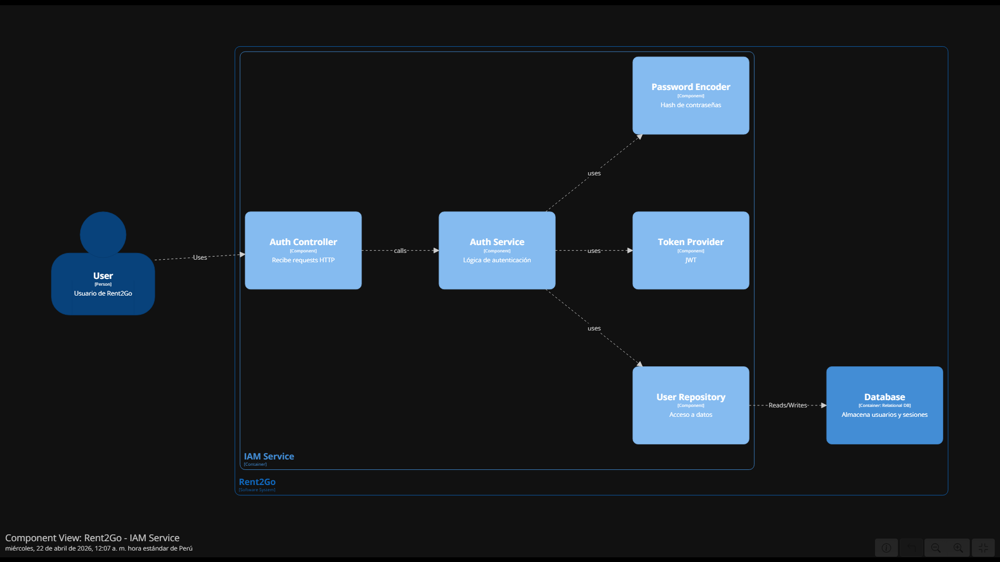

#### 2.6.3.6. Bounded Context Software Architecture Code Level Diagrams

Se detallan los diagramas de implementación para el bounded context de IAM.

##### 2.6.3.6.1. Bounded Context Domain Layer Class Diagrams

  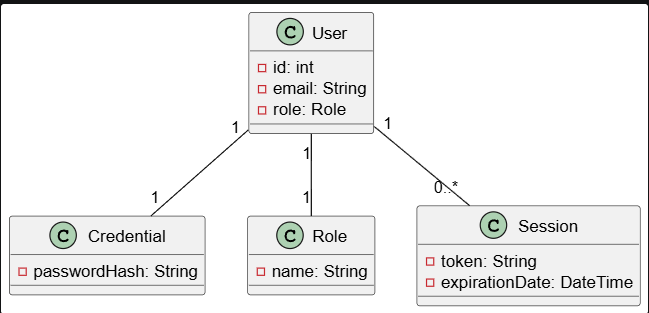

##### 2.6.3.6.2. Bounded Context Database Design Diagram

  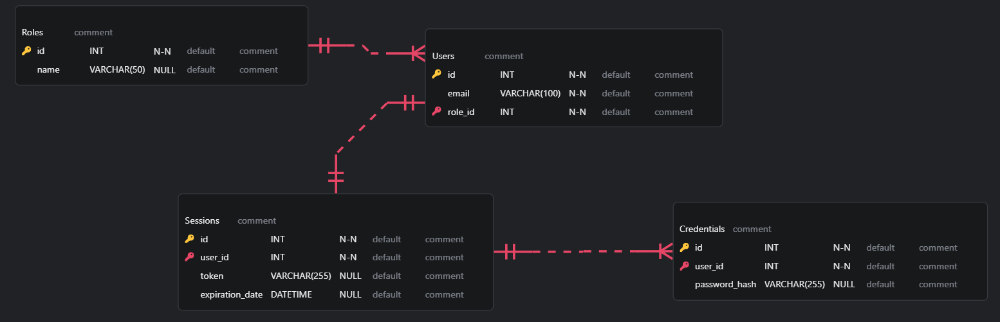

### 2.6.4. Bounded Context: Payments

Este bounded context gestiona el ciclo de vida de los pagos dentro de la plataforma. Centraliza la creación de pagos asociados a reservas, el cálculo del desglose monetario, la integración con Stripe Sandbox para el procesamiento de pagos de prueba y la persistencia del estado de cada transacción. A continuación se presenta el diccionario de clases y las relaciones clave de la solución.

| Clase                           | Propósito                                                              | Atributos principales                                                                                                         | Métodos principales                                                  | Relaciones                                                                                        |
| ------------------------------- | ---------------------------------------------------------------------- | ----------------------------------------------------------------------------------------------------------------------------- | -------------------------------------------------------------------- | ------------------------------------------------------------------------------------------------- |
| Payment                         | Aggregate Root que representa un pago asociado a una reserva           | paymentId, reservationId, status, breakdown, gatewayReference                                                                 | create(), approve(), reject(), refund(), getTotal()                  | Contiene FeeBreakdown; usa PaymentStatus; referencia a Booking/Reservation mediante reservationId |
| FeeBreakdown                    | Value Object que encapsula el desglose económico del pago              | baseFee, taxes, platformCommission, total                                                                                     | calculateTotal()                                                     | Pertenece a Payment; usa Money                                                                    |
| Money                           | Value Object que representa un monto monetario                         | amount, currency                                                                                                              | add(), subtract()                                                    | Pertenece a FeeBreakdown                                                                          |
| PaymentStatus                   | Enum de estado del pago                                                | PENDING, PROCESSING, APPROVED, REJECTED, REFUNDED                                                                             | N/A                                                                  | Usado por Payment                                                                                 |
| PaymentTransaction              | Entidad de soporte que registra la operación procesada con la pasarela | transactionId, paymentId, provider, providerPaymentToken, providerReference, transactionStatus, amount, currency, processedAt | create(), markProcessed()                                            | Referencia a Payment mediante paymentId                                                           |
| PaymentController               | Controller REST de pagos                                               | N/A                                                                                                                           | createPayment(), getPaymentById(), getPaymentsByReservationId()      | Usa PaymentCommandService y PaymentQueryService                                                   |
| PaymentCommandService           | Domain Service de comandos para pagos                                  | N/A                                                                                                                           | handle(CreatePaymentCommand), handle(RefundPaymentCommand)           | Implementado por PaymentCommandServiceImpl                                                        |
| PaymentQueryService             | Domain Service de consultas para pagos                                 | N/A                                                                                                                           | handle(GetPaymentByIdQuery), handle(GetPaymentsByReservationIdQuery) | Implementado por PaymentQueryServiceImpl                                                          |
| PaymentCommandServiceImpl       | Implementación de comandos de pago                                     | N/A                                                                                                                           | handle(CreatePaymentCommand), handle(RefundPaymentCommand)           | Usa PaymentRepository, PaymentTransactionRepository y StripeGateway                               |
| PaymentQueryServiceImpl         | Implementación de consultas de pago                                    | N/A                                                                                                                           | handle(GetPaymentByIdQuery), handle(GetPaymentsByReservationIdQuery) | Usa PaymentRepository                                                                             |
| PaymentRepository               | Repository del agregado Payment                                        | N/A                                                                                                                           | findById(), findAllByReservationId(), save()                         | Maneja Payment                                                                                    |
| PaymentTransactionRepository    | Repository de transacciones de pago                                    | N/A                                                                                                                           | findByPaymentId(), save()                                            | Maneja PaymentTransaction                                                                         |
| StripeGateway                   | Gateway externo para procesar cobros en entorno de prueba              | N/A                                                                                                                           | charge(), refund()                                                   | Usado por PaymentCommandServiceImpl; integra Stripe Sandbox                                       |
| CreatePaymentCommand            | Comando para crear un pago                                             | reservationId, paymentToken                                                                                                   | N/A                                                                  | Consumido por PaymentCommandService                                                               |
| RefundPaymentCommand            | Comando para reembolsar un pago                                        | paymentId                                                                                                                     | N/A                                                                  | Consumido por PaymentCommandService                                                               |
| GetPaymentByIdQuery             | Consulta de un pago por ID                                             | paymentId                                                                                                                     | N/A                                                                  | Consumido por PaymentQueryService                                                                 |
| GetPaymentsByReservationIdQuery | Consulta de pagos por reserva                                          | reservationId                                                                                                                 | N/A                                                                  | Consumido por PaymentQueryService                                                                 |

#### 2.6.4.1. Domain Layer
El core del dominio se modela con un agregado principal: Payment, el cual representa el pago asociado a una reserva dentro de la plataforma. Sus respectivos Value Objects son FeeBreakdown y Money, encargados de encapsular el detalle monetario del pago, incluyendo tarifa base, impuestos, comisión de la plataforma y monto total. El ciclo de vida del pago se representa mediante el enum PaymentStatus, cuyos estados son PENDING, PROCESSING, APPROVED, REJECTED y REFUNDED.

Adicionalmente, el contexto incluye la entidad PaymentTransaction, utilizada para registrar la operación ejecutada contra la pasarela de pago. Las reglas de negocio más importantes, como la asociación obligatoria de un pago a una reserva y la consistencia entre el estado del pago y el resultado del procesamiento externo, se modelan dentro del agregado y sus servicios de dominio. Las abstracciones de acceso a datos se definen en PaymentRepository y PaymentTransactionRepository.

#### 2.6.4.2. Interface Layer
La capa de interfaz expone un controller REST especializado: PaymentController, encargado de la creación y consulta de pagos. Sus principales endpoints permiten registrar un pago asociado a una reserva, obtener un pago por identificador y listar pagos vinculados a una reserva específica.

Cada controller utiliza resources y assemblers para transformar los modelos de dominio en representaciones REST, manteniendo así la separación entre capas. Esta capa permite que la aplicación móvil consuma el bounded context de Payments de forma desacoplada, mostrando el resultado del pago directamente dentro de la app sin depender de notificaciones por correo.

#### 2.6.4.3. Application Layer
Los flujos de negocio se coordinan mediante PaymentCommandService y PaymentQueryService, que actúan como handlers para comandos y consultas específicos del contexto. En particular, PaymentCommandService procesa operaciones de escritura como la creación y el eventual reembolso de pagos, mientras que PaymentQueryService resuelve operaciones de lectura como la búsqueda por ID y la consulta por reserva.

Las implementaciones PaymentCommandServiceImpl y PaymentQueryServiceImpl encapsulan la lógica de aplicación, orquestando la validación del pago, la interacción con la pasarela externa y la persistencia de la información. De esta manera, la capa de aplicación coordina el flujo completo desde la solicitud iniciada por la app móvil hasta la actualización final del estado del pago.

#### 2.6.4.4. Infrastructure Layer
La infraestructura implementa los repositorios PaymentRepository y PaymentTransactionRepository sobre una base de datos relacional, gestionando la persistencia de pagos y transacciones. Asimismo, incorpora el adaptador StripeGateway, responsable de conectarse con Stripe Sandbox para procesar cobros de prueba y devolver las referencias externas necesarias para la trazabilidad.

Esta capa permite desacoplar el dominio de la tecnología específica del proveedor de pagos. Además, soporta el almacenamiento de identificadores externos, estados de transacción y montos procesados, lo que facilita tanto la auditoría como el seguimiento de pagos dentro de la plataforma.

#### 2.6.4.5. Bounded Context Software Architecture Component Level Diagrams
Se detallan los diagramas de implementación para el bounded context de Pagos.

  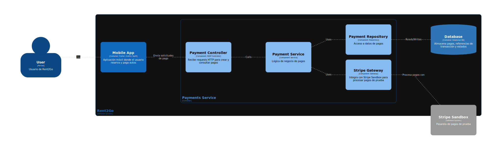

#### 2.6.4.6. Bounded Context Software Architecture Code Level Diagrams
Se detallan los diagramas de implementación para el bounded context de pagos.

##### 2.6.4.6.1. Bounded Context Domain Layer Class Diagrams

  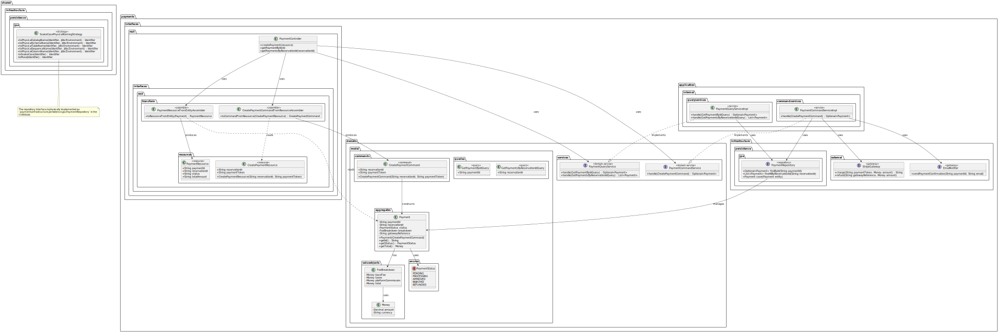

##### 2.6.4.6.2. Bounded Context Database Design Diagram

  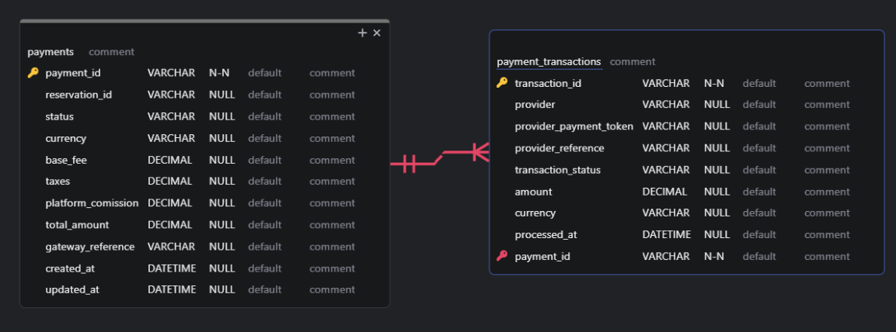

### 2.6.5 Bounded Context: Community & Trust

Este bounded context gestiona el ciclo de vida de la confianza y la comunidad dentro de la plataforma. Centraliza las reseñas verificadas post-alquiler, la mensajería privada entre usuarios, los perfiles públicos y el registro formal de incidentes de seguridad. A continuación se presenta el diccionario de clases y las relaciones clave de la solución.

| Clase | Propósito | Atributos principales | Métodos principales | Relaciones |
| :--- | :--- | :--- | :--- | :--- |
| **UserProfile** | Aggregate Root que representa el perfil público del usuario | profileId, userId, bio, avatarUrl, trustScore, verificationBadge, reviewCount | create(), updateBio(), applyBadge(), recalculateTrustScore() | Contiene TrustScore; recibe VerificationBadge desde IAM; relacionado con Review |
| **Review** | Aggregate Root que modela una evaluación dejada tras un alquiler completado | reviewId, reservationId, authorId, targetVehicleId, rating, comment, publishedAt | create(), validate() | Referencia a Booking (reservationId) y Vehicle Catalog (targetVehicleId) |
| **MessageThread** | Aggregate Root que agrupa la conversación privada entre arrendatario y propietario | threadId, participants[renterId, ownerId], reservationId, messages[] | startThread(), addMessage() | Contiene Message; referencia a Booking (reservationId) |
| **Message** | Value Object / entidad dentro de MessageThread con el contenido de un mensaje individual | messageId, senderId, content, sentAt | N/A | Pertenese a MessageThread |
| **IncidentReport** | Aggregate Root que representa un reporte formal de un evento de seguridad o conflicto | reportId, reporterId, description, status, createdAt | create(), updateStatus() | Usa IncidentStatus |
| **TrustScore** | Value Object que encapsula el índice de confianza calculado | value: Float | N/A | Pertenece a UserProfile |
| **VerificationBadge** | Value Object indicador de identidad verificada recibido desde IAM vía evento | verified: Boolean | N/A | Pertenece a UserProfile |
| **IncidentStatus** | Enum de estado del reporte de incidente | OPEN, UNDER_REVIEW, RESOLVED, CLOSED | N/A | Usado por IncidentReport |
| **ProfileController** | Controller REST del perfil y reseñas | N/A | getProfile(), updateProfile(), getReviews() | Usa ProfileCommandService y ProfileQueryService |
| **ReviewController** | Controller REST de reseñas | N/A | createReview(), getReviewsByTarget() | Usa ReviewCommandService y ReviewQueryService |
| **MessageController** | Controller REST de mensajería | N/A | startThread(), sendMessage(), getThread() | Usa MessageCommandService y MessageQueryService |
| **IncidentController** | Controller REST de incidentes | N/A | reportIncident(), getIncident() | Usa IncidentCommandService |
| **ProfileCommandService** | Domain Service de comandos para perfiles | N/A | handle(UpdateProfileCommand), handle(ApplyBadgeCommand), handle(RecalculateTrustScoreCommand) | Implementado por ProfileCommandServiceImpl |
| **ReviewCommandService** | Domain Service de comandos para reseñas | N/A | handle(CreateReviewCommand) | Implementado por ReviewCommandServiceImpl |
| **MessageCommandService** | Domain Service de comandos para mensajería | N/A | handle(StartThreadCommand), handle(SendMessageCommand) | Implementado por MessageCommandServiceImpl |
| **IncidentCommandService** | Domain Service de comandos para incidentes | N/A | handle(ReportIncidentCommand), handle(UpdateIncidentStatusCommand) | Implementado por IncidentCommandServiceImpl |
| **ProfileQueryService** | Domain Service de consultas para perfiles | N/A | handle(GetProfileByUserIdQuery) | Implementado por ProfileQueryServiceImpl |
| **ReviewQueryService** | Domain Service de consultas para reseñas | N/A | handle(GetReviewsByTargetQuery) | Implementado por ReviewQueryServiceImpl |
| **MessageQueryService** | Domain Service de consultas para mensajería | N/A | handle(GetThreadQuery) | Implementado por MessageQueryServiceImpl |
| **UserProfileRepository** | Repository del agregado UserProfile | N/A | findByUserId(), save() | Maneja UserProfile |
| **ReviewRepository** | Repository del agregado Review | N/A | findByReservationId(), findByTargetVehicleId(), save() | Maneja Review |
| **MessageThreadRepository** | Repository del agregado MessageThread | N/A | findByThreadId(), findByReservationId(), save() | Maneja MessageThread |
| **IncidentReportRepository** | Repository del agregado IncidentReport | N/A | findByReportId(), save() | Maneja IncidentReport |

#### 2.6.5.1. Domain Layer

El core del dominio se modela con cuatro agregados principales: UserProfile, Review, MessageThread e IncidentReport. Sus respectivos Value Objects son TrustScore, VerificationBadge y Message. Las reglas de negocio más críticas como la unicidad de reseña por reserva y la restricción de threads a reservas activas se codifican directamente en los agregados. Los estados de IncidentReport (OPEN, UNDER_REVIEW, RESOLVED, CLOSED) son representados mediante un enum IncidentStatus. Las abstracciones de acceso a datos se definen en UserProfileRepository, ReviewRepository, MessageThreadRepository e IncidentReportRepository.

#### 2.6.5.2. Interface Layer

La capa de interfaz expone cuatro controllers REST especializados: ProfileController (gestión y consulta de perfiles públicos), ReviewController (creación y consulta de reseñas por vehículo o usuario), MessageController (inicio de threads y envío de mensajes) e IncidentController (registro y seguimiento de incidentes). Cada controller utiliza resources y assemblers para transformar los modelos de dominio en representaciones REST, manteniendo la separación entre capas. Los endpoints siguen los casos de uso definidos en las User Stories HU06, HU07, HU11, HU12 y HU33.

#### 2.6.5.3. Application Layer

Los flujos de negocio se coordinan mediante Command y Query Services por agregado (Profile, Review, Message, Incident), actuando como handlers para comandos y consultas específicos. Cada servicio ejecuta la lógica de negocio y publica eventos de dominio como ProfileUpdated, ReviewPublished o MessageSent.

#### 2.6.5.4. Infrastructure Layer

La infraestructura implementa los repositorios en MySQL y gestiona la persistencia mediante adaptadores específicos. Además, integra la mensajería para publicar eventos de dominio y consumir ReservationCompleted, habilitando así la creación de reseñas.

#### 2.6.5.5. Bounded Context Software Architecture Component Level Diagrams

  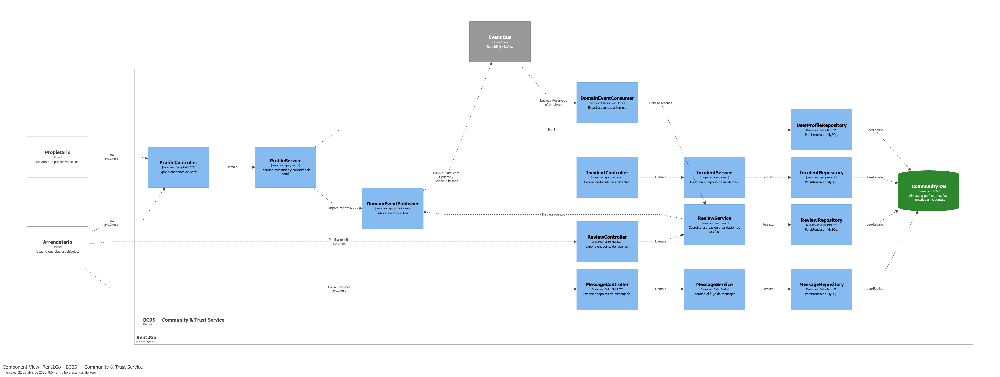

#### 2.6.5.6. Bounded Context Software Architecture Code Level Diagrams

Se detallan los diagramas de implementación para el bounded context de Community & Trust.

##### 2.6.5.6.1. Bounded Context Domain Layer Class Diagrams

  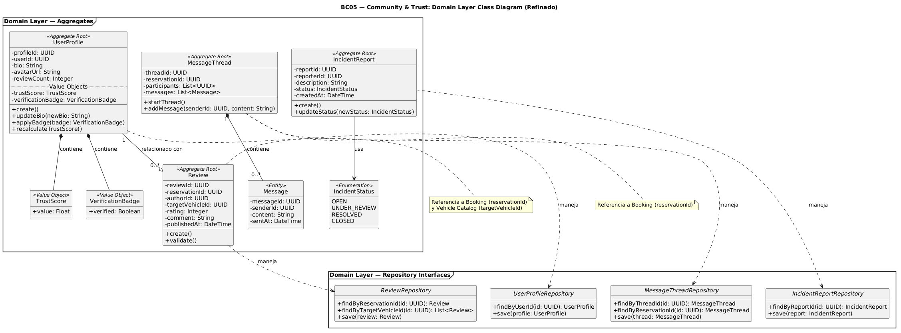

##### 2.6.5.6.2. Bounded Context Database Design Diagram

  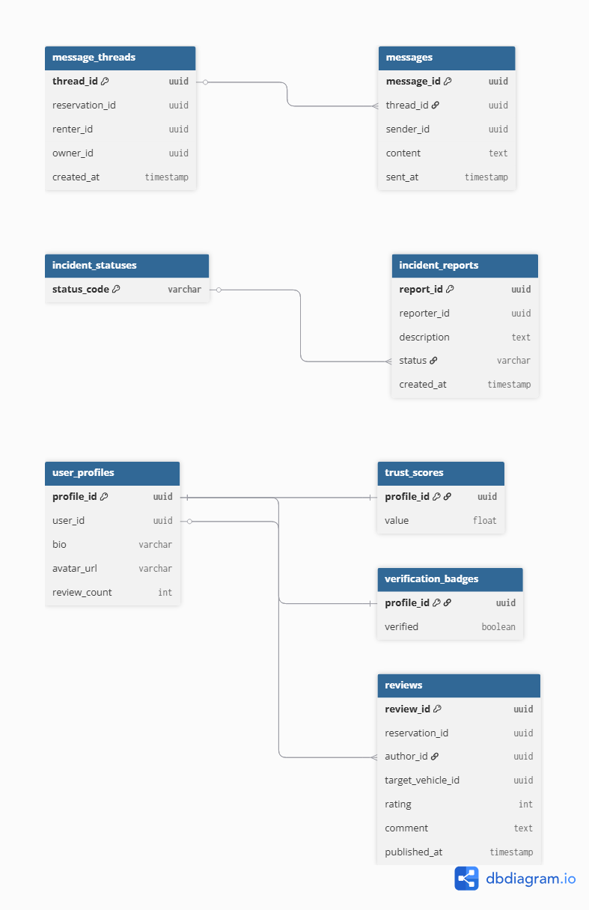

## Conclusiones

### Conclusiones y recomendaciones

En esta entrega se consolido la base del proyecto Rent2Go desde la investigacion hasta el diseño de la solucion. Las entrevistas y el needfinding evidencian una necesidad clara de confianza y seguridad para propietarios y arrendatarios, lo que orienta la propuesta de valor hacia garantias verificables. La especificacion de requerimientos y el backlog permiten priorizar funcionalidades criticas como registro, reservas, pagos y verificacion de identidad. La arquitectura DDD y los diagramas C4 delimitan los bounded contexts y aseguran una base tecnica coherente para el desarrollo mobile-first.

Como recomendaciones, se debe mantener el enfoque en mecanismos de seguridad y trazabilidad, validar los flujos con usuarios reales en las siguientes iteraciones y asegurar que las integraciones externas (pagos, notificaciones y mapas) respalden la experiencia movil.

### Video About-the-Team

**URL**: [Insert public link]

## Bibliografia

Gothelf, J., & Seiden, J. (2021). Lean UX: Applying lean principles to improve user experience (3.ª ed.). O'Reilly Media.

Bland, D. J., & Osterwalder, A. (2019). Testing business ideas: A field guide for rapid experimentation. John Wiley & Sons.

Adzic, G. (2012). Impact mapping: Making a big impact with software products and projects. Provoking Thoughts.

Cohn, M. (2004). User stories applied: For agile software development. Addison-Wesley Professional.

Smart, J. F. (2014). BDD in action: Behavior-driven development for the whole software lifecycle. Manning Publications.

Evans, E. (2004). Domain-driven design: Tackling complexity in the heart of software. Addison-Wesley Professional.

Brandolini, A. (2021). Introducing EventStorming. Leanpub. https://www.leanpub.com/introducing_eventstorming

Brown, S. (2020). The C4 model for visualising software architecture. https://c4model.com/

ABET. (2023). Criteria for accrediting engineering programs, 2023-2024. ABET Engineering Accreditation Commission. https://www.abet.org/accreditation/accreditation-criteria/criteria-for-accrediting-engineering-programs-2023-2024/

Stripe. (s.f.). Stripe API reference. Recuperado el [Ingresa la fecha de hoy, ej. 22 de abril de 2026], de https://stripe.com/docs/api

## Anexos
